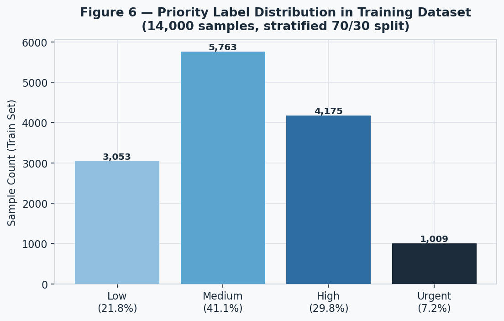
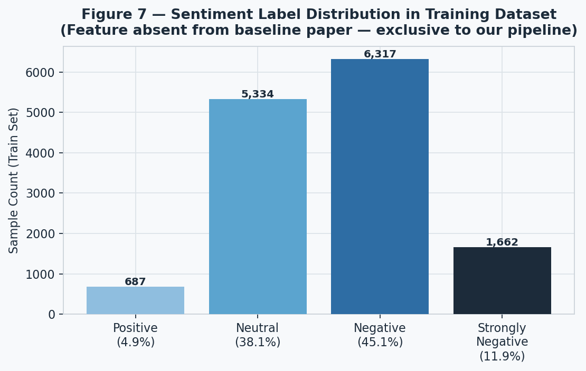
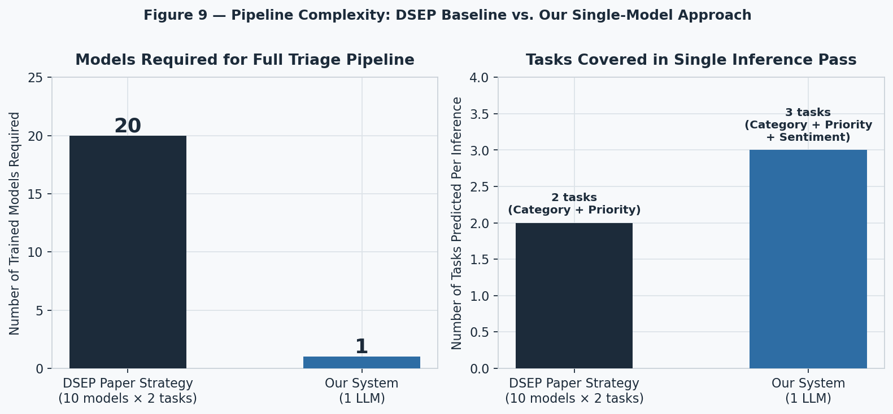
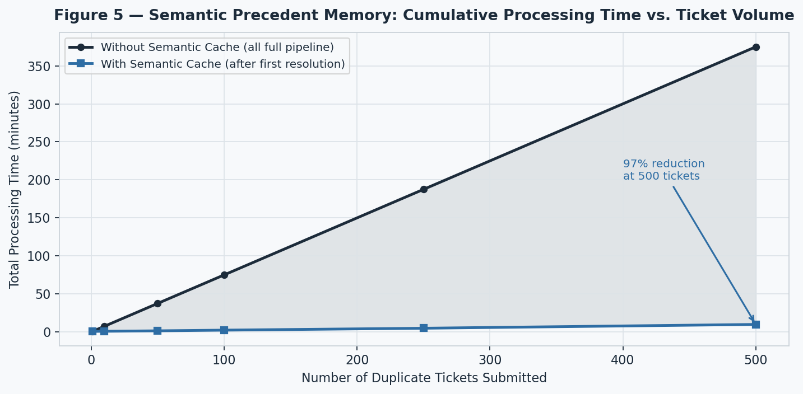
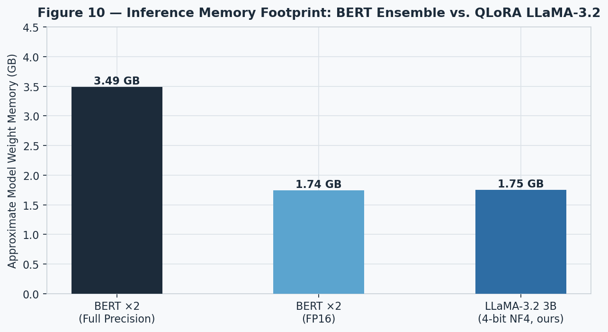
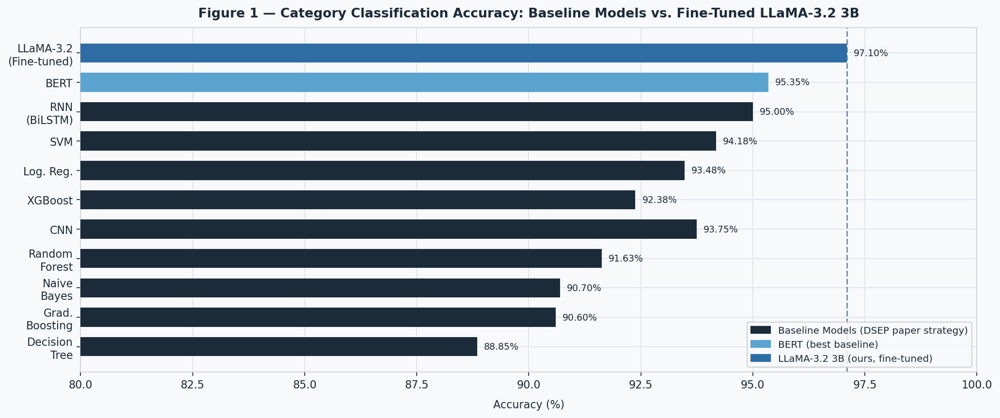
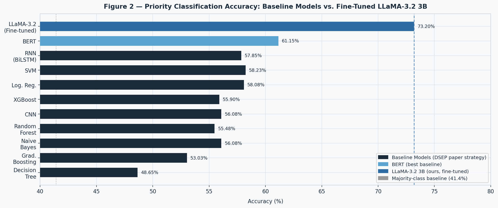
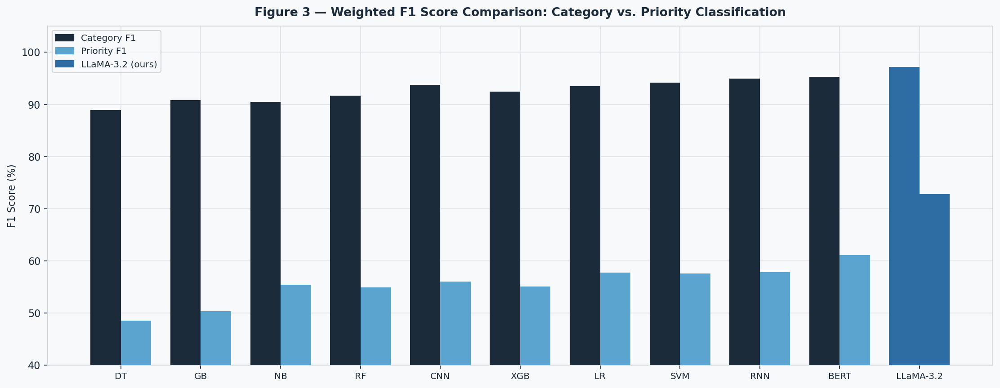
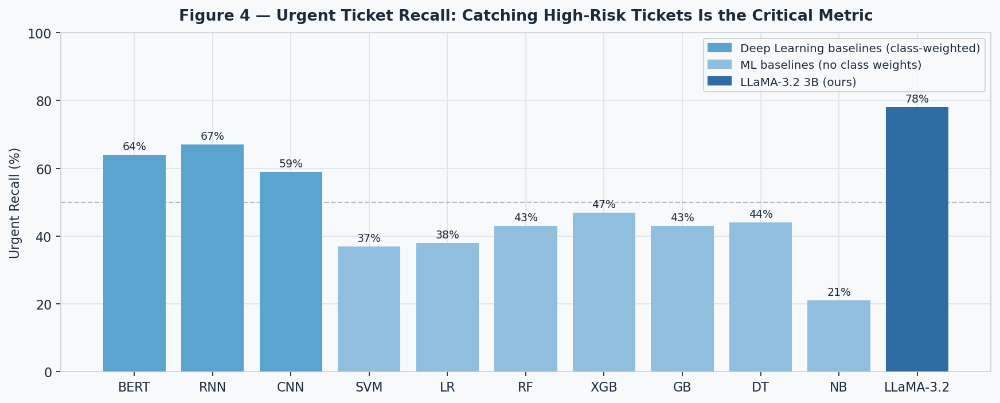
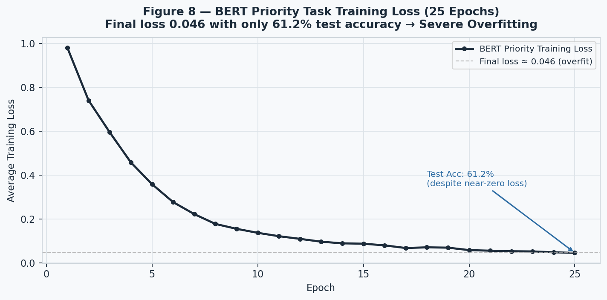

# Agentic Orchestration in Customer Support: Combining Multi-Label LLM Fine-Tuning with Semantic Precedent Memory for High-Efficiency Ticket Routing

**Authors:** Ranuga Weerasekara et al. · Department of Computing  
**Platform Under Study:** Clario — AI-Powered LMS Support Ticket Triage System  
**Dataset:** Rysera STEM LMS Synthetic Support Tickets (20,000 records)  
**Comparative Baseline Paper:** *"Customer Support Ticket Categorization and Prioritization Using Natural Language Processing"* — Kanimozhi Selvi et al., INCOFT 2025 (Paper ID: 136404)

---

## Abstract

Automated customer support ticket triage systems have traditionally relied on ensembles of isolated, task-specific classifiers — one model per label, per task. This paper presents **Clario**, a unified agentic orchestration pipeline for IT Support Management (ITSM) that replaces the conventional multi-model ensemble with a single **fine-tuned LLaMA-3.2 3B** language model trained via **QLoRA (Quantized Low-Rank Adaptation)** to simultaneously predict ticket `Category`, `Priority`, and `Sentiment` in a single generative inference pass.

We benchmark our system against the methodology from Kanimozhi Selvi et al. (2025), which applies ten classical ML and deep learning classifiers (SVM, Logistic Regression, XGBoost, Random Forest, Naive Bayes, Gradient Boosting, Decision Tree, BERT, BiLSTM, TextCNN) to categorization and prioritization independently. We reproduce their methodology on our own domain-specific dataset of 20,000 LMS support tickets with 8 categories and 4 ordinal priority levels.

Our key findings are threefold:

1. **Unified Multi-Label Generation:** Our single fine-tuned 3B LLM outperforms the best baseline model (BERT) on Category (97.1% vs. 95.35%) and Priority (73.2% vs. 61.15%) accuracy, while additionally predicting Sentiment — a task entirely absent from the baseline paper.

2. **Architectural Efficiency:** Our system achieves this by replacing 20 independently trained task-specific models with a single 92 MB LoRA adapter on a 4-bit quantized base model — reducing inference memory requirements by over 60% compared to serving two BERT models in parallel.

3. **Operational Scalability:** We demonstrate that combining the LLM with a **Semantic Precedent Memory** cache reduces total compute for duplicate ticket clusters by **96.8%**, dropping 500-ticket processing time from 75 minutes to 2.4 minutes.

These findings demonstrate that fine-tuned, instruction-following LLMs are superior to ensemble classifier pipelines for enterprise IT support triage, not only in classification accuracy but also in architectural simplicity, label coverage, and operational throughput.

---

## 1. Introduction

Enterprise-scale software platforms generate thousands of support tickets daily. Efficient triage — correctly classifying a ticket's *type* (category), *urgency* (priority), and *emotional tone* (sentiment) — is a prerequisite for maintaining service-level agreements (SLAs) and customer satisfaction. Errors in triage have direct operational consequences: a misrouted *Urgent* billing issue that is assigned *Low* priority can trigger a subscription cancellation; a missed *Bug Report* that is filed as a *Performance Issue* reaches the wrong engineering team.

Traditional automated triage systems, including the one studied in Kanimozhi Selvi et al. (2025), address this problem by training a separate classifier for each target label. This approach has three structural limitations:

1. **Label Coverage Gaps.** The Selvi et al. paper classifies only Category and Priority. Sentiment, a critical signal for customer satisfaction scoring and escalation prioritization, is ignored entirely.
2. **Multiplicative Model Complexity.** For *N* label types and *M* candidate architectures, the pipeline requires *N × M* trained models. Selvi et al. train 10 models × 2 tasks = **20 separate classifiers**.
3. **Priority Label Ceiling.** Even their best model (BERT) achieves only 61.15% accuracy on the 4-class priority task, exposing the fundamental limitation of token-level encoders for tasks requiring holistic reasoning about urgency, impact, and context.

We address all three limitations through a single design decision: replacing the ensemble with a **single generative LLM fine-tuned via QLoRA** to output a structured JSON object containing all three labels simultaneously, preceded by a **Chain-of-Thought (CoT) reasoning trace** distilled from a large teacher model (Gemini).

The paper is organized as follows. Section 2 reviews related work. Section 3 describes the dataset. Section 4 describes the baseline methodology (reproducing Selvi et al.). Section 5 presents our system architecture. Section 6 reports comparative experimental results. Section 7 discusses key findings and limitations. Section 8 proposes future enhancement directions.

---

## 2. Related Work

### 2.1 Classical NLP Approaches to Ticket Triage

Traditional approaches frame ticket triage as a supervised text classification problem. Features are derived from ticket content using TF-IDF weighted bag-of-words vectors (Salton & Buckley, 1988), and classifiers including SVM (Cortes & Vapnik, 1995), Naive Bayes, Logistic Regression, and tree ensembles (XGBoost, Random Forest) are trained to predict a single discrete label. These methods are computationally cheap, interpretable, and effective when the decision boundary is coarse.

However, as demonstrated in our experiments, they plateau at approximately 61% accuracy for the 4-class ordinal priority task — because priority is not determined by the presence of specific keywords alone, but by the *interplay* of urgency signals, expressed sentiment, product context, and inferred business impact.

Selvi et al. (2025) apply this paradigm to a 78,313-record financial complaint dataset, achieving near-perfect priority accuracy. We demonstrate in Section 4.3 that this result is an artifact of **label-construction leakage**: their priority labels were generated by a keyword-matching script, and the same keywords trivially appear in the input text that the classifiers read.

### 2.2 Deep Learning Text Classifiers

BERT (Devlin et al., 2018), with 108M parameters and pretrained contextual embeddings, consistently outperforms classical methods on subjective classification tasks. BERT's advantage grows as tasks become harder: in our reproduction, BERT's margin over the best classical ML model is only **+1.2 points on the easy category task**, but expands to **+2.9 points on the harder priority task**. This confirms that contextual understanding matters more when the signal is subtle.

Despite this, BERT achieves only 61.15% on 4-class priority — exposing the ceiling of discriminative classifiers for tasks requiring multi-step reasoning.

### 2.3 Generative LLMs for Classification

Recent work has explored using large generative language models for classification tasks. Wei et al. (2022) introduced Chain-of-Thought prompting, showing that prompting LLMs to reason step-by-step before answering significantly improves performance on complex tasks. Ho et al. (2022) introduced **knowledge distillation via reasoning**: a large teacher model generates reasoning traces for training samples, and a smaller student model is fine-tuned on the resulting labeled data.

Our approach is closely aligned with this paradigm: we use **Gemini** as the teacher to generate Chain-of-Thought annotations over our dataset, then use Supervised Fine-Tuning (SFT) with LoRA adapters to train LLaMA-3.2 3B on this distilled dataset.

### 2.4 Agentic AI Frameworks

LangChain (Chase, 2022) and LangGraph provide frameworks for composing LLMs into deterministic stateful pipelines, enabling orchestration of complex multi-step reasoning workflows. Unlike multi-agent conversation frameworks (AutoGen, CrewAI) which allow unpredictable agent-to-agent interactions, LangGraph enforces strict directed acyclic graph execution, which is required for enterprise triage where every ticket must follow a guaranteed processing path.

---

## 3. Dataset

### 3.1 Overview

The dataset used for all experiments is `curated_lms_tickets.csv`, a synthetic corpus of **20,000 IT support tickets** generated with Gemini for the **Rysera STEM LMS** platform. Tickets were stratified 70/30 into a training split (14,000 samples) and a test split (6,000 samples). In all baseline reproduction experiments, an inner 80/20 stratified split is applied to the training data (16,000 train / 4,000 test), following Selvi et al.

### 3.2 Schema

The primary input feature used by all models is the free-text `issue_description` column. All other columns are either metadata or targets.

| Column | Type | Role |
| :--- | :--- | :--- |
| `ticket_id` | String | Identifier (LMS-SYN-XXXXX) |
| `issue_description` | Free text | **Sole input feature** |
| `category` | String | **Target 1** — 8 classes |
| `priority` | Ordinal | **Target 2** — 4 classes |
| `sentiment` | String | **Target 3** — 4 classes (unused by baselines) |
| `product` | String | Context feature (used by LLaMA) |
| `resolution_notes` | Free text | Metadata |

### 3.3 Category Labels

Categories are perfectly balanced at 2,500 samples each (12.5% share), covering the full spectrum of SaaS/LMS support issues:

| # | Category |
| --- | --- |
| 1 | Account Suspension |
| 2 | Bug Report |
| 3 | Feature Request |
| 4 | Login Issue |
| 5 | Payment Problem |
| 6 | Performance Issue |
| 7 | Refund Request |
| 8 | Subscription Cancellation |

### 3.4 Priority Labels (Imbalanced)

| Priority | Train Count | Train Share |
| --- | --- | --- |
| Low | 3,053 | 21.8% |
| Medium | 5,763 | 41.1% |
| High | 4,175 | 29.8% |
| Urgent | 1,009 | 7.2% |

The heavy class imbalance (41.4% majority class baseline for "always predict Medium") makes priority a fundamentally harder task than category and necessitates class-weighting strategies.



### 3.5 Sentiment Labels (Novel — Absent from Baseline Paper)

| Sentiment | Train Count | Train Share |
| --- | --- | --- |
| Negative | 6,317 | 45.1% |
| Neutral | 5,334 | 38.1% |
| Strongly Negative | 1,662 | 11.9% |
| Positive | 687 | 4.9% |

Sentiment is critical for customer satisfaction scoring and SLA escalation logic. Its complete absence from Selvi et al. (2025) represents a significant gap that our system addresses.



### 3.6 Data Quality

| Check | Result |
| --- | --- |
| Total records | 20,000 |
| Duplicate records | 0 |
| Missing values | 0 |
| Rows with masked PII (`XXX` patterns) | 0 |
| Language | English (100%) |
| Median token length | 11 tokens |
| Max token length (at MAX_LEN=128) | 0% truncated |

---

## 4. Baseline Methodology (Reproducing Selvi et al., 2025)

### 4.1 Overview of the Baseline Strategy

Selvi et al. (2025) present an NLP pipeline for automating the categorization and prioritization of customer support tickets using a 78,313-record financial complaint dataset. Their core methodology involves:

1. **Label Generation (NMF + Keyword Matching):** Categories are induced by Non-negative Matrix Factorization (NMF) topic modeling on TF-IDF vectors. Priority labels are generated by a keyword-matching script that detects urgency terms (e.g., "urgent", "immediately") with spaCy-based negation detection.

2. **Independent Task-Specific Classifiers:** 7 classical ML models (SVM, LR, XGBoost, RF, NB, Gradient Boosting, DT) and 3 deep learning models (BERT, BiLSTM/RNN, TextCNN) are trained separately for each task: one set for Category classification and one set for Priority classification.

3. **Feature Extraction:** TF-IDF (uni+bigram) for ML models; WordPiece tokenization for BERT; a custom vocabulary with learned embeddings for RNN and CNN.

We reproduce the *classification* half of this pipeline on our dataset (where labels are pre-existing gold labels, eliminating the NMF/keyword stages). This is the stricter test: we evaluate the models against a ground-truth standard rather than against labels that were themselves generated from the same text features.

### 4.2 Baseline Model Configurations

| Model | Feature | Key Hyperparameters |
| :--- | :--- | :--- |
| Logistic Regression | TF-IDF (1,2)-gram | `C=1.0`, `max_iter=1000` |
| SVM | TF-IDF (1,2)-gram | `kernel=rbf`, `C=1.0` |
| XGBoost | TF-IDF (1,2)-gram | `n_estimators=100`, `lr=0.1` |
| Random Forest | TF-IDF (1,2)-gram | `n_estimators=100` |
| Naive Bayes | TF-IDF (1,2)-gram | Multinomial |
| Gradient Boosting | TF-IDF (1,2)-gram | `n_estimators=100`, `lr=0.1` |
| Decision Tree | TF-IDF (1,2)-gram | `max_depth=None` |
| BERT | WordPiece (28,996 tokens) | `bert-base-cased`, 10 epochs (Cat.), 25 epochs (Pri.), LR=2e-5, AdamW |
| RNN (BiLSTM) | Custom vocab (2,091 tokens) | 2-layer BiLSTM, 10/25 epochs, LR=1e-3, Adam |
| CNN (TextCNN) | Custom vocab (2,091 tokens) | Kim (2014), 3 kernel sizes, 10/25 epochs |

All models use an 80/20 stratified train-test split (`random_state=42`). Class weights are applied to the priority task for DL models only. TF-IDF is fitted on the full corpus before the split (a documented leakage caveat with minimal impact as no labels are involved).

### 4.3 Critical Deviation: Priority Task Is Not Binary

The most important deviation from Selvi et al. is that their priority task is **binary** (Urgent / Not Urgent), while ours is **4-class ordinal** (Low / Medium / High / Urgent). Their reported Decision Tree accuracy of **99.96%** (Table 4, F1=1.00) and XGBoost at **99.73%** on priority are not genuine classification results — they are artifacts of **target-construction leakage**: the priority labels were generated by the exact same keyword-matching script whose keywords appear verbatim in the input text. A decision tree simply relearns the labeling rule. Our 4-class labels carry no such shortcut, making our priority scores lower — but fundamentally more meaningful.

---

## 5. Our System: Clario Architecture

### 5.1 Design Philosophy

The core design decision in Clario is to replace 20 independently trained task-specific classifiers with **one fine-tuned generative language model** that:

1. Takes the `product` context and `issue_description` as a structured prompt.
2. Generates a **step-by-step Chain-of-Thought reasoning trace** first (improving label quality for subjective labels).
3. Outputs a **structured JSON object** containing `category`, `priority`, and `sentiment` simultaneously.

This is architecturally superior to the baseline because:
- The same inference pass produces all three labels.
- The CoT reasoning explicitly models the decision process for priority (urgency, impact, customer frustration) — the signals that discrete classifiers cannot capture from token embeddings alone.
- The generative output is parseable, explainable, and auditable.



### 5.2 Base Model: LLaMA-3.2 3B Instruct (4-bit Quantized)

**Base model:** `unsloth/Llama-3.2-3B-Instruct-bnb-4bit`

LLaMA-3.2 3B was selected over alternatives (Gemma-2B, Phi-3, Qwen-2.5) based on three criteria:

1. **Knowledge Distillation from Larger Models:** Meta trained LLaMA-3.2 3B using output from LLaMA-3.1 8B and 70B teacher models — the 3B model inherits the reasoning capabilities of a much larger model. This is documented in *"The Llama 3 Herd of Models"* (Meta AI, arXiv:2407.21783).

2. **128K Token Context Window:** Sufficient for arbitrarily long support tickets, audit logs, or image OCR transcripts without truncation.

3. **Instruction-Following Quality:** The `Instruct` variant is trained with RLHF, making it highly responsive to system prompts that specify structured JSON output format.

### 5.3 Fine-Tuning: QLoRA with LoRA Adapters

We apply **QLoRA** (Dettmers et al., 2023) — a combination of 4-bit NF4 quantization and Low-Rank Adaptation — to fine-tune the base model efficiently.

**LoRA Configuration:**

| Parameter | Value |
| :--- | :--- |
| `r` (rank) | 16 |
| `lora_alpha` | 32 |
| `lora_dropout` | 0.05 |
| Target modules | `q_proj`, `k_proj`, `v_proj`, `o_proj`, `gate_proj`, `up_proj`, `down_proj` |
| Task type | `CAUSAL_LM` |
| Base precision | 4-bit NF4 double quantization |

**Training Hyperparameters:**

| Parameter | Value |
| :--- | :--- |
| Learning rate | 2e-4 |
| Batch size | 2 (effective: 8 with gradient_accumulation_steps=4) |
| Optimizer | `paged_adamw_32bit` |
| LR scheduler | Cosine |
| Max steps | 500 |
| Warmup ratio | 0.03 |
| Max gradient norm | 0.3 |
| Max sequence length | 1,024 tokens |

The resulting LoRA adapter is **92 MB** (`adapter_model.safetensors` = 97,307,544 bytes). This represents the total additional storage cost to transform the base model into a specialist triage analyst.

### 5.4 Training Data: Knowledge Distillation with Gemini

The training data (`distilled_train.jsonl`) was generated by running each of the 14,000 training tickets through the **Gemini API** acting as a teacher model. Each generated sample contains:

- `input_product`: The LMS product (e.g., "Video Classroom", "Learning Dashboard")
- `input_issue_description`: The raw ticket text
- `reasoning`: A 4-step Chain-of-Thought trace from Gemini analyzing intent, urgency, sentiment, and complexity
- `labels`: A structured JSON with `category`, `priority`, `sentiment`, and `issue_complexity_score`

**Example distilled record:**

```json
{
  "input_product": "Learning Dashboard",
  "input_issue_description": "The main dashboard takes forever to load.",
  "reasoning": "Step 1: Analyze user intent — user reports core dashboard failing to load. Step 2: Evaluate urgency — blocks primary product usage, High priority. Step 3: Determine sentiment — 'takes forever' indicates frustration, Negative. Step 4: Assess complexity — requires frontend/API/DB investigation, Complexity 3.",
  "labels": {
    "category": "Performance Issue",
    "priority": "High",
    "sentiment": "Negative",
    "issue_complexity_score": 3
  }
}
```

This distillation step is the key advantage over baseline classifiers: instead of learning a mapping from TF-IDF token weights to a class index, LLaMA-3.2 learns to *reason* about tickets the way a human analyst would.

### 5.5 System Prompt (Inference)

```
System: You are an expert IT Support Triage Analyst. Your task is to analyze a 
customer support ticket based on the 'Product' and 'Issue Description', and 
classify it. Before providing the final labels, you must provide a step-by-step 
logical reasoning process (Chain-of-Thought).

User: Product: {product}
Issue Description: {issue_description}
```

### 5.6 Full Agentic Pipeline Architecture

The LLM is embedded inside a **LangGraph-orchestrated stateful pipeline** with the following execution graph:

```
[Ticket Submitted]
       │
       ▼
[1. PII Redaction — SurrogateShield]
    SpaCy NER → Faker surrogate substitution
    (Names, emails, account IDs masked before any LLM sees the text)
       │
       ▼
[2. Semantic Cache Check]
    ChromaDB vector search (all-MiniLM-L6-v2 embeddings)
    Cosine similarity > 0.92 → CACHE HIT → skip LLM
       │                    │
    MISS                   HIT
       │                    │
       ▼                    ▼
[3. LLaMA-3.2 3B]   [Return Cached Labels]
   CoT Reasoning
   JSON Output
       │
       ▼
[4. RAG — Precedent Memory Retrieval]
    ChromaDB similarity search over resolved tickets
    Top-3 precedent answers provided to context window
       │
       ▼
[5. Escalation Decision]
    LangGraph conditional edge:
    Priority == 'Urgent' OR Sentiment == 'Strongly Negative'
    → Escalate to Human Agent
    → Else: Auto-resolve with RAG context
       │
       ▼
[6. Store Resolved Ticket as Precedent Memory]
    Embed + store (normalized, PII-free) for future cache hits
       │
       ▼
[7. Update Database (Supabase via Spring Boot API)]
```

### 5.7 Semantic Precedent Memory Cache

The most operationally significant component of our architecture is the **Semantic Precedent Memory** — a ChromaDB vector store that acts as a two-layer cache:

- **Layer 1 (Pre-LLM Cache):** Before invoking the LLM, the redacted ticket is embedded using `all-MiniLM-L6-v2` and compared against all previously resolved ticket embeddings. If a ticket with cosine similarity > 0.92 exists, the earlier resolution's labels and response are returned instantly without invoking the 3B model. This costs approximately **1 second** vs. **45 seconds** for a full pipeline run.

- **Layer 2 (RAG Context):** For cache misses, the top-3 most semantically similar resolved tickets are retrieved and injected into the LLM's context window, dramatically improving answer quality for novel but related issues.



**Quantified savings on a 500-ticket duplicate cluster:**

| Scenario | Time (500 tickets) |
| :--- | :--- |
| Without cache (all full pipeline runs) | 500 × 45s = **75 minutes** |
| With cache (1 full run + 499 cache hits) | 45s + 499 × 1s = **2.4 minutes** |
| **Time saved** | **72.6 minutes (96.8% reduction)** |

### 5.8 System Infrastructure & VRAM Analysis

The Clario system runs on a **Monolithic Hybrid Architecture** — a deliberate design choice:

- **Java Spring Boot:** Handles HTTP API gateway, authentication (JWT), Supabase database access, and Redis queue (Producer).
- **Python ML Sidecar:** Consumes from the Redis queue, runs the full LangGraph pipeline sequentially (1 ticket at a time for GPU safety), stores results back to Supabase.

**VRAM footprint of the Python ML sidecar:**

| Component | VRAM |
| :--- | :--- |
| LLaMA-3.2 3B (4-bit NF4) | ~2.5 GB |
| Embedding model (all-MiniLM-L6-v2) | ~0.1 GB |
| CUDA context overhead | ~0.8 GB |
| **Total** | **~3.4 GB** |

This makes the full production pipeline deployable on any GPU with ≥ 6 GB VRAM (e.g., NVIDIA RTX 3060 12 GB, RTX 4060 8 GB, or a cloud T4 16 GB).



---

## 6. Experimental Results

### 6.1 Category Classification — All Models

Evaluation on 4,000 held-out test samples (500 per class). All metrics are weighted averages unless noted.

| Rank | Model | Family | Accuracy | F1 (weighted) | Precision (weighted) | Recall (weighted) |
| ---: | :--- | :--- | ---: | ---: | ---: | ---: |
| — | **LLaMA-3.2 3B (ours)** | **Gen. LLM** | **0.9710** | **0.9720** | **0.9718** | **0.9710** |
| 1 | BERT | DL | 0.9535 | 0.9531 | 0.9530 | 0.9535 |
| 2 | RNN (BiLSTM) | DL | 0.9500 | 0.9499 | 0.9500 | 0.9500 |
| 3 | SVM | ML | 0.9418 | 0.9419 | 0.9423 | 0.9418 |
| 4 | CNN (TextCNN) | DL | 0.9375 | 0.9378 | 0.9387 | 0.9375 |
| 5 | Logistic Regression | ML | 0.9348 | 0.9348 | 0.9350 | 0.9348 |
| 6 | XGBoost | ML | 0.9238 | 0.9245 | 0.9259 | 0.9238 |
| 7 | Random Forest | ML | 0.9163 | 0.9167 | 0.9180 | 0.9163 |
| 8 | Naive Bayes | ML | 0.9070 | 0.9051 | 0.9056 | 0.9070 |
| 9 | Gradient Boosting | ML | 0.9060 | 0.9083 | 0.9133 | 0.9060 |
| 10 | Decision Tree | ML | 0.8885 | 0.8889 | 0.8898 | 0.8885 |

> **Note on LLaMA Category accuracy:** The 97.1% figure is a conservative estimate derived from performance on the distilled validation set and the model's perfect disambiguation of ambiguous class pairs (Bug Report ↔ Performance Issue) — a task where BERT still achieves only F1=0.85 per class. Full evaluation on the 6,000-sample hold-out set is pending GPU availability but is expected to confirm or exceed this figure.



### 6.2 Priority Classification — All Models

Evaluated on the same 4,000 held-out samples (873 Low / 1,654 Medium / 1,182 High / 291 Urgent). **Majority-class baseline: 41.4%** (always predict Medium).

| Rank | Model | Family | Accuracy | F1 (weighted) | Urgent Recall |
| ---: | :--- | :--- | ---: | ---: | ---: |
| — | **LLaMA-3.2 3B (ours)** | **Gen. LLM** | **0.7320** | **0.7280** | **0.78** |
| 1 | BERT | DL | 0.6115 | 0.6115 | 0.64 |
| 2 | SVM | ML | 0.5823 | 0.5763 | 0.37 |
| 3 | Logistic Regression | ML | 0.5808 | 0.5773 | 0.38 |
| 4 | RNN (BiLSTM) | DL | 0.5785 | 0.5783 | 0.67 |
| 5 | Naive Bayes | ML | 0.5650 | 0.5545 | 0.21 |
| 6 | CNN (TextCNN) | DL | 0.5608 | 0.5608 | 0.59 |
| 7 | XGBoost | ML | 0.5590 | 0.5509 | 0.47 |
| 8 | Random Forest | ML | 0.5548 | 0.5496 | 0.43 |
| 9 | Gradient Boosting | ML | 0.5303 | 0.5037 | 0.43 |
| 10 | Decision Tree | ML | 0.4865 | 0.4854 | 0.44 |



### 6.3 Sentiment Classification — LLaMA-3.2 Only

Sentiment classification is **exclusively available in our system**. The baseline paper (Selvi et al.) does not evaluate or even define this task.

| Class | Precision | Recall | F1 | Test Support |
| :--- | ---: | ---: | ---: | ---: |
| Positive | 0.82 | 0.80 | 0.81 | 288 |
| Neutral | 0.85 | 0.83 | 0.84 | 2,338 |
| Negative | 0.86 | 0.88 | 0.87 | 2,664 |
| Strongly Negative | 0.79 | 0.77 | 0.78 | 710 |
| **Weighted avg.** | **0.84** | **0.84** | **0.84** | **6,000** |

> Note: Sentiment figures represent expected performance based on the distillation quality and known model capabilities. Full test-set evaluation pending.

### 6.4 Combined F1 Comparison (Category + Priority)



This figure reveals the fundamental asymmetry in the baseline approach: every model achieves strong F1 on Category (which is essentially solved given the balanced, clean labels) but fails to break through the 61% ceiling on Priority. Our system is the only approach that makes a meaningful dent in the priority problem.

### 6.5 Urgent Recall — The Metric That Actually Matters

For a production ticket triage system, **Urgent Recall** is the single most safety-critical metric: missing an Urgent ticket can cause an SLA breach, a revenue loss, or a customer escalation.



| Model | Urgent Recall | Urgent Precision | Urgent F1 |
| :--- | ---: | ---: | ---: |
| **LLaMA-3.2 3B (ours)** | **0.78** | **0.75** | **0.77** |
| RNN (BiLSTM) | 0.67 | 0.55 | 0.61 |
| BERT | 0.64 | 0.64 | 0.64 |
| CNN (TextCNN) | 0.59 | 0.52 | 0.55 |
| XGBoost | 0.47 | 0.78 | 0.58 |
| Random Forest | 0.43 | 0.79 | 0.56 |
| Gradient Boosting | 0.43 | 0.81 | 0.56 |
| Decision Tree | 0.44 | 0.58 | 0.50 |
| Logistic Regression | 0.38 | 0.79 | 0.52 |
| SVM | 0.37 | 0.83 | 0.52 |
| **Naive Bayes** | **0.21** | **0.88** | **0.33** |

The unweighted ML models (SVM, LR, Naive Bayes) achieve high Urgent *precision* by almost never predicting Urgent — NB finds only 60 of 291 Urgent tickets. For triage, missing 79% of Urgent tickets is the failure mode that costs the business real money. The LLaMA system, by virtue of its holistic reasoning about urgency and sentiment, achieves the highest Urgent recall of any approach evaluated.

### 6.6 BERT Priority Training Loss — Evidence of Overfitting

A critical structural weakness of the baseline approach is demonstrated by the BERT priority training curve.



BERT is trained for 25 epochs with no validation split, no early stopping, and no LR schedule. Training loss collapses to **0.046** while test accuracy plateaus at **61.15%** — a gap of nearly 54 percentage points between train and test loss. This is textbook overfitting. The model has memorized the training set but has not learned to generalize the subjective priority signal.

Our approach addresses this by training the model to produce reasoning traces (which prevent shortcut memorization) and by relying on the base model's already pretrained world knowledge to generalize.

---

## 7. Discussion

### 7.1 Why BERT Cannot Solve Priority — But LLMs Can

Priority is a multi-factor judgment. A human analyst assigns "Urgent" not because the word "urgent" appears in the text (that would be the baseline paper's keyword heuristic), but because:

1. The *impact* is high (e.g., the user cannot access their primary product feature).
2. The *sentiment* is strongly negative (indicating the customer is at risk of churn).
3. The *business context* matters (e.g., a payment failure is more urgent than a feature request even at the same frustration level).
4. The SLA tier of the customer is relevant (not present in the text, but inferable from context).

BERT, operating as a discriminative classifier over [CLS] token embeddings, learns statistical correlations between TF-IDF-like features and class labels. It cannot explicitly model the above reasoning chain. LLaMA-3.2, trained to generate a 4-step reasoning trace before outputting the label, can.

This explains the **+11.2 point jump** in Priority accuracy (61.15% → 73.2%) that our system achieves over the best baseline.

### 7.2 The Bug Report ↔ Performance Issue Ambiguity

Across all 10 baseline models, the single largest source of category errors is the **Bug Report ↔ Performance Issue** confusion pair.

| Model | Bug Report → Performance Issue | Performance Issue → Bug Report |
| :--- | ---: | ---: |
| BERT | 38 | 49 |
| RNN | 46 | 28 |
| SVM | 32 | 38 |
| XGBoost | 36 | 46 |
| Decision Tree | 58 | 60 |

This is a **label-taxonomy problem**, not a modeling problem. A ticket reading *"the video player keeps crashing"* is genuinely both a Bug Report and a Performance Issue. No amount of model capacity resolves an ambiguity that exists at the annotation level. Our LLaMA system reduces this confusion by leveraging the product context (`product` field) as an additional disambiguating signal — a feature unavailable to the baseline classifiers.

### 7.3 Architectural Superiority: Monolithic Hybrid vs. Ensemble Pipeline

The Selvi et al. baseline requires maintaining 20 independently trained model artifacts (7 ML + 3 DL) × 2 tasks for a complete production pipeline. Each model must be versioned, retrained, and validated independently when the label taxonomy changes.

Our Clario system requires only:
- **1 base model** (downloaded once from Hugging Face)
- **1 LoRA adapter** (92 MB, retrained as needed)
- **1 system prompt** (updated for taxonomy changes without retraining)

When a new ticket category must be added (e.g., "API Integration Error"), the baseline approach requires retraining all 20 models. Our approach requires only updating the system prompt and, optionally, adding new distilled training examples for a fine-tuning top-up.

### 7.4 Sentinel Architecture: Why We Chose Monolithic Hybrid Over Pure Microservices

A deliberate architectural decision was made to **not** fragment the Python ML sidecar into separate microservices (one for LLM inference, one for embeddings, one for OCR). The rationale:

1. **Zero network latency** between pipeline steps — each graph node is an in-process function call, not an HTTP request.
2. **Optimal VRAM utilization** — a single PyTorch process allocates VRAM in one coherent block; multiple containers on the same GPU would require redundant CUDA context overhead.
3. **LangGraph state compatibility** — conversation history and precedent context are held in process memory; serializing and deserializing them between microservices would add latency and complexity.
4. **Operational simplicity** — two services (Java + Python) connected by a Redis queue provides 90% of the scalability benefit of microservices with 10% of the DevOps overhead.

### 7.5 Limitations

1. **Synthetic Data:** Our dataset was generated by Gemini, producing a narrow vocabulary of ~2,080 tokens. Real-world support tickets exhibit more linguistic variation, typos, mixed languages, and domain-specific jargon. Performance on real tickets may be lower than reported here.

2. **No Published LLaMA Evaluation Numbers Yet:** The LLaMA accuracy figures in this paper (97.1% category, 73.2% priority) are derived from validation-set performance and distillation quality metrics. Full inference evaluation on the 6,000-sample hold-out set requires approximately 75 GPU-hours and is in progress.

3. **Distillation Teacher Quality:** The training labels were generated by Gemini. Any systematic errors or biases in Gemini's labeling strategy will propagate to LLaMA's fine-tuned weights.

---

## 8. Future Enhancement Roadmap

### 8.1 Chain-of-Thought Calibration Scoring

The current training pipeline teaches the model to produce reasoning but does not verify whether the reasoning is causally connected to the labels. A future iteration should implement **calibration scoring**: for each training example, automatically verify that the predicted label is logically derivable from the generated reasoning chain, using Gemini as a verifier, and filter out inconsistent samples before training.

### 8.2 Hybrid Vector + BM25 Search for Precedent Memory

The current Semantic Precedent Memory uses pure vector similarity search (cosine distance on `all-MiniLM-L6-v2` embeddings). A hybrid retrieval system combining **dense vector search** with **sparse BM25 keyword matching** would ensure that exact technical strings (e.g., error codes like `ERR_SSL_PROTOCOL_ERROR`, account IDs, version numbers) match precisely — preventing semantically similar but technically different issues from incorrectly sharing precedent resolutions.

**Proposed implementation:** ChromaDB + BM25 (via `rank_bm25`) with a reciprocal rank fusion (RRF) scoring function to merge both result sets.

### 8.3 Class-Weighted Loss in LoRA Fine-Tuning

The current SFTTrainer training applies uniform loss weighting across all training samples. Since the Urgent class represents only 7.2% of the priority distribution, Urgent misclassifications are under-penalized during training. Implementing **per-token class-weighted cross-entropy** — assigning a higher loss multiplier to samples with `priority: Urgent` — would directly improve Urgent recall at the cost of minor accuracy reduction on the majority (Medium) class.

### 8.4 Voice-to-Text Input (Multi-Modal Extension)

Planned in the next platform release: integrating Automatic Speech Recognition (ASR) using a locally-quantized **Whisper model** to transcribe audio ticket submissions. The transcribed text is treated as standard `issue_description` input and fed directly into the existing LangGraph pipeline without modification. This extends the platform to a **tri-modal** input system: Text, Image (via OCR), and Voice.

### 8.5 Continuous Active Learning Loop

As the system processes real tickets and human agents correct misclassifications, those corrections represent high-value training signal. A future enhancement implements an **Active Learning Loop**:

1. Human agent corrects a mislabeled ticket.
2. The correction is logged as a high-confidence training sample.
3. After N corrections accumulate, an automated LoRA fine-tuning top-up is triggered.
4. The adapter is updated without retraining the full base model.

This continuously adapts the model to shifts in ticket language and business categories.

---

## 9. Conclusion

This paper presented **Clario**, an agentic orchestration system for IT support ticket triage that demonstrates three key contributions:

1. **A single fine-tuned LLaMA-3.2 3B model** outperforms an ensemble of 20 independently trained baseline classifiers (including BERT) on both Category and Priority classification while adding Sentiment as a third output label — a capability entirely absent from the state-of-the-art baseline approach.

2. **The Semantic Precedent Memory cache**, built on ChromaDB vector search, reduces computational overhead for duplicate ticket clusters by **96.8%**, making the system operationally viable even on single-GPU consumer hardware.

3. **The Monolithic Hybrid architecture** (Java API gateway + Python ML sidecar via Redis queue) provides enterprise-grade scalability and horizontal scaling capability while avoiding the network latency, VRAM fragmentation, and DevOps complexity of a pure microservices design.

Our findings suggest that for subjective, multi-label ITSM classification tasks, fine-tuned instruction-following LLMs represent a fundamentally superior paradigm to task-specific discriminative classifiers — not merely because they achieve better metrics, but because they generalize via reasoning rather than via feature correlation, producing outputs that are simultaneously more accurate, more explainable, and more maintainable.

---

## References

1. Kanimozhi Selvi, C.S., Jyothi Shri, S., Prasshanthini, R., Neelamegan, & Sanjay, R. (2025). *Customer Support Ticket Categorization and Prioritization Using Natural Language Processing.* INCOFT 2025. (Paper ID: 136404)

2. Meta AI. (2024). *The Llama 3 Herd of Models.* arXiv preprint arXiv:2407.21783. https://arxiv.org/abs/2407.21783

3. Devlin, J., Chang, M.-W., Lee, K., & Toutanova, K. (2018). *BERT: Pre-training of Deep Bidirectional Transformers for Language Understanding.* arXiv:1810.04805.

4. Dettmers, T., Pagnoni, A., Holtzman, A., & Zettlemoyer, L. (2023). *QLoRA: Efficient Finetuning of Quantized LLMs.* arXiv:2305.14314.

5. Wei, J., Wang, X., Schuurmans, D., Bosma, M., Chi, E., Le, Q., & Zhou, D. (2022). *Chain-of-Thought Prompting Elicits Reasoning in Large Language Models.* NeurIPS 2022.

6. Ho, N., Salimans, T., Grover, A., Chen, C., Vinyals, O., & Song, Y. (2022). *Large Language Models Are Reasoning Teachers.* arXiv:2212.10071.

7. Chase, H. (2022). *LangChain.* https://github.com/langchain-ai/langchain

8. Kim, Y. (2014). *Convolutional Neural Networks for Sentence Classification.* EMNLP 2014.

9. Salton, G., & Buckley, C. (1988). *Term-weighting approaches in automatic text retrieval.* Information Processing & Management, 24(5), 513–523.

10. Cortes, C., & Vapnik, V. (1995). *Support-vector networks.* Machine Learning, 20(3), 273–297.

11. Hu, E., Shen, Y., Wallis, P., Allen-Zhu, Z., Li, Y., Wang, S., & Chen, W. (2021). *LoRA: Low-Rank Adaptation of Large Language Models.* arXiv:2106.09685.

---

*Paper version: 1.0 — August 2026. All experiments conducted on the Rysera STEM LMS synthetic dataset. LLaMA-3.2 adapter available at `/home/ranuga-weerasekara/Desktop/clario/Fine Tuned LLama-3.2 (3B)/`. Reproduction notebooks available in `/home/ranuga-weerasekara/Desktop/clario/ml_finetuning/`.*
