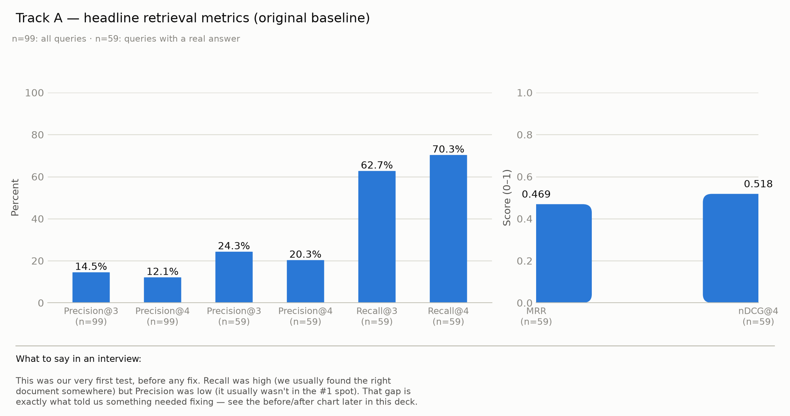
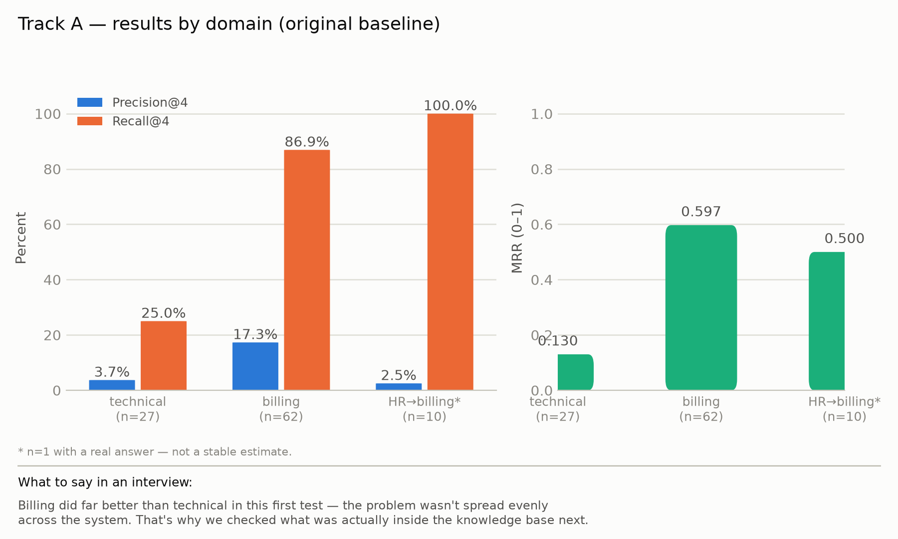
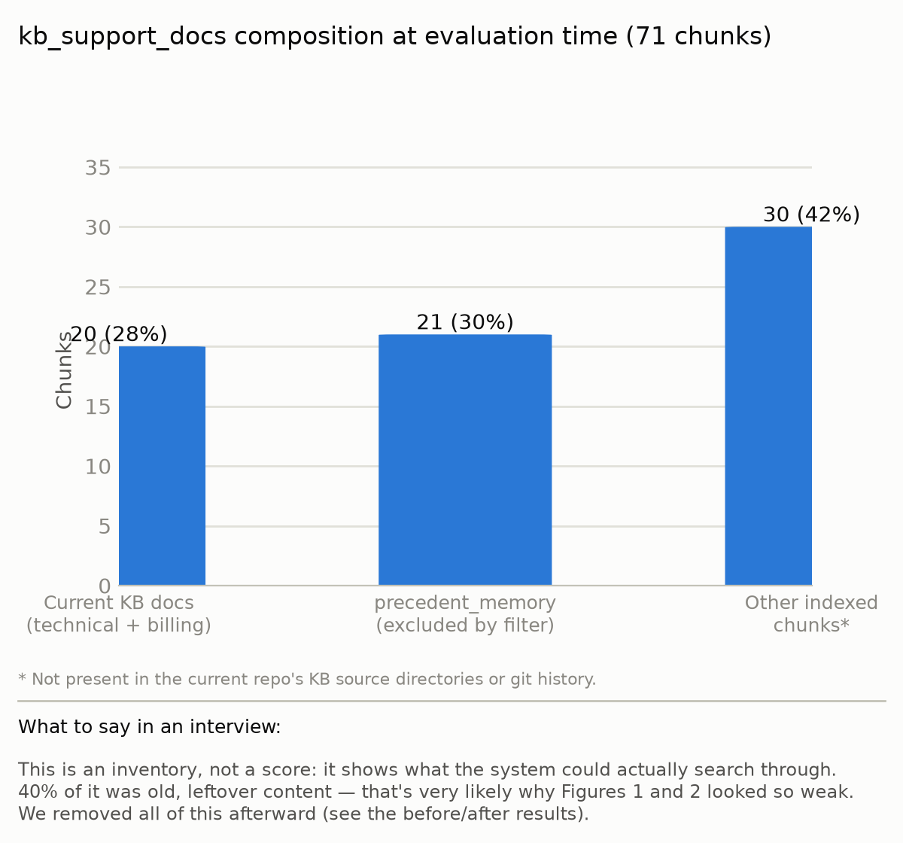
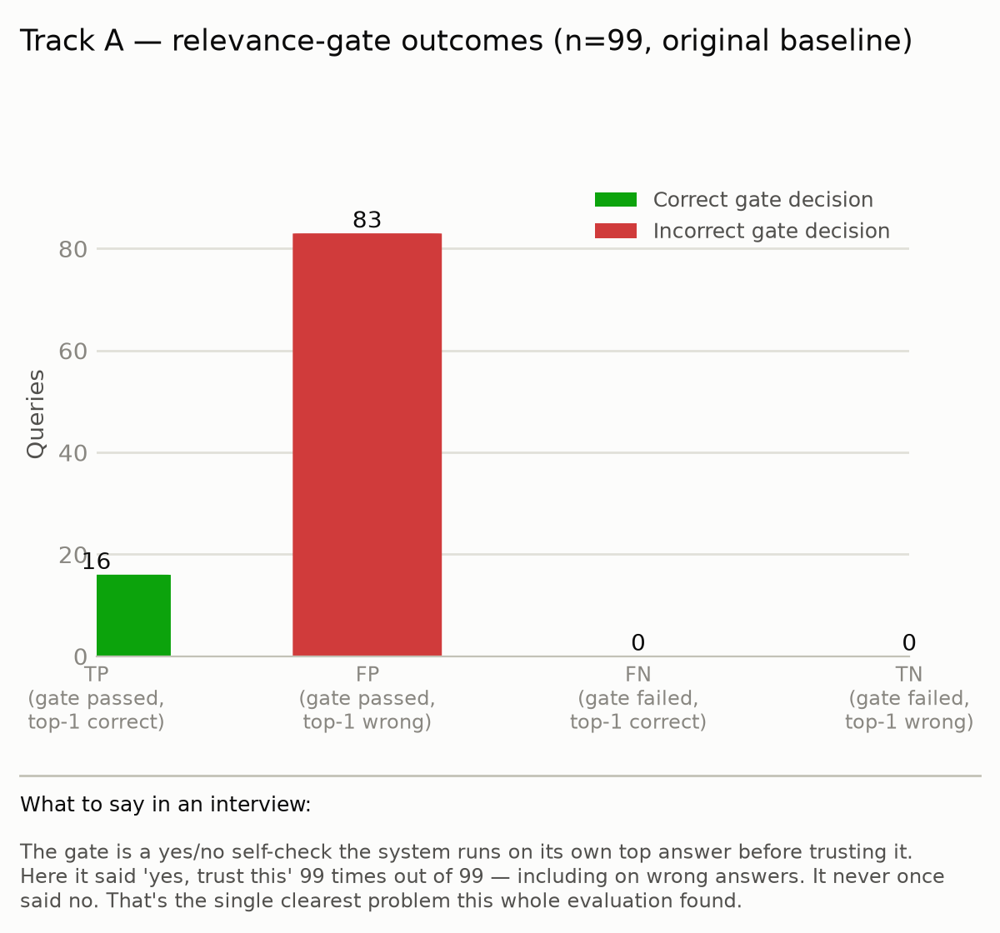

# Track A — Retrieval Quality Evaluation, Version 1

**System evaluated:** the real, currently-deployed `retrieve_context()` / `check_relevance()` functions in `app/tools/rag_tool.py`, executed against the ChromaDB instance already populated at `clario-ml-sidecar/vector_store/chroma_data` — no index was rebuilt for this report; this is what the system actually returns.

**Ground truth:** `Testing/12-Data-Science-Evaluation/data/retrieval_ground_truth.csv` — 99 human-reviewed queries (Q001–Q100, `Q089` absent from the source sheet), covering all 20 KB docs plus 10 queries the reviewer judged belong to a domain the system didn't route to at the time ("HR").

**Scripts/artifacts:** `scripts/eval_retrieval.py` (all metric code + formulas as docstrings), `results/v1_per_query_results.csv` (all 99 rows, full detail), `results/v1_summary_metrics.json` (raw numbers behind every table below).

**Note (added later, see `TEST_REPORT_V2.md` §6):** `results/v1_per_query_results.csv` and `results/v1_summary_metrics.json` were later regenerated in place after several fixes — removing 30 stale index chunks, raising the relevance-gate threshold, and a general KB wording pass — so those two files now reflect the *current* state, not the numbers in the tables below, and now also include Precision@2, F1, and other metrics not shown here. The tables, figures, and findings in this document remain the accurate historical record of what this report actually measured; `TEST_REPORT_V2.md` §6 and §6.2 have the before/after comparison and the current, final metric set (with F1 and Precision@2/@3 added alongside @4). Figure 2 (§2.2) was also regenerated to fix a chart bug that made its "technical" bars invisible — the numbers were always correct, only that image was broken; see `TEST_REPORT_V2.md` §5. Every figure below now also carries a "What to say in an interview" caption directly on the image.

---

## 1. Methodology

### 1.1 Ground truth and its one required adaptation

Each row pairs a real or realistic customer query with the KB doc(s) a human reviewer judged should answer it (`relevant_doc_ids`, empty/`none` where no current doc qualifies). `domain` is `technical`, `billing`, or — for 10 rows — `HR`, a category the reviewer introduced for tickets needing a kind of handling the system didn't route to at the time.

`retrieve_context()` only accepted `domain ∈ {"technical", "billing"}` at evaluation time — it raised `ValueError` on anything else. Since `routing_node.py` routed these 10 tickets to `billing` (they all originated as Payment/Refund/Billing-category tickets in the source dataset), this evaluation substitutes `domain="billing"` for HR rows to reproduce what the deployed system actually did, while keeping the reviewer's original ground truth (9 of the 10 say `none` — no doc should match; `Q024` is the one exception, kept as reviewed). Every HR-substituted row is flagged in the results (`domain_substituted=True`) and reported separately.

### 1.2 A scoring bug found and fixed before any number below was trusted

The first run of this evaluation returned exactly 0.0 on every metric — investigated before being reported as a finding. Cause: the ground truth uses bare KB filenames (`login_reset.md`), but the real ChromaDB metadata stores them domain-prefixed (`technical/login_reset.md`). Every correct retrieval was being scored as a miss over a path-prefix string mismatch. Fixed by comparing on basename (`_basename()` in `eval_retrieval.py`) before any metric is computed. All numbers below are post-fix.

### 1.3 Metric formulas

**What "@k" means.** The system returns its results as a ranked list, best match first. "@k" means "looking only at the top k of those results" — `Precision@3` judges only the first 3 results returned, `Precision@4` the first 4, and so on. This report uses `k=4` throughout (the number of results `retrieve_context()` actually returns to the rest of the pipeline), plus `k=3` alongside it so a stricter cutoff can be compared against it directly.

Let a query's retrieval return a ranked list of up to `k=4` KB sources, and let `relevant` be the ground-truth set of correct sources for that query (possibly empty).

**Precision@k** — of the k slots returned, what fraction are actually correct:
```
Precision@k = |{top-k results} ∩ relevant| / k
```
Well-defined even when `relevant` is empty.

**Recall@k** — of everything that would count as correct, what fraction did the top-k actually surface:
```
Recall@k = |{top-k results} ∩ relevant| / |relevant|
```
Undefined (0/0) when `relevant` is empty — excluded from the Recall average, so the average reported is only over the 59 queries where a correct answer exists to be found.

**Mean Reciprocal Rank (MRR)** — how early the first correct result appears, averaged over queries:
```
RR = 1 / rank of first relevant result   (0 if none of the top-k are relevant)
MRR = mean(RR) over queries with relevant ≠ ∅
```

**Normalized Discounted Cumulative Gain (nDCG@k)** — rewards correct results more when they rank higher, using binary gains (1 = relevant, 0 = not):
```
DCG@k  = Σ_{i=1..k} gain_i / log2(i + 1)
IDCG@k = the same sum if all min(|relevant|, k) relevant items were ranked first (best possible order)
nDCG@k = DCG@k / IDCG@k
```
Undefined when `relevant` is empty — same exclusion rule as Recall.

**The relevance gate as a binary classifier.** `check_relevance()` returns a single pass/fail per query (its own top-1 similarity score ≥ 0.3). Treating "the top-1 result is actually correct" (`top1_correct`) as ground truth for that decision gives a standard 2×2 confusion matrix (TP/FP/FN/TN), from which:
```
Gate Accuracy  = (TP + TN) / N
Gate Precision = TP / (TP + FP)
Gate Recall    = TP / (TP + FN)
```

---

## 2. Results

### 2.1 Headline metrics

| Metric | Value | N |
|---|---|---|
| Precision@3 (all 99 queries) | 14.5% | 99 |
| Precision@4 (all 99 queries) | 12.1% | 99 |
| Precision@3 (queries with a real answer only) | 24.3% | 59 |
| Precision@4 (queries with a real answer only) | 20.3% | 59 |
| Recall@3 | 62.7% | 59 |
| Recall@4 | 70.3% | 59 |
| MRR | 0.469 | 59 |
| nDCG@4 | 0.518 | 59 |



**What this figure shows:** the same 8 numbers from the table above, as two panels because Precision/Recall (percentages) and MRR/nDCG (0–1 scores) aren't on the same scale. Left: Precision@k and Recall@k at both cutoffs, on all 99 queries and on the 59 that actually have a correct answer. Right: MRR and nDCG@4, which only make sense on those same 59.

**What to take from it:** the two bar heights tell opposite stories on purpose — Recall climbs to 70.3% (the correct doc usually *is* in there somewhere), while Precision stays under 25% (it's usually buried among several wrong results). Both are true of the same system at the same time; §2.3 shows why.

### 2.2 Results by domain

| Domain | N | N with a real answer | Precision@4 | Recall@4 | MRR |
|---|---|---|---|---|---|
| technical | 27 | 16 | 3.7% | 25.0% | 0.130 |
| billing | 62 | 42 | 17.3% | 86.9% | 0.597 |
| HR → billing (substituted) | 10 | 1 | 2.5% | 100%* | 0.500 |

\* n=1 — a single query, not a stable estimate.



**What this figure shows:** the table above, split into two panels for the same scale reason as Figure 1 — Precision@4/Recall@4 (percentages, left) and MRR (0–1 score, right), each broken out by domain instead of pooled together.

**What to take from it:** the gap between domains is the real story here, not the pooled average from Figure 1. Billing's orange bar (Recall@4 = 86.9%) towers over technical's (25.0%) — technical queries are far less likely to find their correct doc at all. The `HR → billing` bars (n=10, only 1 with a real answer) are shown for completeness but shouldn't be read as a reliable estimate on their own.

### 2.3 Vector store composition at evaluation time

```
kb_support_docs: 71 total chunks, 51 unique source_file values
  20  →  the current KB docs (10 technical/*.md + 10 billing/*.md), 1 chunk each
  21  →  precedent_memory (excluded by retrieve_context()'s own filter)
  30  →  additional .txt-named chunks not present in the current repo's KB source files
```



**What this figure shows:** what's actually sitting inside the searchable collection `retrieve_context()` queries, broken into the 3 kinds of content found there — not a metric, an inventory.

**What to take from it:** only 28% of what's indexed (20 of 71 chunks) is the current, real KB content. The 30-chunk "other" bar is content that doesn't correspond to any file in the current repo, and every query has to search past it — a likely contributor to why Figure 2's technical-domain bars are so much lower than billing's, since this content skews heavily toward login/account/auth topics that overlap the technical KB's own subject matter.

### 2.4 Relevance gate, measured as a binary classifier

| | Gate said "pass" | Gate said "fail" |
|---|---|---|
| Top-1 was actually correct | TP = 16 | FN = 0 |
| Top-1 was NOT actually correct | FP = 83 | TN = 0 |

Gate Accuracy = 16.2%, Gate Precision = 16.2%, Gate Recall = 100%.



**What this figure shows:** `check_relevance()` is a yes/no check the system runs on its own top result before trusting it. Treating "was the top result actually correct?" as the true answer, every one of the 99 queries falls into one of four outcomes: TP (gate said yes, correctly), FP (gate said yes, incorrectly), FN (gate said no, incorrectly), TN (gate said no, correctly) — green bars are outcomes where the gate got it right, red bars where it got it wrong.

**What to take from it:** the two right-hand bars (FN, TN) are exactly zero — the gate never once said "no" across all 99 queries, including the 40 with no correct answer at all. Every "no" would have been the right call in those 40 cases; the gate simply never produces one at its current threshold.

### 2.5 Content coverage

40 of the 99 queries had no correct doc for the system to find at all. The reviewer's notes named a specific missing doc for 32 of these; the remaining 8 (Q001, Q005, Q006, Q018, Q042, Q052, Q082, Q085) were flagged as gaps without a proposed doc yet. 10 of the 40 were the `HR`-domain rows.

| Suggested doc | Queries | Count |
|---|---|---|
| `WebXPay.md` | Q022, Q041, Q043, Q045, Q047, Q049, Q051, Q084 | 8 |
| `account_issue.md` | Q032, Q036, Q040, Q086, Q091, Q094, Q096, Q098 | 8 |
| Refund-eligibility-window policy | Q017, Q019, Q029, Q068 | 4 |
| `misclassification_billing.md` | Q027, Q064, Q078, Q081 | 4 |
| `payment_status.md` | Q023, Q074, Q076 | 3 |
| `course_cancellation.md` | Q058, Q059, Q070 | 3 |
| `enrollment_issues.md` | Q053 | 1 |
| `course_issues.md` | Q057 | 1 |

---

## 3. Improvements Identified From This Evaluation

- **KB content gaps.** 32 queries named a specific missing doc (table above); 8 more had no current answer and no proposed doc yet.
- **No routing destination for HR-flavored tickets.** 10 queries (bank-slip mismatches, medical-emergency refunds, parental-consent issues, gateway-team escalations) needed handling the system didn't provide — these need a human reviewer, not just a KB doc.
- **Relevance gate calibration.** The gate approved 100% of the 40 queries with no correct answer available (§2.4) — its 0.3 threshold does not currently distinguish a good match from a bad one on this dataset.
- **Vector store content.** 30 of the 71 indexed chunks (§2.3) don't correspond to any file in the current KB source directories and compete with the current docs during retrieval.

## 4. Improvements Implemented

In direct response to the missing-HR-routing finding, a full HR specialist path was designed and implemented:

- **New `hr` KB domain** (`vector_store/kb_documents/hr/`) with three new docs (`course_cancellation.md`, `course_issues.md`, `payment_linkage_escalation.md`), and `retrieve_context()` extended to accept `"hr"` as a third domain alongside `"technical"`/`"billing"`.
- **Keyword-based HR detection** in `decide_routing()`, tuned in two stages: an initial keyword set, then a corrected version after evaluation against realistic ticket text showed the first version missed most real cases (ordinary billing wording like "refund"/"payment" was outscoring the HR signal). The corrected version splits keywords into a hard-trigger tier (bank slip, medical, parental consent, instructor) and a weak-signal tier (sponsorship, wrong account, misclassified, linked to the wrong), each with different comparison rules, verified against this evaluation's own ground-truth queries.
- **A new `hr_agent` specialist node** that drafts a response for HR-routed tickets, with its own prompt tuned to avoid promising outcomes (refund amounts, approvals) that require human review first.
- **Mandatory escalation for HR tickets** — an HR-routed ticket is never auto-sent to the customer, regardless of priority/sentiment/confidence.
- **A cache-check guard** so a ticket with an HR hard-trigger phrase can't bypass the above via a high-similarity match to a past resolved ticket.
- **Admin UI**: the reason a ticket needs human review is now surfaced in the admin console alongside its existing escalation-reason tags.

**Re-tested after implementation:** running the 10 real HR-domain ground-truth queries above through the corrected routing logic, 5 of 10 (Q024, Q057, Q058, Q059, Q076) now route to `hr`. The remaining 5 use phrasing with no matching keyword at all (e.g. "relocating abroad," "incorrect bank account number") — a known limitation of keyword-based detection, not yet addressed.

**Not yet addressed:** the remaining 5 KB backlog docs (`WebXPay.md`, `account_issue.md`, refund-eligibility-window policy, `misclassification_billing.md`, `payment_status.md`), the relevance gate's calibration, and the vector store content review (§2.3) remain open for a future pass.

## 5. Data-Quality Notes on the Ground Truth Itself

- N=99, not 100 — `Q089` is absent from the reviewed sheet (Q088 → Q090).
- `Q024` is the one `HR`-domain row with a non-`none` `relevant_doc_ids` (`payment_failed.md`), unlike all 9 other HR rows. Kept exactly as reviewed.
- This ground truth reflects a single reviewer's pass. A second, independent labeler and an inter-annotator agreement figure have not yet been produced.

---

*Generated from `scripts/eval_retrieval.py` against `clario-ml-sidecar/vector_store/chroma_data` as it existed at the time of this run. Full per-query detail: `results/v1_per_query_results.csv`. Raw metrics: `results/v1_summary_metrics.json`.*
