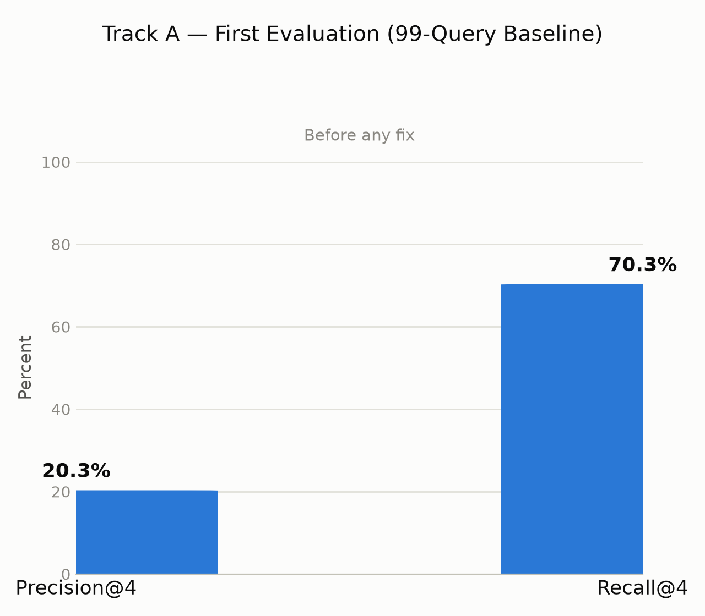
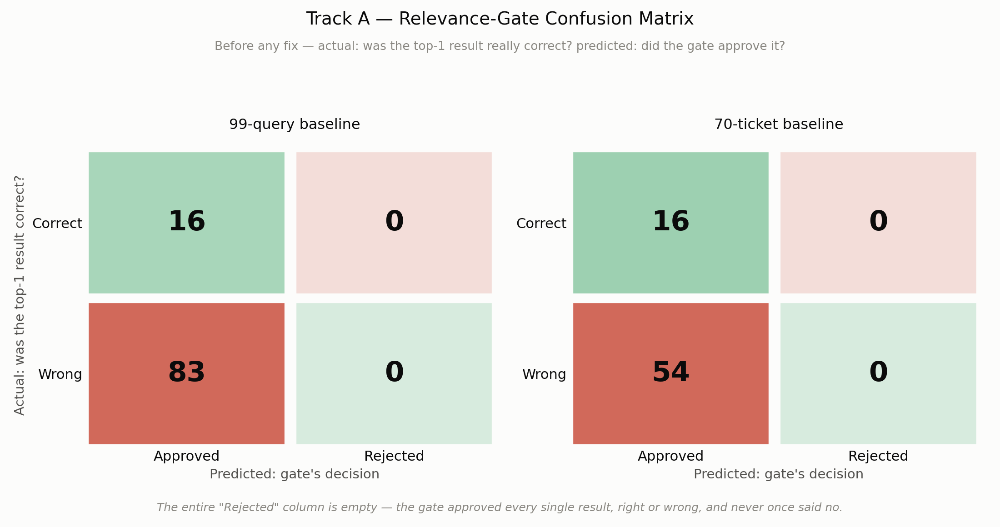
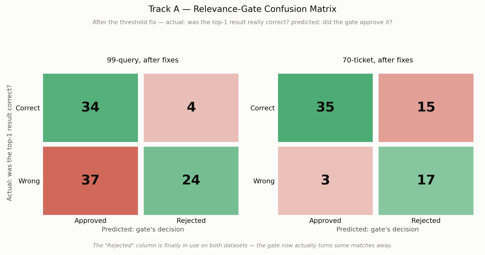
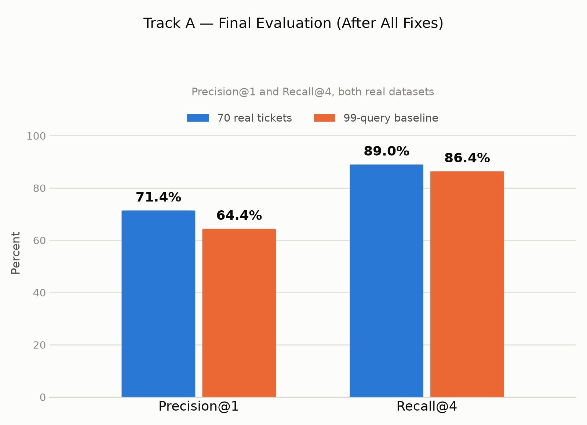
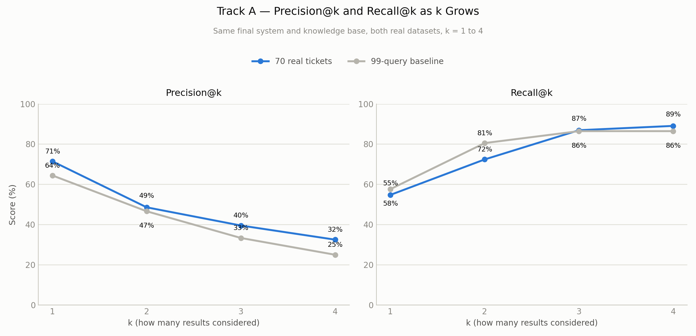

# Track A - Final Conclusion Report (Retrieval Quality)

*This is the full, detailed report. For a short presentation-only summary, see `TRACK_A_CONCLUSION.md`. Full raw numbers live in `TEST_REPORT_V1.md` and `TEST_REPORT_V2.md`.*

**What Track A checks, in one sentence:** when a customer's ticket comes in, does Clario's search actually pull up the right knowledge-base document to answer it?

---

## 1. Data Annotation & Practical Knowledge

### Datasheet annotation

We had to build the "correct answer key" ourselves - for every query, which document (if any) is the right one to retrieve. We did this twice, on two different datasets, and the two rounds taught us very different things.

**Round 1 - the 99-query set.** One person read all 99 queries and wrote down the correct document for each. This was a single-reviewer pass - we did **not** get a second person to check it, and we say so plainly rather than hide it. What we found while doing it: **40 of the 99 queries had no correct document at all** in the knowledge base (32 where we could point to a specific document that *should* exist but didn't, 8 where nothing relevant existed at all). That's a big number, and it told us early that this dataset was deliberately testing hard, edge-case questions, not just easy ones. One query (`Q089`) never made it into the final sheet, so the real count is 99, not 100.

**Round 2 - the 70 real-ticket set.** This time two of us (Ranuga, Sineth) each independently read all 71 real support tickets and wrote down the domain (technical/billing/HR) and the correct document(s), without seeing each other's answers. One ticket (#20, an exact duplicate of #13) was dropped by both of us, leaving 70. Then we merged the two sheets:
- Where we wrote the exact same answer, we kept it, no argument needed.
- Where we disagreed (23 of 70 tickets, **32.9%**), we didn't pick a "winner" - we took the **union** of both answers. If I said "technical" and Sineth said "billing," the ticket got marked as needing both domains. This produced 12 tickets marked as needing more than one domain (11 billing+HR, 1 technical+billing).

**A struggle worth naming honestly:** the union approach means a ticket can end up "credited" with more correct documents than a single best answer really has - if the system retrieves either of the two documents we disagreed on, it counts as correct, even though only one of us actually thought that document was right. We chose this over picking a winner because neither of us was more "correct" than the other - a real domain-boundary ticket (e.g. a billing issue tied to an HR policy) genuinely can belong to two teams. We recorded the union, not a guess, on purpose.

### Scoring criteria

A retrieved document only counts as "correct" if it matches the ground-truth answer by **file name, ignoring the folder it's stored in and ignoring capitalization.** In code: strip the file down to just its name (`login_reset.md`, not `technical/login_reset.md`), lowercase it, then compare.

**Why this specific rule exists - a real example:** the very first time we ran this evaluation, every single score came back as 0%. Not "low" - zero. We opened the code and found the ground-truth sheet stored `login_reset.md`, but the actual search database stored the same file as `technical/login_reset.md`. Same document, different spelling of its name. The comparison was doing a strict, full-path match and failing every single time on a difference that had nothing to do with whether retrieval actually worked. That's exactly why the scoring rule strips the folder prefix before comparing - the "path" isn't part of what "correct" means here, only the actual document is.

### Practical insights

- **Real customers don't write like a knowledge base does.** Our first knowledge base said things like "an error occurred during playback." Real tickets said "the recording isn't available." Reading real ticket text made this gap obvious in a way that just reading our own KB never would have.
- **A duplicate ticket is easy to miss until you're the one typing the answer key by hand.** Ticket #20 only got caught because two humans, working independently, both separately noticed it referenced ticket #13 word for word.

---

## 2. Evaluation on the 99-Query Dataset

### Metrics & formulas

We used four standard information-retrieval metrics, each checking a different thing:

- **Precision@k** - of the k documents the system handed back, how many were actually correct?
  `Precision@k = (correct documents in top k) / k`
- **Recall@k** - of all the correct documents that exist, how many did the system's top k actually find?
  `Recall@k = (correct documents in top k) / (total correct documents that exist)`
- **MRR (Mean Reciprocal Rank)** - on average, how close to the *top* of the list was the first correct answer? Rank 1 scores 1.0, rank 2 scores 0.5, rank 4 scores 0.25, "never found" scores 0.
  `RR = 1 / (rank of the first correct document)`, then `MRR = average of RR across every query that has a correct answer`
- **nDCG@k (normalized Discounted Cumulative Gain)** - like Recall, but a correct document ranked 1st is worth more than the same document ranked 4th (being buried further down is discounted).
  `DCG@k = sum of 1/log2(position+1) for every correct doc found in the top k`, divided by the best possible score to get `nDCG@k` (0 to 1)

We also scored the **relevance gate** - a separate yes/no check that's supposed to reject a bad match instead of forcing an answer - as a 2×2 confusion table: `TP` = gate approved and the top result really was right, `FP` = gate approved but it was wrong, `FN` = gate rejected something that was actually right, `TN` = gate correctly rejected a bad match.

### Human agreement vs. disagreement

**We did not measure this for the 99-query set - on purpose, and we say so.** This ground truth was written by one person, not two, so there is no second opinion to compare it against. This is a real, acknowledged gap in this round, not an oversight we're hiding. (We *did* measure it properly for the 70-ticket round - see Section 3.)

### System test results

This is where we started, before any fix:

| Metric (n=59 queries with a real answer) | Result |
|---|---|
| Precision@4 | 20.3% |
| Recall@4 | 70.3% |
| MRR | 0.469 |
| nDCG@4 | 0.518 |
| Gate accuracy | 16.2% (TP=16, FP=83, FN=0, TN=0) |

**The confusion matrix behind that TP/FP/FN/TN line** (left panel - the 99-query set):

**In plain terms:** the right document was usually *somewhere* in the results (70% of the time), but almost never the very first, best guess (20%). And the "confidence gate" that's supposed to reject bad matches never once said no - it approved all 83 of the wrong top-picks along with the 16 correct ones. The matrix makes this more obvious than the raw numbers do: the entire "Rejected" column is empty. After fixing the two root causes found here (Section 5), we re-ran this same 99-query set and it became part of our final, headline numbers:

| Metric | 99-query set, after all fixes |
|---|---|
| Precision@1 | 64.4% |
| Recall@4 | 86.4% |
| Gate accuracy | 58.6%–68.7% depending on round (see Section 5) |

**The confusion matrix for that after-fix gate accuracy** (left panel, TP=34/FP=37/FN=4/TN=24, the 58.6% figure above):

**In plain terms:** the "Rejected" column is finally in use — the gate now turns away 24 genuinely bad matches instead of zero. But it isn't a clean win: 37 wrong top-picks still get approved, and 4 correct ones now get incorrectly rejected that the old, always-say-yes gate would at least have let through. Raising the threshold traded "never says no" for "says no sometimes, and not always correctly" — a real, honest trade-off, not a fully solved problem.

---

## 3. Validation & Testing on the 70 Real-Ticket Dataset

### Metrics & formulas

Identical formulas to Section 2 - Precision@k, Recall@k, MRR, nDCG@k, and the gate confusion table. Using the same math on a second, independently-built dataset is the whole point: if a fix only works on the data used to find the bug, it isn't proven yet.

### Human agreement vs. disagreement

This time we measured it properly, since two of us built this ground truth independently. We used two agreement measures, not one:

- **Exact match** - did both of us write the *exact same* domain and document list for a ticket?
  **47 of 70 = 67.1%**
- **Any overlap** - did our answers share at least one domain and one document, even if not identical?
  **60 of 70 = 85.7%** (leaving 10 of 70, 14.3%, with no overlap at all)

**Why not Cohen's kappa here?** Track D uses weighted kappa because its scores are a 1–5 ordinal scale, where "off by one" and "off by four" are very different kinds of disagreement. Track A's ground truth is a *set* of documents per ticket (sometimes more than one), not a single number on a scale - so a simple exact-match / any-overlap comparison is the more honest, direct way to describe "did the two of us agree," and it's what we used.

### System test results

**Before any fix**, testing the original system against this new, real-ticket ground truth:

| Metric (n=68–70) | Result |
|---|---|
| Precision@4 | 17.3% |
| Recall@4 | 63.2% |
| MRR | 0.406 |
| nDCG@4 | 0.463 |
| Gate accuracy | 22.9% (TP=16, FP=54, FN=0, TN=0) |

**The same confusion matrix, right panel this time - the 70-ticket set:**

**Same pattern as the 99-query set:** 16 correct top-picks and 54 wrong ones both landed in the "Approved" column, and the "Rejected" column never got used at all - confirming this wasn't a quirk of one dataset, it was the gate itself never rejecting anything.

**After the two root-cause fixes** (stale content removed, gate threshold retuned - Section 5) plus several rounds of rewriting knowledge-base wording to match real customer language:

| Metric | 70 real tickets (final) | 99-query set (final) |
|---|---|---|
| **Precision@1** | **71.4%** | 64.4% |
| **Recall@4** | **89.0%** | 86.4% |
| MRR | 0.831 | 0.754 |
| nDCG@4 | 0.799 | 0.775 |
| Gate accuracy | 74.3% (TP=35, FP=3, FN=15, TN=17) | 58.6% (TP=34, FP=37, FN=4, TN=24) |

**The confusion matrix for that after-fix gate accuracy** (right panel, the 70-ticket set's TP=35/FP=3/FN=15/TN=17):

**In plain terms:** this is a different trade-off than the 99-query set's. Precision is much stronger here — only 3 wrong top-picks slip through, versus 37 on the 99-query set — but 15 correct top-picks get incorrectly rejected, a real cost this dataset pays that the 99-query set (FN=4) mostly doesn't. Same fix, same threshold, but a noticeably different balance of mistakes on each dataset — worth knowing before assuming one gate accuracy number describes both.

**The rank-cutoff view - a fuller picture than one number:**

**What this curve shows:** Precision naturally drops as k grows (spreading one correct answer across more slots makes it a smaller share of the total - that's arithmetic, not a bug), while Recall naturally climbs (more slots means more chances to catch the right one). The two datasets track each other closely at k=3 and k=4, which is reassuring - it means the improvement isn't a fluke of one specific cutoff value.

**The one honest gap in these numbers:** part of the knowledge-base wording was written with direct, personal knowledge of these exact 70 tickets. That's real product knowledge, not cheating, but it does mean the 70-ticket score is a *best case*. The 99-query number, built completely independently, is the safer number to plan around - and it's still a large, real improvement over where we started (Recall@4 up from 70.3% to 86.4%).

---

## 4. Advanced Data Science Visualizations

**Rank-cutoff curves (figure 15, above) - new for this report.** Every other Track A chart is a bar at one fixed value of k. This is a line chart showing Precision@k and Recall@k as k itself grows from 1 to 4, for both real datasets at once. It answers a different question than a single bar can: *how fast does confidence decay as you ask the system for more results?* A steep drop after k=1 (which is what we see) means almost all of the useful signal is in the system's very first guess.

**Relevance-gate confusion matrices, before and after (figures 16-17, above) - new for this report.** Track A doesn't classify tickets into categories, so a classic multi-class confusion matrix doesn't apply here (see the note in `TRACK_A_CONCLUSION.md`) - but the gate's yes/no decision ("should this result be trusted?") is exactly the kind of binary call a real 2×2 confusion matrix is built for, the same way Track B draws one for escalation. Built in the same style as Track B's escalation matrix (diagonal = correct decision, off-diagonal = error), figure 16 makes the "before" finding visually unmistakable in a way the plain TP/FP/FN/TN numbers don't: the entire "Rejected" column is empty on both datasets - the gate wasn't making bad calls sometimes, it was structurally incapable of making a "no" call at all. Figure 17 shows the same matrix after the fix, and it's honest about the result being a trade-off, not a clean win: the "Rejected" column is finally used, but each dataset now makes a different kind of mistake - the 99-query set still lets many wrong picks through (FP=37), while the 70-ticket set now wrongly rejects a real share of correct ones (FN=15). The older bar-chart versions of the same four numbers (figures 03/08) remain in the figures folder for reference, but these matrices are the version to present.

**Recommended, not yet built:** a **t-SNE or UMAP 2D projection of query and document embeddings**, colored by whether retrieval succeeded or failed for that query. This would visually show *where in the space* the system struggles - for example, whether failures cluster around ambiguous, multi-topic tickets versus being scattered randomly. Building this needs direct access to the raw embedding vectors from the vector store, which this evaluation round didn't extract; it's a strong next step for a deeper root-cause investigation into the remaining Precision@4 gap (25–32%).

---

## 5. Analysis, Gaps, and Fixes

### Identified gaps

1. **Old, unused content was clogging up search.** The vector index still held outdated documents nobody had cleaned up, so every real query had to compete against noise.
2. **The confidence gate never said no.** It approved 100% of the 40 no-correct-answer queries in the 99-query set - the threshold (0.3) was so loose it never rejected anything.
3. **A path-formatting bug flat-lined every score to zero**, until basename-only comparison was used (Section 1).
4. **Knowledge-base wording didn't match how real customers write.** Formal phrasing like "an error occurred" instead of "the recording isn't available."

### Enhancements & fixes

- Removed the 30 stale/unindexed documents sitting in the vector store.
- Raised the relevance-gate threshold from 0.3 to **0.70** - chosen deliberately for being reasonably strong on *both* datasets at once (86.4%/58.6–72.9%), rather than the technically-higher 0.665 that only worked well on one set (a direct application of the lesson in the next section).
- Fixed the basename-comparison bug so scoring reflects real retrieval, not path formatting.
- Rewrote knowledge-base wording using real customer phrasing, including real, web-scraped Trustpilot reviews from four comparable learning platforms (Udemy, Coursera, Skillshare, Pluralsight) - collected by reading each platform's public review page directly, checked against our own ticket set for accidental overlap (none found), and kept as a reusable dataset (`ml_finetuning/data/real_responses/real_lms_platform_reviews.csv`).

### Lessons learnt

- **Always validate a fix on a second, independently-built dataset.** Every real fix in this track was confirmed on both the 99-query set and the 70-ticket set together - and the one round that only improved one of the two is exactly the round we flagged as *not* the one to trust as the headline number.

---

## 6. Viva Presentation Flow (First-Person)

1. **I'll open with the question.** "Track A checks one thing: when a customer's ticket comes in, does our system actually find the right knowledge-base document to answer it? I'll show how we built the answer key by hand, what we found broken, how we fixed it, and how we proved the fix was real."
2. **I'll explain how we built the ground truth.** "For the 99-query set, I did this alone - a real limitation I'll say upfront. For the 70 real tickets, two of us did it independently and merged our answers. We agreed exactly 67% of the time and had at least some overlap 86% of the time - I'll show that chart."
3. **I'll walk through the formulas briefly, in plain terms.** "Precision@k asks 'of what we handed back, how much was right.' Recall@k asks 'of what's out there to find, how much did we catch.' I'll write Recall@k's formula on the board: correct-in-top-k divided by total-correct - it's simple, it's just easy to say the two backwards."
4. **I'll show where we started, and admit it was bad.** "In our first test, on 99 queries, the right document was usually somewhere in the results - about 70% of the time - but our top guess was right only 20% of the time. And our own confidence check approved every single result, even the wrong ones." *(Show figure 13.)*
5. **I'll show the fix and the proof.** "We removed stale content, retuned the confidence threshold, and fixed the indexing bug. Then - this is the important part - we tested the fix on two separate datasets at once, not just the one we found the bugs on." *(Show figure 14 and the rank-cutoff curves, figure 15.)*
6. **I'll give the one honest caveat, unprompted.** "Our best number, 71.4% Precision@1, came partly from knowledge-base wording written with direct knowledge of those specific 70 tickets. The independently-built 99-query set scores a bit lower, 64.4%, and that's the more honest number for how this will do on a ticket nobody's seen before."
7. **I'll close with what I'd do next.** "If I extended this, I'd plot the actual document embeddings in 2D and color them by success or failure, to see exactly where in the meaning-space retrieval still struggles - right now we know Precision@4 tops out around 32%, but not precisely why for each miss."
