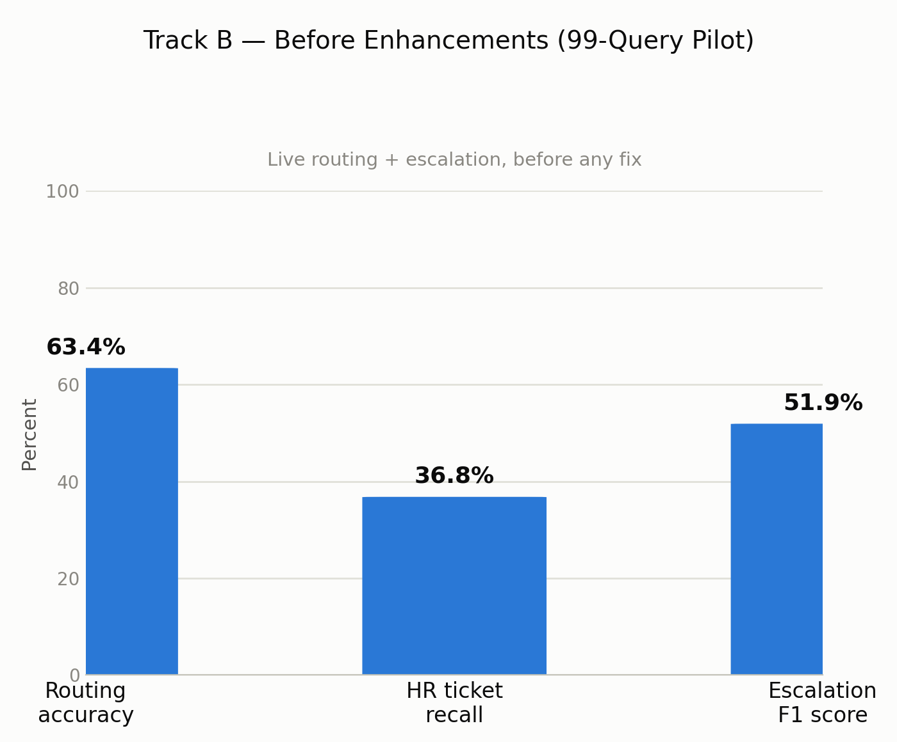
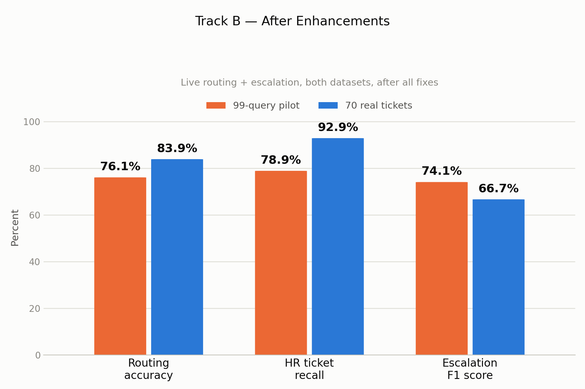
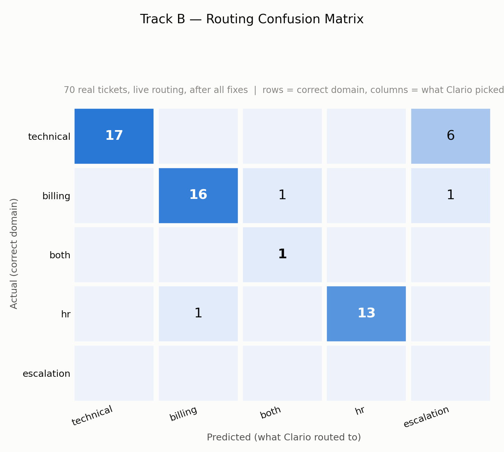
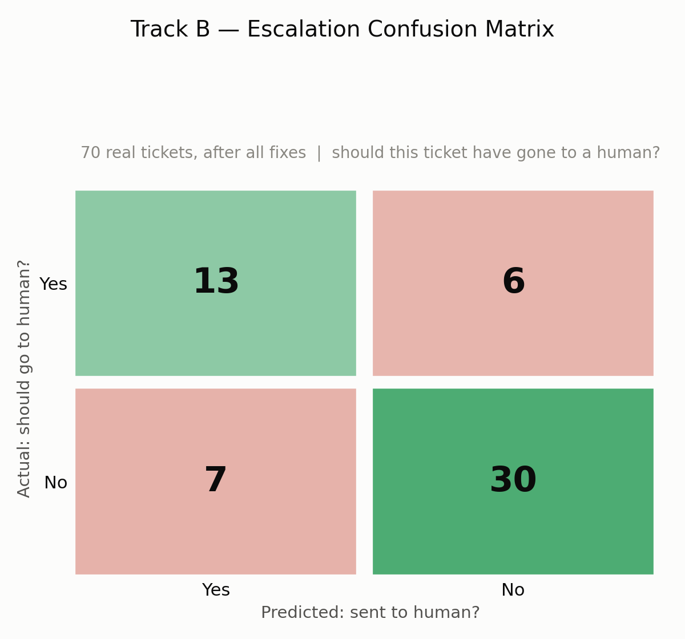
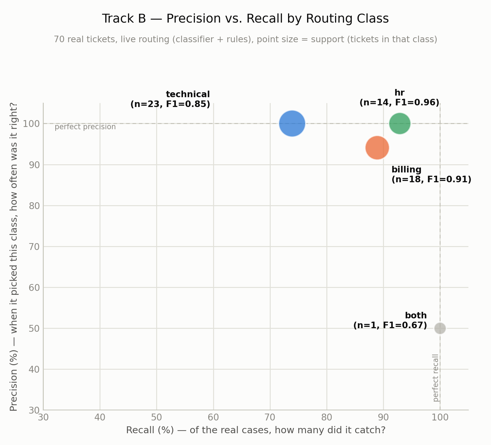

# Track B — Final Conclusion Report (Routing & Escalation Accuracy)

*This is the full, detailed report. For a short presentation-only summary, see `TRACK_B_CONCLUSION.md`. Full pilot detail lives in `pilot-99-query/PILOT_99_REPORT.md`.*

**What Track B checks, in one sentence:** when a ticket comes in, does it get sent to the right team (technical/billing/HR), and does the system correctly know when a human needs to step in first?

---

## 1. Data Annotation & Practical Knowledge

### Datasheet annotation

Two of us (Vinma, Sineth) each independently filled in `data/routing_annotation_sample.csv` for all 70 real tickets, without seeing each other's answers or what the live system actually decided. We weren't starting from a blank sheet, though — a script (`prepare_routing_annotation.py`) first worked out a **mechanical** guess for each ticket's correct team, reusing Track A's already-verified domain labels: one domain → that team directly; both technical and billing → "both"; anything else → flagged for a human to decide. That flagged exactly **11 of 70 tickets** — every one of them a case needing both billing and HR judgment, a combination the system has no real destination for.

So each of us only had to write two things by hand: **should this ticket escalate to a human** (yes/no, for all 70), and, only for those 11 hard cases, **which single team should this really go to.**

**A struggle worth naming honestly:** a blank cell in the override column was meant to mean "I agree with the mechanical guess" — but that convention was never written down anywhere during the pilot round, and the merge script initially treated a blank cell as "no opinion" rather than "agree," silently dropping at least one real override (a ticket both of us had actually written "hr" for, against a mechanical guess of "billing"). This is a genuine annotation-process bug, not a labeling mistake, and it's exactly the kind of thing you only catch by checking the merge output against the raw sheets by hand.

Where we disagreed on either question, we didn't force an answer — the row was marked `NEEDS_REVIEW` and logged to `data/routing_disputes.txt` for us to actually discuss, rather than guessed at or split down the middle. That was **17 individual disagreements across 14 unique tickets** (three tickets — RB012, RB031, RB041 — had us disagreeing on *both* the team and the escalation call at once).

### Scoring criteria

- **"Which team is this ticket's correct destination?"** — mechanically derived from Track A's own domain annotation. A single clear domain maps straight across; a ticket needing both technical and billing knowledge is labeled "both"; anything murkier goes to a human.
- **"Should this ticket have escalated to a person?"** — the working rule we used: *a ticket that names a real policy problem, or describes an unresolved repeat issue, should have escalated.* In practice we looked at the ticket's real, recorded `recommended_action` text as a strong signal — wording like "escalate," "assign a dedicated followup," or describing something the system genuinely can't do itself (a manual account correction, a refund exception) meant a strong "yes." Wording like "tighten the reply's phrasing" or "confirm and reply" meant a strong "no." A higher real priority (Medium/High/Critical) leaned the call toward "yes" too.

### Practical insights

- **A generic AI category label can be almost useless for routing.** On real tickets, the classifier returns a vague label like *"General Support"* roughly half the time — a label that fits technical, billing, and HR tickets about equally, so it tells the routing rules nothing at all.
- **The keyword list backing up that weak classifier was tuned for the wrong vocabulary.** It was built to catch words like "login" or "payment" — but real customers write "the recording isn't available," or describe a cancellation in their own words with no obvious keyword at all.
- **Reading real tickets by hand is what surfaces real judgment calls a rulebook can't anticipate** — the plain-cancellation-request case ("I've already attended a few sessions, so I'm not expecting a full refund, but is there anything I can get back?") only stood out as a genuine HR case because a human read the actual sentence, not because any keyword matched it.

---

## 2. Evaluation on the 99-Query Dataset

### Metrics & formulas

- **Routing accuracy** — of every ticket, what share got sent to the exact right team?
  `accuracy = (number of tickets routed correctly) / (total tickets scored)`
- **Per-class recall** (e.g. HR recall) — of all the tickets that *should* go to a given team, how many actually did?
  `recall (for class X) = TP / (TP + FN)` — true positives for that class over everything that really belonged there
- **Escalation F1** — escalation is a yes/no call, so we use the standard way of combining precision and recall for a binary decision into one number:
  `F1 = 2 × (precision × recall) / (precision + recall)`
- **Cohen's kappa (unweighted)** — used to check how much the two of us agreed with each other, beyond what random chance would already predict. Unlike Track D's 1–5 score kappa, routing/escalation labels aren't an ordered scale (technical isn't "closer to" billing than HR is), so this uses plain, unweighted kappa — every disagreement counts the same, there's no "partial credit" for a near-miss.

### Human agreement vs. disagreement

Two annotators, 99 queries:

| Comparison | Agreement | Kappa | Read |
|---|---|---|---|
| Should this escalate? (all 99) | 71/99 = 71.7% | 0.430 (moderate) | Real, but not extreme, judgment disagreement |
| Which team? (40 flagged rows) | 38/40 = 95.0% | 0.922 (near-perfect) | Once a case is genuinely unclear, we still mostly land on the same team |

28 rows were left as genuine `NEEDS_REVIEW` disagreements rather than force-resolved; scoring below uses the 71 agreed-upon rows.

### System test results

Before any Track B fix:

| Metric | Result |
|---|---|
| Routing accuracy | 63.4% |
| HR ticket recall | 36.8% |
| Escalation F1 | 51.9% |

**In plain terms:** routing was wrong more than a third of the time overall, and HR tickets specifically were routed correctly less than 4 times out of 10. Escalation was roughly a coin flip.

---

## 3. Validation & Testing on the 70 Real-Ticket Dataset

### Metrics & formulas

Same three formulas as Section 2, applied to the fresh, independently-annotated 70-ticket set — the real test of whether the pilot's fixes actually hold up outside the data that found them.

### Human agreement vs. disagreement

| Comparison | Agreement | Kappa | Read |
|---|---|---|---|
| Should this escalate? (all 70) | 56/70 = 80.0% | **0.572** (moderate) | Real, but not extreme, disagreement on judgment calls |
| Which team? (11 unclear tickets) | 10/11 = 90.9% | **0.814** (strong) | Once a ticket is genuinely ambiguous, we mostly still land on the same team |

Both numbers match `TRACK_B_CONCLUSION.md` exactly and were independently recomputed for this report directly from `data/routing_annotation_sample.csv` — not just copied forward. 17 disagreements (14 tickets) were left as genuine, unresolved `NEEDS_REVIEW` rows; the 56 remaining scorable rows drive the numbers below.

### System test results

After all four fixes (Section 5), tested live end-to-end (real AI classifier + real routing rules):

| Metric | 99-query pilot | 70 real tickets |
|---|---|---|
| **Routing accuracy** | 76.1% | **83.9%** |
| **HR ticket recall** | 78.9% | **92.9%** |
| **Escalation F1** | 74.1% | 66.7% |

**Per-class breakdown, 70-ticket set (n=56 scorable):**

| Class | Precision | Recall | F1 | Support |
|---|---|---|---|---|
| technical | 100% | 73.9% | 0.85 | 23 |
| billing | 94.1% | 88.9% | 0.91 | 18 |
| hr | 100% | 92.9% | 0.96 | 14 |
| both | 50% | 100% | 0.67 | 1 |

**Confusion matrices (70 real tickets, after all fixes):**

**What I'd say showing this:** "Each row is the correct team, each column is what Clario actually picked. Almost everything sits on the diagonal. The one real weak spot is that row of 6 — technical tickets that got escalated to a human instead of routed automatically, not tickets sent to the wrong team."

**What I'd say showing this:** "43 of 70 are correct. The 6 in the top-right should have escalated and didn't — the more serious kind of miss. The 7 in the bottom-left escalated when they didn't need to — safer, but extra human workload."

**The one gap still open:** 1 HR ticket out of 14 is still misrouted even with the correct team handed to the rules directly — a cancellation request with no strong distinguishing phrase. We're reporting this as a known, honest gap rather than writing a brittle keyword rule for one ticket.

---

## 4. Advanced Data Science Visualizations

**Confusion matrices (figures 03/04, above) — already the standard, correct tool for this track.** Routing is a genuine multi-class classification problem and escalation is a genuine binary classification problem, so real confusion matrices (not a stand-in) are exactly the right diagnostic here — reading the off-diagonal cells is what pinpoints the "technical tickets over-escalating" pattern, something a plain accuracy number would hide.

**Precision-vs-recall class scatter (figure 05) — new for this report.**

**What this shows that the confusion matrices don't as clearly:** each routing class plotted by its own precision and recall, with the size of the point showing how much real data backs it up. It makes the *kind* of imperfection visible at a glance — technical sits at 100% precision but only 74% recall (when the system says "technical," it's always right, but it's cautious and sometimes escalates a technical ticket instead of trusting itself); billing is the most balanced; "both" is a single data point and should not be over-read despite its 50% precision. Sizing by support is what keeps that single-ticket class from being visually mistaken for a real, statistically meaningful pattern.

**Recommended, not yet built:** a **t-SNE/UMAP plot of ticket-text embeddings**, colored by true domain and shaped by predicted domain, would visually show whether the 6 escalated-instead-of-routed technical tickets sit in an overlapping region of "meaning space" with billing/HR tickets — i.e. whether they're *genuinely* ambiguous-sounding tickets, or a rule gap. This needs the same embedding-extraction step flagged in Track A's report.

---

## 5. Analysis, Gaps, and Fixes

### Identified gaps

1. **HR tickets were being sent to billing.** The routing code was supposed to use the AI's category label for HR tickets, but it only matched 4 exact literal keywords ("bank slip," "medical," "parental consent," "instructor"). 11 of 19 HR-ground-truth tickets fell through to billing or escalation even when the correct category was handed to the rules directly.
2. **Too many tickets escalated just for sounding negative.** `negative_sentiment == "Negative"` alone triggered escalation, unconditionally — 27 of 32 false-positive escalations in the pilot (84%) came from this one rule. A first fix attempt (only escalate on Negative *and* High priority) changed nothing, because the classifier was already calling routine, well-documented complaints "High priority" just as often as genuinely severe ones — of 36 High+Negative tickets in the pilot, 24 (67%) shouldn't have escalated at all.
3. **The AI classifier's category label was often useless, with no real backup plan.** "General Support" tells the routing rules nothing, and the keyword-list fallback didn't match real customer wording.
4. **Plain cancellation requests weren't recognized as needing a person.** "I've changed my mind, I want to cancel" is a real HR judgment case (documented policy, but each one needs a person to weigh the specific circumstances) that no keyword rule caught.
5. **A merge-script bug silently dropped a real annotation override**, undercounting genuine HR disagreements in the pilot round until caught by hand-checking the merged output against the raw sheets.

### Enhancements & fixes

- Added real payment-linkage wording patterns so HR-category tickets actually route to HR.
- Removed the sentiment-alone escalation trigger entirely, rather than trying to patch it with a priority gate that the data showed didn't work. Pilot result: false positives dropped from 32 to 7, F1 0.519 → 0.727.
- Added the real phrasing patterns found by reading the actual 70 real tickets (e.g. "not enrolled," "deposit slip," "hasn't been linked," "relocat-") to the keyword fallback.
- Added the same real-wording approach for plain cancellation requests, closing the HR recall gap: 50% → 92.9% (13 of 14 correct) on the 70-ticket set from this fix alone.
- Fixed the merge script to honor any human override regardless of whether that row had been mechanically flagged, so no real disagreement gets silently discarded again.

All four routing/escalation fixes were re-checked against the 99-query pilot after every change, confirming no regressions.

### Lessons learnt

- **A rule that "should" work needs checking against how people actually write, not how you'd expect them to write.** Every real bug here (HR keywords, cancellation wording, the negative-sentiment trigger) came from the gap between assumed and real customer language — never from a logic error in the rule itself.
- **A fix that "obviously" should help needs to be checked against the data before trusting it.** The priority-gate fix for over-escalation looked reasonable and did nothing, because the classifier's own priority labels didn't behave the way we assumed — measuring the fix, not just reasoning about it, is what caught that.
- **An annotation pipeline needs the same scrutiny as the model it's evaluating.** The dropped-override bug lived in *our own* merge script, not in Clario — a reminder that "the ground truth is definitely right" is an assumption worth checking, not a given.

---

## 6. Viva Presentation Flow (First-Person)

1. **I'll open with the two questions Track B answers.** "Does a ticket get sent to the right team, and does the system know when a human needs to step in before any reply goes out?"
2. **I'll explain how the answer key was built.** "Two of us scored all 70 tickets independently. We agreed strongly on which team a ticket belongs to — 91% — and moderately on escalation — 80%. I'll show the kappa numbers and explain why routing agreement is so much higher: it's usually obvious which team a ticket belongs to; escalation is a genuine judgment call." *(Have the agreement table ready.)*
3. **I'll walk through the formulas briefly.** "Routing accuracy is just exact matches over total. Escalation F1 is the standard precision/recall combination for a yes/no decision. Kappa here is unweighted, because unlike Track D's 1-5 scores, there's no 'partial credit' between routing to billing versus HR — they're just different, not near each other."
4. **I'll show where we started.** "In the pilot, on 99 tickets, routing was right about 63% of the time overall — but for HR tickets specifically, only 37% of the time. About half of all escalation calls were wrong too." *(Show figure 01.)*
5. **I'll walk through the four real bugs, in the order we found them.** "HR tickets falling through to billing because the routing code only checked a handful of exact keywords. Tickets escalating just for sounding negative — we tried gating that on priority first, and it did nothing, because the classifier's priority label wasn't reliable either. A generic classifier label with a keyword-list backup that didn't match real wording. And plain cancellation requests slipping through with no matching keyword at all."
6. **I'll show the fix and the proof.** "We fixed all four, and — this matters — re-checked the pilot set after every single change to make sure nothing broke that used to work." *(Show figure 02, then the two confusion matrices, then the precision/recall scatter — point out technical's perfect precision but lower recall, and note that 'both' is one ticket and shouldn't be over-read.)*
7. **I'll give the one honest gap.** "One HR ticket out of 14 is still missed — a cancellation request with no strong distinguishing wording. We're reporting it rather than forcing a rule for one case."
8. **I'll close with what I'd do next.** "If I extended this, I'd plot ticket-text embeddings colored by domain to see whether those 6 escalated-instead-of-routed technical tickets genuinely sit near billing/HR tickets in meaning-space, or whether that's a rule gap we haven't found yet."
