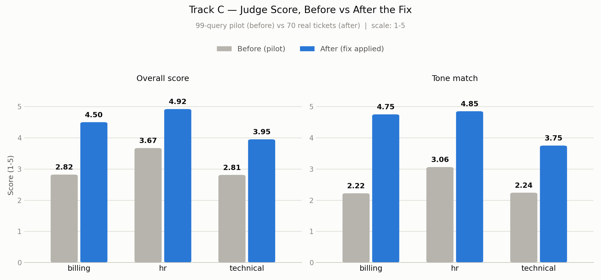
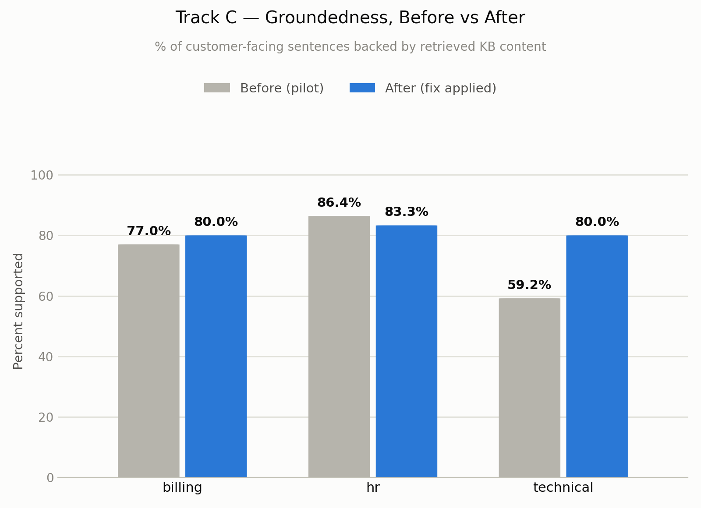
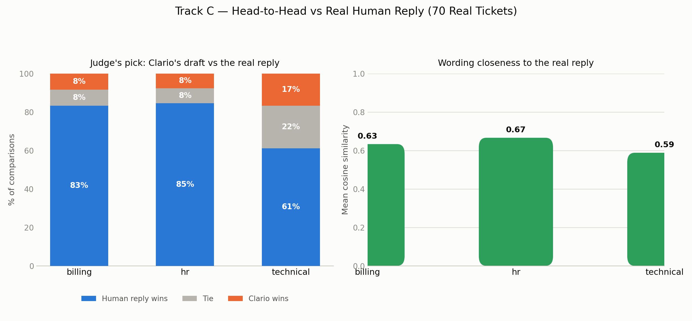
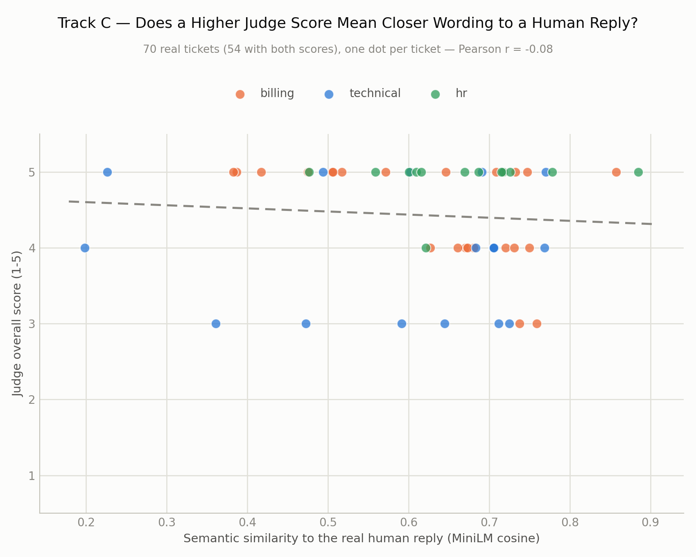
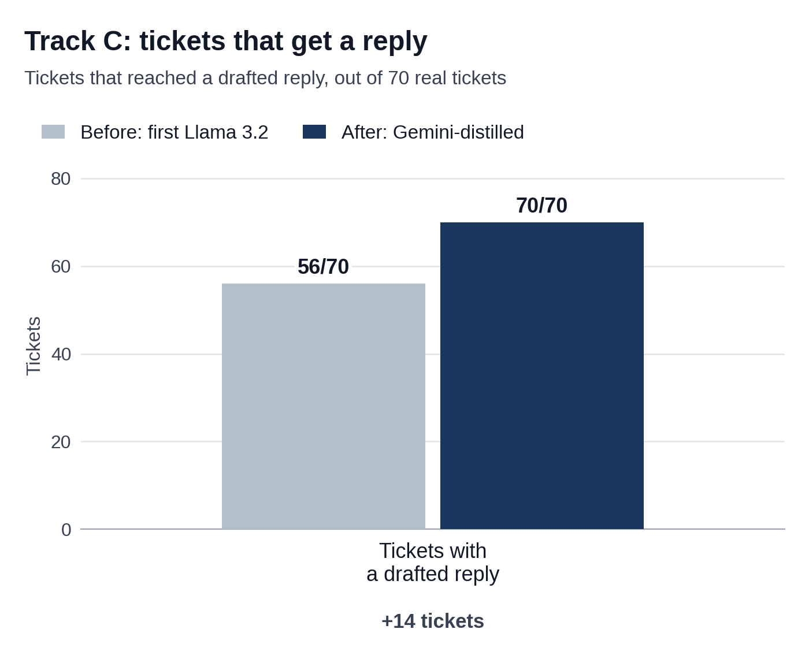
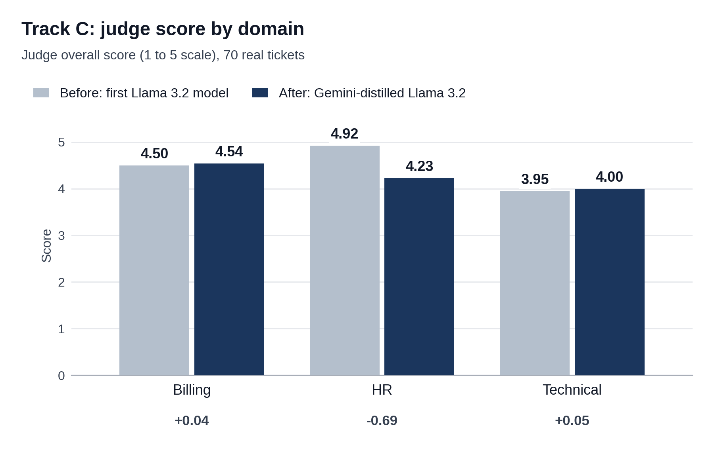

# Track C — Final Conclusion Report (Final Response Quality)

*This is the full, detailed report. For a short presentation-only summary, see `TRACK_C_CONCLUSION.md`. Full pilot detail lives in `pilot-99-query/TRACK_C_PILOT_99_REPORT.md`.*

**What Track C checks, in one sentence:** is the actual reply Clario sends a customer as good as what a real human support agent would have written for that same ticket?

---

## 1. Data Annotation & Practical Knowledge

### Datasheet annotation

**99-query pilot — finding problems, not scoring against an answer key.** The 99-query set has no real human reply to compare against, so this round's job was different from a normal annotation pass: two of us (Ranuga, Vinma) read all 90 real generated drafts side by side with their ticket text, and each independently flagged every row with one label (`good` / `needs_improvement` / `wrong_or_inaccurate` / `too_generic` / `tone_issue` / `missing_info`) plus a free-text note on what should change. We treated the free-text notes as the real signal, not the label — disagreements were grouped by the *underlying problem described*, not by whose label "won." One reviewer marking a draft "good" and the other marking it "needs_improvement — no timeframe given" isn't a contradiction to resolve; it's one real finding either way. That grouping produced 5 concrete, repeated problems that became the actual fix list (Section 5) — the labels themselves were almost secondary to the notes.

**70-ticket final round — sourcing real human replies to compare against.** For this round we needed something the pilot never had: what a real person actually wrote back. `prepare_human_reference_data.py` joined each of the 70 tickets to its real historical reply and recommended action, reusing the exact same ticket-matching logic Track B had already solved and verified (including the same two manual text overrides and the one unresolvable source ticket, Q016). It wrote two columns per ticket: `human_reply_as_sent` (the reply verbatim) and `human_reply_corrected` (meant for a rewritten, improved version). **Honest note:** that second, "corrected" pass was never actually done — checking the file directly shows both columns are still byte-identical for every row we sampled. It exists as an optional next step, not a finished part of this round, and we say so rather than imply it happened.

### Scoring criteria

The automatic judge scores every reply 1–5 on six separate things: **overall**, **priority/tone match**, **completeness**, **accuracy**, **policy compliance**, **groundedness** — each with its own concrete 1–5 description (fixed as part of Track D's rubric work; e.g. groundedness's "2" is specifically "contains a claim not supported by anything retrieved," not just "bad").

Two more, independent checks run alongside the judge, each with its own precise rule:

- **Mechanical groundedness** — pull out the actual customer-facing reply text, split it into individual sentences, throw away anything that's clearly not a factual claim (short filler, a question, a greeting, an apology, or — added after the final round found a new false-flag pattern — forward-looking filler like "I will follow up within 24 hours"). Every sentence that's left gets compared, by meaning (not exact words), against the retrieved knowledge-base content. **A sentence is "supported" if its similarity to something actually retrieved is 0.35 or higher; otherwise it's flagged as unsupported.**
- **Pairwise judge** — a separate judge call directly compares Clario's draft against the real human reply and picks a winner, "which response better serves the customer." It's asked twice per ticket, with the two replies' positions swapped the second time, specifically to cancel out any tendency to just prefer whichever reply is shown first. **A win only counts as a real win if both passes agree** — any disagreement between the two passes is recorded as a tie, not a coin-flip winner.

### Practical insights

- **Reading real drafts by hand caught patterns a rubric alone wouldn't.** Replies sometimes claimed something was already done when it wasn't ("we've verified your account"), guessed at a cause before actually checking it (blaming bank fees before asking for details), or gave a technically-fine but generic non-answer to a specific question. None of these look like an "accuracy" or "completeness" failure in the abstract — they only stood out from reading actual text.
- **A mechanical checker needs its own quality control, the same as any model.** The very first groundedness run flagged "Hi there, thank you for reaching out" as an unsupported factual claim — because a greeting obviously can't match anything in a knowledge base. That's not the model failing; it's the *checker* asking the wrong question of that sentence.
- **The judge's tone score was masking a plumbing problem, not a writing problem.** The root cause of the pilot's weak tone scores wasn't that the model wrote badly — it was drafting completely blind to the ticket's priority and sentiment, because that information was computed elsewhere in the pipeline and never actually reached the prompt that writes the reply.

---

## 2. Evaluation on the 99-Query Dataset

### Metrics & formulas

- **Judge score** — 1–5 per dimension, per the rubric above; no formula beyond the rubric itself, since it's a direct LLM judgment, not a computed statistic.
- **Groundedness %** — `100 × (supported sentences) / (total scored sentences)`, using the 0.35 similarity-threshold rule above.
- Semantic similarity and the pairwise judge were **not** run in this round — there was no real human reply to compare against for the 99-query set, so those two checks only apply to the 70-ticket round (Section 3).

### Human agreement vs. disagreement

Two reviewers, 90 drafts, flag-based (not a 1–5 score, so this isn't the same kappa formula Track D uses):

| Measure | Result |
|---|---|
| Exact same flag chosen | 44/90 = 48.9% |
| Simplified "good" vs. "any issue" agreement | 54/90 = 60.0% |
| Cohen's kappa (simplified 2-way) | **0.18** (weak) |

**We report this weak kappa without dressing it up.** Six-way, subjective quality labeling genuinely doesn't force two careful readers to convergence — that's expected, not a red flag about the annotators. It's exactly why the free-text notes, not the flag itself, drove the actual fix list. Only one case (Q061) was a real split between "good" and "wrong_or_inaccurate" — the two of us were almost never on opposite ends, just choosing different labels for similar concerns.

### System test results

Judge overall / tone-match / groundedness, by domain:

| Domain (n) | Overall | Tone match | Groundedness | Issue-flag rate |
|---|---|---|---|---|
| billing (51) | 2.82 | 2.22 | 77.0% | 66.7% |
| technical (21) | 2.81 | 2.24 | 59.2% | 52.4% |
| hr (18) | 3.67 | 3.06 | 86.4% | 50.0% |

**In plain terms:** tone match was the weakest score everywhere, barely above 2 out of 5 in two of the three domains — a sign something structural was wrong, not a wording nitpick. The mechanical groundedness checker's first raw run flagged 37.9% of all sentences as unsupported; after fixing the greeting/filler false-flag problem (Section 1), that dropped to a more defensible **26.3%**.

---

## 3. Validation & Testing on the 70 Real-Ticket Dataset

### Metrics & formulas

Same judge rubric and groundedness formula as Section 2, plus two checks unique to this round, both needing a real human reply to compare against:

- **Semantic similarity** — embed the draft and the real human reply with a sentence-embedding model (`all-MiniLM-L6-v2`), then measure **cosine similarity** between the two embeddings — a 0–1 score for how close in *meaning* the two texts are, regardless of exact wording.
- **Pairwise win rate** — `(comparisons where the judge picked the human reply, both passes agreeing) / (total comparisons scored) × 100`, per domain.

### Human agreement vs. disagreement

**No second human-annotation pass was done for this round.** The 70-ticket round relies on the judge score, the mechanical groundedness check, semantic similarity, and the pairwise judge — not a repeat of the pilot's dual-human flagging. The judge's own reliability against real humans is checked separately and far more rigorously in **Track D**, which is exactly why Track D exists as its own track rather than being folded into this one.

### System test results

Judge overall / tone-match / groundedness, by domain, after the fixes (Section 5):

| Domain (n) | Overall | Tone match | Groundedness |
|---|---|---|---|
| billing (24) | 4.50 | 4.75 | 80.0% |
| hr (13) | 4.92 | 4.85 | 83.3% |
| technical (21) | 3.95 | 3.75 | 80.0% |

**In plain terms:** tone match roughly doubled in every domain (2.22–3.06 → 3.75–4.85). Technical's groundedness jumped the most, 59.2% → 80.0%. Getting a trustworthy groundedness number here took three more rounds of fixing the checker's own false positives, because the new empathy/timeframe wording the tone fix introduced ("I will follow up within 24 hours") tripped the exact same kind of false alarm the pilot had already fixed once, in a new form.

**Semantic similarity to the real reply (MiniLM cosine):** hr 0.666, billing 0.633, technical 0.588.

**Pairwise: Clario's draft vs. the real human reply (n=55):**

| Domain | Human wins | Tie | Clario wins |
|---|---|---|---|
| billing (24) | 20 | 2 | 2 |
| hr (13) | 11 | 1 | 1 |
| technical (18) | 11 | 4 | 3 |
| **Overall (55)** | **76%** | | technical closest to even |

**This is the honest number in this whole report.** The judge scores above look strong, but a judge directly comparing Clario's draft against what a real person actually sent still picks the human reply about three times out of four. That's not a contradiction — "is this reply good on its own" and "which one would you rather receive" are genuinely different questions, and a real agent brings small, natural touches a rubric doesn't capture. This is the number we'd point to as what to improve next, not the judge scores.

**A real bug found running this check:** the first pairwise run returned no result at all for 58 of 70 tickets. Root cause: this evaluation script had no pacing between API calls — unlike the other two generation scripts, which had already learned this lesson — so it hit Gemini's free-tier rate limit almost immediately. Fixed by adding the same 8-second pacing already used elsewhere, mirrored to both services. Re-run: 53/70 processed cleanly, 0 failed; the remaining 17 hit a genuine daily quota limit after everything else ran that day, not a bug.

---

## 4. Advanced Data Science Visualizations

**Pairwise win/tie/loss breakdown (figure 03, left panel) — the confusion-matrix equivalent for this track.** Track C doesn't classify into fixed categories, so a classic confusion matrix doesn't apply (see the note in `TRACK_C_CONCLUSION.md`); the 3-outcome win/tie/loss breakdown, read per domain, plays the same role — it's read the same way, looking for which domain's off-diagonal (non-human-win) share is largest.

**Judge score vs. semantic similarity correlation (figure 04) — new for this report.**

**What this shows, and why it matters:** one dot per ticket, x = how close the draft's wording is to the real human reply, y = the judge's own overall score. If the judge and "closeness to a human" were really measuring the same thing, this cloud would slope clearly upward. **It doesn't — the correlation here is essentially zero (Pearson r = −0.08).** That's a genuinely useful, slightly uncomfortable finding: a high judge score does not reliably predict that the wording is close to what a human actually wrote. It's a second, independent line of evidence for the same conclusion the pairwise chart already pointed to — the judge and "matches a human" are different signals, not two views of the same thing.

**Recommended, not yet built:** a **box or violin plot of judge scores by domain**, instead of the single mean bar currently shown, would reveal whether a domain's "good" mean score is hiding a wide spread (some excellent replies and some poor ones averaging out) versus a genuinely consistent domain. This would need per-ticket score arrays already present in `results/clario_full_graph_drafts.csv` — a quick addition if this report needs to go one level deeper.

---

## 5. Analysis, Gaps, and Fixes

### Identified gaps

1. **The groundedness checker itself was broken.** It scored greetings and empathy lines as if they were factual claims — a greeting can never match knowledge-base content, so it was flagging tone, not fabrication.
2. **The drafting model never received the ticket's priority or sentiment.** Classification already computes "High priority, Frustrated" for a ticket, but that never reached the prompt writing the reply — the root cause of the weak tone scores.
3. **HR's "no promises" rule was too strict.** It correctly banned promising a specific outcome (needs human review first) but accidentally banned even a rough response-time estimate too.
4. **Three more patterns found by reading real drafts:** claiming an action was already done when it wasn't; guessing at a cause before checking; generic non-answers to a specific question.
5. **A second wave of groundedness false-flags**, caused by the tone fix's own new empathy/timeframe wording tripping the same kind of alarm the first fix had already solved once.
6. **A rate-limiting bug in the pairwise evaluation tool itself**, failing 58 of 70 comparisons on the first run.
7. **The optional "corrected reply" annotation pass was never actually completed** — both reference columns remain identical, a gap this report states plainly rather than implying the pass happened.

### Enhancements & fixes

- Added a filter excluding greeting/empathy/procedural sentences from the groundedness check, plus fixed a markdown-formatting bug gluing stray `**` onto sentences. False-flag rate: 37.9% → 26.3% (pilot).
- Wired priority and sentiment through to every specialist's drafting prompt, with an explicit instruction to lead with empathy and give a timeframe when priority is High/Critical or sentiment is Frustrated/Negative.
- Narrowed HR's "no promises" rule so it still can't promise outcomes, but can say "within 1–2 business days."
- Turned the three read-by-hand patterns (false completion claims, unverified guesses, generic non-answers) into explicit hard rules in the drafting prompt.
- Extended the groundedness boilerplate filter again for the new empathy/timeframe wording pattern the tone fix introduced.
- Added the same 8-second API pacing already proven in the other generation scripts to the pairwise evaluation tool, mirrored to both services, tests updated.

### Lessons learnt

- **A weak score is a symptom, not a diagnosis — trace it to where the information actually breaks.** The tone-match fix wasn't "write better," it was "the model never received the input it needed to write better," found by tracing the pipeline, not by tuning prompts blind.
- **Fixing one measurement tool can quietly break another.** The same wording that fixed tone match (adding timeframes and empathy) introduced a *new* groundedness false-flag pattern almost identical in shape to the one already fixed — a reminder that two checks touching the same text aren't independent of each other.
- **A high score on one measure doesn't mean a high score on a different, related measure — check, don't assume.** Strong judge scores and a 76%-human-win-rate look contradictory until you actually measure the correlation between judge score and human-likeness directly, and find it's close to zero. Assuming they'd agree would have hidden a real, useful finding.

---

## 6. Viva Presentation Flow (First-Person)

1. **I'll open with what makes Track C different.** "Tracks A and B check that the system finds the right information and sends it to the right place. Track C checks the actual words a customer receives — is Clario's reply as good as what a real support agent wrote for that same ticket?"
2. **I'll explain how we built the check, in two parts.** "For the pilot, we had no real human reply to compare against, so two of us just read all 90 drafts and flagged problems by hand. Our labels only agreed 60% of the time — kappa of 0.18, genuinely weak — but that's expected for six-way subjective judgment, so we tracked the free-text notes as the real signal, not the label."
3. **I'll walk through the checks and formulas briefly.** "The judge scores six dimensions 1 to 5. A separate mechanical check measures whether each sentence is actually backed by the retrieved documents, using cosine similarity above 0.35 as the bar. And a pairwise judge directly compares our draft to the real reply, asked twice with the order swapped, so position bias can't quietly decide the winner."
4. **I'll show where we started.** "In the pilot, tone match was barely above 2 out of 5 in two of three domains. Reading all 90 drafts by hand found the real cause: the model never even knew the ticket's priority or sentiment when it wrote the reply — that information existed elsewhere in the pipeline and never arrived." *(Show figure 01.)*
5. **I'll show the fix and the proof.** "We wired that information through, fixed the groundedness checker's false positives, and added three new hard rules from patterns we found reading real text. Tone match roughly doubled everywhere. Technical's groundedness went from 59% to 80%." *(Show figures 01 and 02.)*
6. **I'll give the one honest number, unprompted.** "But a judge directly comparing our draft to what a real person sent still picks the human 76% of the time. I'll show a second chart that makes the same point a different way — plotting judge score against how close the wording is to a human reply, the correlation is basically zero. High judge score does not mean 'sounds like a human.' That's the real, useful finding here, not a footnote." *(Show figures 03 and 04.)*
7. **I'll mention the tooling bug we caught.** "The evaluation script itself had no rate-limit pacing and failed on 58 of 70 tickets the first run — found it, fixed it the same way we'd already fixed it elsewhere, re-ran clean."
8. **I'll close with what's still open.** "The optional step of writing an actually-corrected human reply for comparison was never done — I'll say that plainly rather than imply it happened. And if I extended this, I'd break the judge-score chart down by ticket instead of by domain average, to see if a domain's good mean is hiding a wide spread underneath."

---

## 7. After the Gemini-Distilled Llama 3.2 Adapter

Everything above was measured with the earlier classifier upstream of drafting. We then replaced it with a new one - the **Llama 3.2 3B adapter, fine-tuned with Gemini-distilled step-by-step reasoning as the teaching signal**, with genuine multi-label category output. This section re-runs the full pipeline (classification → routing → retrieval → draft → judge) end to end on the same 70 real tickets, so it's a like-for-like re-test, not a re-scoring of the old drafts.

**The clearest, least ambiguous win: the old classifier left 14 of these 70 tickets escalated before a draft was ever written - no reply reached the customer at all. With the new classifier every one of the 70 tickets gets a drafted reply.** (On the first pass, 2 of the 70 tickets failed on outright API errors - not because the model declined to answer. We re-ran those two, and both produced drafts, so the final set is 70 of 70 with 74 domain-drafts.)

**Meaning-similarity to the real human reply was equal or higher in all three domains (billing is essentially flat):**

| Domain | Before | After |
|---|---|---|
| Billing | 0.633 | 0.637 |
| HR | 0.666 | **0.689** |
| Technical | 0.588 | **0.617** |

**Judge overall score:** billing and technical both moved up (4.50→4.54, 3.95→4.00), with technical's tone-match score climbing from 3.75 to 4.06. HR moved the other way (4.92→4.23) - we're reporting that plainly rather than leaving it out. One more thing to keep in mind: the technical average now covers 35 drafts instead of 21, because tickets that used to get no draft at all now get one, so it includes harder tickets than before.

**One number that needs its own explanation, not a headline:** the mechanical groundedness check (an independent script, not the judge) flagged more sentences as "unsupported" on the new drafts in billing and technical (80%→65.8% and 80%→57.9% supported; HR improved, 83.3%→94.4%). Reading every one of the 30 flagged sentences by hand, every single one is the same kind of empathetic filler the original pilot report already flagged as a false-positive pattern - "I will personally follow up within 24 hours," "please try refreshing the page" - not an invented fact, number, or policy claim. The new adapter's drafts lean more heavily on exactly this kind of reassurance language, which is the intended effect of the tone/urgency fix from Section 5 above, and it's why the mechanical checker's raw flag rate rose even though nothing false is actually being said. Not a single fabricated fact was found in the new flagged set.

**Honest caveat, same as Track A and B:** where this section needed a reference for the model's own classification labels, that reference was generated by Gemini - the same model the adapter was distilled from - not independent human annotation. The judge scores, groundedness check, and similarity-to-human-reply numbers above are unaffected by this; those are unchanged, independent checks run on the actual drafted text.
