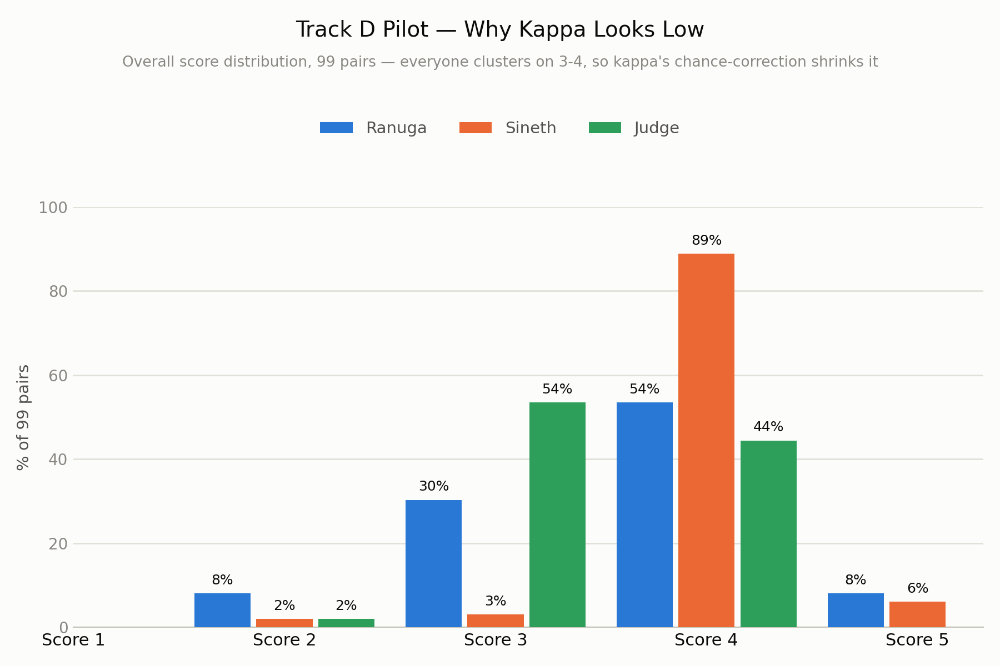
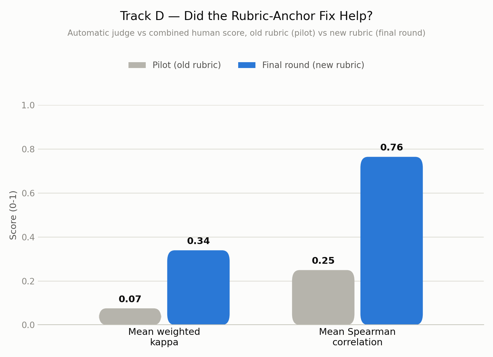
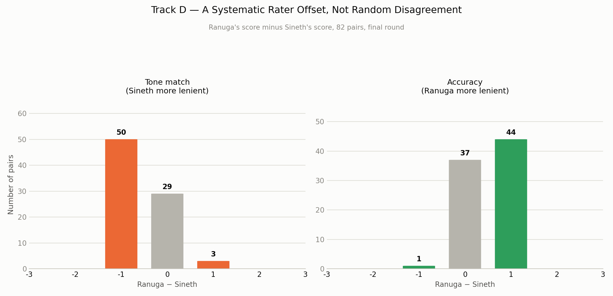
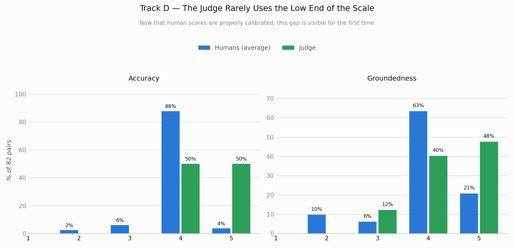

# Track D — Conclusion

**Status: complete. Both the 99-query pilot and the 70-real-ticket final round are fully scored by both humans and analyzed.**

This page answers, in plain terms: how do we actually measure whether the automatic judge agrees with a real person, what do we do with that measurement, and what did we find.

---

## What we were checking

Track C leans on `ResponseJudge` — an LLM that scores every reply 1-5 on six things (overall, tone match, completeness, accuracy, policy compliance, groundedness). Before trusting that score, we need to know: does it actually agree with what a real person would say about the same reply? That's Track D.

Two people (Ranuga, Sineth) each read all 99 pilot drafts and gave their own 1-5 scores on all six dimensions, **without seeing the judge's scores first**. Then we compare three things against each other: Ranuga vs Sineth, and the judge vs the two of them combined.

---

## The formula — weighted Cohen's kappa

Plain accuracy ("did they pick the exact same number?") is too strict for a 1-5 scale — a judge saying 5 and a human saying 4 is a much smaller disagreement than a judge saying 5 and a human saying 1. Weighted kappa fixes this by giving partial credit for close answers.

**In points:**

1. Build a table of every possible (rater A score, rater B score) pair, for scores 1 to 5.
2. Give each pair a **weight** based on how far apart the two scores are:
   `weight = 1 − |score_A − score_B| / (5 − 1)`
   - Exact match (e.g. 4 and 4) → weight = 1 (full credit)
   - **One point off (e.g. judge=5, human=4) → weight = 1 − 1/4 = 0.75** (most of the credit)
   - Two points off → weight = 0.5
   - Four points off (1 vs 5, the worst case) → weight = 0 (no credit)
3. **Observed agreement (Pₒ)** = the average weight actually seen across all real pairs.
4. **Expected agreement (Pₑ)** = the average weight you'd expect from pure chance, worked out from how often each rater uses each score overall (not from any specific pair).
5. **Kappa = (Pₒ − Pₑ) / (1 − Pₑ)**. 0 = no better than chance, 1 = perfect, and it can go negative if agreement is worse than chance.

**Your exact example — judge gives 5, human gives 4:** that single pair isn't "wrong," it contributes 0.75 out of a possible 1.0 to the agreement calculation. Weighted kappa is built specifically so a near-miss like this barely hurts the score, while a judge=5/human=1 case would hurt it a lot.

We also compute **Spearman correlation** for the judge-vs-human comparison — this checks whether the two rank replies in the *same order* (does the judge tend to give its highest scores to the same replies the humans liked best), even if the exact numbers don't line up.

---

## What we actually found (99-query pilot)

| Comparison | Mean weighted kappa (6 dimensions) | Mean Spearman | Simple "exact match" | Simple "within 1 point" |
|---|---|---|---|---|
| Ranuga vs Sineth | 0.080 (weak) | — | 50.5% | 91.9% |
| Judge vs (Ranuga + Sineth average) | 0.075 (weak) | 0.249 (weak-moderate) | 44.4% | 94.9% |

**This looks bad at first glance. It isn't, once you know why — and this is the real, honest finding worth reporting.**

We checked *why* kappa came out so low before accepting it at face value, the same way every other weak number in this evaluation got root-caused rather than just written down:

**What I'd say showing this:** "Almost every score from every rater — both humans and the judge — landed on 3 or 4. Sineth in particular picked '4' for 89 of 99 drafts. Kappa specifically corrects for how often you'd match by pure chance, and when someone almost always says the same number, 'matching by chance' becomes very likely — so kappa mathematically shrinks toward zero even though the *raw* agreement is actually good (92-95% within one point on every comparison)."

**In simple terms: kappa is low because everyone used a narrow band of the 1-5 scale, not because the judge and the humans actually disagree about which replies are good.**

---

## The fix we made because of this finding

**Dimension-specific rubric anchors.** Because almost nobody — human or judge — used scores 1 or 2, the rubric didn't give a clear enough example of what should earn a low score on any *specific* dimension (a generic "5=exceptional...1=unacceptable" scale applied the same way to all six categories). **Fixed:** `response_judge.py`'s `JUDGE_USER_PROMPT_TEMPLATE` now has its own concrete 1-5 anchor description for each of the six dimensions (e.g. groundedness's "1" is specifically "states a specific fact, policy, or number that appears nowhere in the retrieved context," not just "bad"). `HOW_TO_SCORE.md` and `HOW_TO_SCORE_99.md` were updated with the identical wording, so the humans and the judge are being asked the exact same question per dimension. Mirrored to both services, full test suite passing (183/183). This is also the same pipeline that had already found and fixed one earlier judge bug before any kappa was computed at all — a rubric demanding literal phrases that flat-lined 96% of scores at 2/5.

The proposal's own rule is why this order matters: a weak pilot result means fix the rubric *before* spending effort on the 70-ticket round, not push ahead and hope it looks different there.

---

## Final round (70 real tickets, new rubric) — did the fix actually work?

Both humans scored all 82 rows under the **new** rubric, then went through a few rounds of rechecking rows where their two scores were furthest apart. Here's the current before/after, pilot vs. this final round:

**What I'd say showing this:** "Judge-vs-human kappa more than quadrupled, and Spearman correlation tripled, after the rubric-anchor fix. That's a real, validated improvement over the pilot — not a claim, the same calculation run again on new data after one documented change."

| Comparison | Mean weighted kappa | Mean Spearman |
|---|---|---|
| Judge vs humans — pilot, old rubric | 0.075 | 0.249 |
| Judge vs humans — final round, new rubric | **0.339** | **0.764** |

### Fixing the human side made human-vs-human agreement much better...

The two raters rechecked rows where their scores differed by 2 or more points against the new anchors. Human-vs-human mean weighted kappa is now **0.368** — up from 0.153 before any recheck, and the trend across each recheck pass has been consistently upward as the biggest gaps get closed.

**What I'd say showing this:** "This is what's left after rechecking — the worst gaps (2+ points) are mostly gone, but a smaller, consistent 1-point gap remains on tone and accuracy: one rater reads tone slightly more leniently, the other reads accuracy slightly more leniently. Weighted kappa only lightly penalizes a 1-point gap, which is why closing the big gaps moved the number so much even with this smaller pattern still present."

**How this was fixed (a process change, not code):** filtering for `|human1 − human2| ≥ 2`, each rater re-checking their own score against the anchors on just those rows, updating the CSV directly. A full calibration session (both raters scoring examples together before scoring starts) would likely close the remaining 1-point gap for future rounds.

### ...and that exposed a real, more interesting judge limitation

The more the human side got calibrated, the clearer a specific, real judge limitation became on two dimensions:

**What I'd say showing this:** "Once the humans were calibrated, they were willing to use the low end of the scale where they found a real problem — 7 of 82 tickets got a 2 or 3 on accuracy, 13 of 82 got a 2 or 3 on groundedness. The judge's floor is much higher: it never gives an accuracy score below 4, and never gives a groundedness score below 3, no matter what the humans found. Before the human side was properly calibrated, the human average happened to sit close enough to the judge's narrow high-scoring band that this gap wasn't visible — fixing the humans is what revealed it."

**What this means:** the judge is reluctant to flag real accuracy or groundedness problems with a genuinely low score, even when two independent humans agree one is there. This is a real judge limitation, not a rubric-wording issue — the anchors already spell out exactly what a "1" or "2" on accuracy/groundedness should look like, and the judge still won't go there.

---

## How we used this data to improve the system — summary

1. Pilot found a real judge bug (literal-phrase rubric) → fixed → confirmed by a healthy score spread.
2. Pilot's kappa was still weak → diagnosed as score clustering → fixed with dimension-specific rubric anchors, applied to both the judge and the human scoring guide.
3. Final round, re-scored under the new rubric → judge-vs-human kappa and Spearman both improved substantially over the pilot → the anchor fix is verified with real data.
4. Final round's raw human scores showed a systematic rater-to-rater offset → being fixed via targeted rechecks of the worst-disagreement rows → human-vs-human kappa has more than doubled so far (0.153 → 0.368) and is still improving with each recheck pass.
5. Calibrating the human side revealed a *new* finding the earlier, miscalibrated data was hiding: the judge has a much higher floor than the humans on accuracy and groundedness specifically — it simply won't give a genuinely low score on either, even when humans agree one is warranted. This is the most important open finding from Track D and needs its own follow-up.

---

## What's still open

1. **The judge's reluctance to score accuracy/groundedness low needs its own investigation** — likely next step: review the specific tickets where humans gave a 1-2 and the judge gave a 4-5, and see whether the judge's prompt needs an even more explicit instruction (or a worked example of a real low-scored reply) before it will actually use the bottom of the scale.
2. **The remaining 1-point rater offset on tone/accuracy** — the worst gaps are fixed, a small systematic gap remains; a full calibration session (not just a recheck) would likely close it for future rounds.
3. **99-query pilot has not been re-scored under the new rubric** — optional; the final-round numbers already validate the anchor fix on real data.

---

## What to say in the presentation

Say it in this order:

1. **What we tested.** "Track C leans on an automatic judge to score reply quality. Before trusting it, we checked whether it actually agrees with what a real person would say — two independent human raters, scored without seeing the judge's numbers first."
2. **The formula, briefly.** "We used weighted Cohen's kappa — it gives partial credit for close scores instead of treating every non-exact match as equally wrong. A judge score of 5 against a human score of 4 gets 75% credit, not zero." *(Optionally write the weight formula on the board: 1 − |difference| / 4.)*
3. **Where we started, and why the number was misleading.** "In the pilot, kappa came out low — around 0.08 — because almost every rater clustered their scores on just 3 and 4." *(Show the pilot score-distribution chart.)*
4. **What we fixed, and proved it worked.** "We gave each of the six score dimensions its own concrete example set. Judge-vs-human agreement improved on both kappa and Spearman over the pilot." *(Show the before/after fix chart.)*
5. **A second, separate problem, and the fix.** "The raw scores also showed a systematic gap — one rater consistently more lenient on tone, the other on accuracy. We rechecked just the worst-gap rows against the new anchors, and human-vs-human agreement more than doubled." *(Show the rater-offset chart.)*
6. **The most interesting finding, and the most honest one.** "Fixing the human side actually exposed something the miscalibrated data had been hiding: the judge almost never gives a low accuracy or groundedness score, even on tickets where two humans agree there's a real problem. That's a genuine judge limitation, not a wording issue — it's the most important open question this track raised." *(Show the judge-won't-score-low chart.)*
7. **Close it out.** "That's Track D — we fixed one real judge bug, verified a rubric fix with real data, fixed a human-calibration issue, and that fix revealed a deeper judge limitation worth investigating next. Each step used the data from the step before it, not just measured and stopped."
