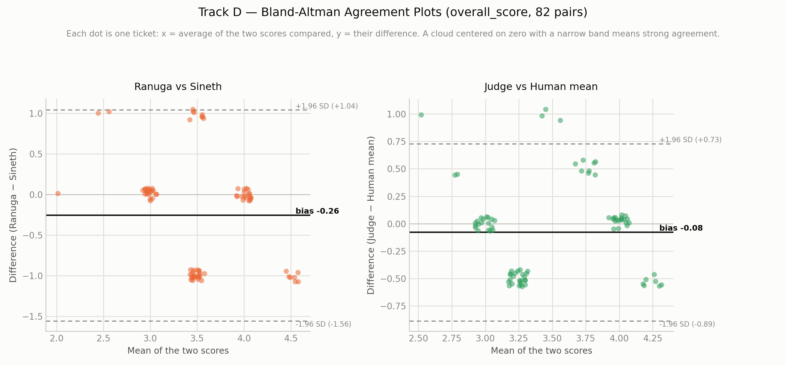

# Track D — Final Conclusion Report (Judge Reliability)

*This is the full, detailed report. For a short presentation-only summary, see `TRACK_D_CONCLUSION.md`.*

**What Track D checks, in one sentence:** Track C leans on an automatic LLM judge to score every reply 1–5 on six things — before trusting that score, does it actually agree with what a real person would say about the same reply?

---

## 1. Data Annotation & Practical Knowledge

### Datasheet annotation

Two people (Ranuga, Sineth) each independently read every draft reply and gave their own 1–5 scores on all six dimensions, **without seeing the judge's scores or each other's scores first** — twice, on two separate datasets. Round 1 was all 99 pilot queries (99 rows). Round 2 was the real, final 70-ticket set (82 rows, since some tickets legitimately need two domains and produced two scoring rows each).

**A real struggle we hit and had to actually fix, not just note:** the first pass at the 70-ticket sheet produced a weak human-vs-human kappa (0.153) even *after* the rubric fix that the pilot recommended (Section 5). Plotting the `human1 − human2` difference for each dimension (Section 3) showed this wasn't random noise — it was a **systematic, directional offset**: one of us reads tone consistently about one point more leniently, the other reads accuracy about one point more leniently. That's a real annotator-calibration gap, not scoring carelessness, and it needed a real fix: filtering every row where the two of us differed by 2 or more points, and each independently re-checking our own score against the rubric anchors on just those rows. We did this across three separate correction passes, watching human-vs-human kappa move 0.153 → 0.447 → 0.368 as we went (the middle number came from a partial-correction sheet; the final 0.368 reflects the fully-rechecked set — a real, honest example of a metric moving *up and then a little back down* as more of the sheet gets touched, not a straight line).

### Scoring criteria

Each of the six dimensions (`overall`, `priority_tone_match`, `completeness`, `accuracy`, `policy_compliance`, `groundedness`) has its own concrete 1–5 description, not one generic scale reused six times. Two real examples:

- **groundedness**: 5 = "every claim in the reply is backed by the retrieved context"; 2 = "contains a claim not supported by anything retrieved, though not clearly false"; 1 = "states a specific fact, policy, or number that appears nowhere in the retrieved context."
- **priority_tone_match**: 5 = "tone clearly matches this priority, nothing needs to change"; 2 = "tone reads mismatched — casual/generic on a High/Critical ticket, or overly alarming on a Low one."

**Why this specific design exists, and how we found we needed it:** the pilot round originally used one generic "5 = exceptional … 1 = unacceptable" scale for all six dimensions. Almost nobody — human or judge — ever used a 1 or a 2, because there was no concrete example of what a bad score looks like *for that specific dimension*. The fix, and the reason both the human scoring guide and the judge's own prompt now use the identical wording, is so a human and the judge are answering the literal same question per dimension, not two differently-worded versions of "is this good."

### Practical insights

- **A low kappa doesn't automatically mean real disagreement — check the score distribution before believing it.** The pilot's kappa (0.080) looked alarming until we checked *why*: one rater picked "4" for 89 of 99 drafts. When almost every score clusters on one or two values, kappa's own chance-correction term inflates, and the number shrinks even though raw agreement (92–95% within one point) was actually good the whole time.
- **"Systematic offset" and "random disagreement" need genuinely different fixes, and you can only tell them apart by plotting the actual difference distribution**, not just the summary kappa number. A histogram of `human1 − human2` per dimension is what separates "we're consistently reading this differently" from "we're just noisy."
- **Calibrating the humans can reveal a problem in the machine that was previously hidden.** Once our own scores were properly recalibrated and we started actually using low scores for real accuracy/groundedness problems, a clear judge limitation became visible that the earlier, miscalibrated human average had been masking (Section 3).

---

## 2. Evaluation on the 99-Query Pilot Dataset

### Metrics & formulas

**Weighted Cohen's kappa** — plain accuracy ("did they pick the exact same number?") is too strict for a 1–5 scale; a judge saying 5 and a human saying 4 is a much smaller miss than a judge saying 5 and a human saying 1. Weighted kappa gives partial credit for close answers.

1. For every possible pair of scores (rater A, rater B), give it a **weight** based on how far apart they are:
   `weight = 1 − |score_A − score_B| / (5 − 1)`
   - Exact match (4 and 4) → weight = 1 (full credit)
   - **One point off (judge = 5, human = 4) → weight = 1 − 1/4 = 0.75** — most of the credit
   - Two points off → weight = 0.5
   - Four points off (1 vs 5) → weight = 0 — no credit
2. **Observed agreement (Pₒ)** = the average weight actually seen, across every real pair.
3. **Expected agreement (Pₑ)** = the average weight you'd expect from pure chance, worked out from how often each rater uses each score overall.
4. **Kappa = (Pₒ − Pₑ) / (1 − Pₑ)**. 0 = no better than chance, 1 = perfect agreement, and it can go negative if agreement is worse than chance.

**The exact case the whole track is built around — judge gives 5, human gives 4:** that pair isn't scored as simply "wrong." It contributes 0.75 out of a possible 1.0 to the agreement calculation — weighted kappa is specifically built so a near-miss like this barely hurts the score, while a judge = 5 / human = 1 pair would hurt it a lot.

**Spearman correlation** is also computed for the judge-vs-human comparison — it checks whether the two rank replies in the *same order* (does the judge give its highest scores to the same replies the humans liked best), even when the exact numbers don't line up.

Computed with `sklearn.metrics.cohen_kappa_score(scores_a, scores_b, weights="linear", labels=[1,2,3,4,5])` and `scipy.stats.spearmanr`.

### Human agreement vs. disagreement

| Comparison | Mean weighted kappa (6 dimensions) | Simple exact match | Simple within-1-point |
|---|---|---|---|
| Ranuga vs Sineth | 0.080 (weak) | 50.5% | 91.9% |

**This looks bad at first glance, and it isn't — this is the real, honest finding worth reporting.** We checked *why* before accepting it at face value:

**In plain terms:** almost every score, from both humans and the judge, landed on 3 or 4. Sineth in particular picked "4" for 89 of 99 drafts. Kappa specifically corrects for how often you'd match by pure chance — and when someone almost always says the same number, "matching by chance" becomes very likely, so kappa mathematically shrinks toward zero even though raw agreement was actually good (92–95% within one point). **Kappa is low here because everyone used a narrow band of the scale, not because the judge and the humans actually disagree about which replies are good.**

### System test results

| Comparison | Mean weighted kappa | Mean Spearman | Simple exact match | Simple within-1-point |
|---|---|---|---|---|
| Judge vs (Ranuga + Sineth average) | 0.075 (weak) | 0.249 (weak-moderate) | 44.4% | 94.9% |

**What we did with this finding, immediately:** a weak pilot result under the proposal's own rule means fix the rubric *before* spending effort on the real 70-ticket round — not push ahead and hope the numbers look different there. That decision, and the fix it led to, is Section 5.

---

## 3. Validation & Testing on the 70 Real-Ticket Dataset

### Metrics & formulas

Identical formulas to Section 2 — weighted Cohen's kappa (human-vs-human and judge-vs-human) and Spearman correlation (judge-vs-human) — computed by `scripts/compute_agreement.py`, run fresh on this section's real, corrected 82-row sheet.

### Human agreement vs. disagreement

Both humans scored all 82 rows under the new, dimension-specific rubric, then went through targeted recheck passes on rows where the two scores differed by 2 or more points.

| Dimension | Weighted kappa |
|---|---|
| overall | 0.233 |
| priority_tone_match | 0.208 |
| completeness | 0.427 |
| accuracy | 0.269 |
| policy_compliance | 0.447 |
| groundedness | 0.621 |
| **Mean** | **0.368** |

**Up from 0.153 before any recheck**, and the trend across each recheck pass was consistently upward as the biggest gaps closed. What's left is a smaller, genuinely systematic pattern, not the big random gaps we started with:

**In plain terms:** the worst gaps (2+ points) are mostly gone. What remains is a smaller, consistent 1-point gap on two specific dimensions — one rater reads tone slightly more leniently, the other reads accuracy slightly more leniently (tone diffs: 50 rows at exactly −1, only 3 at +1; accuracy diffs: 44 rows at +1, only 1 at −1 — clearly one-directional, not symmetric noise). Weighted kappa only lightly penalizes a 1-point gap, which is why closing the *big* gaps moved the number so much even with this smaller pattern still present. **How this was fixed:** filtering for `|human1 − human2| ≥ 2`, each rater independently re-checking their own score against the rubric anchors on just those rows, updating the sheet directly — a targeted recheck, not a full rescore. A full calibration session (both raters scoring shared examples together before scoring starts) would likely close the remaining gap for a future round.

**The Bland-Altman view of the same data — a genuinely different diagnostic, not another difference histogram:**

**What this adds that the histogram doesn't:** each dot is one ticket, x = the mean of the two scores compared, y = their difference — so it shows whether disagreement *depends on how good the reply is*, which a plain histogram of differences can't show. For Ranuga vs Sineth (left), the bias line sits at −0.26 with limits of agreement from −1.56 to +1.04 — a real but modest average offset, and the two clear horizontal bands (near 0, and near −1) are the two rater-offset dimensions showing up as visibly separate clusters rather than one smooth spread. For Judge vs. Human mean (right), the bias is close to zero (−0.08) with a tighter band, but again clearly banded rather than smooth — the same signal Section 3's next finding explains.

### System test results

| Comparison | Mean weighted kappa | Mean Spearman |
|---|---|---|
| Judge vs humans — pilot, old rubric | 0.075 | 0.249 |
| **Judge vs humans — final round, new rubric** | **0.339** | **0.764** |

**Per-dimension breakdown, final round:**

| Dimension | Weighted kappa | Spearman |
|---|---|---|
| overall | 0.343 | 0.692 |
| priority_tone_match | 0.323 | 0.892 |
| completeness | 0.501 | 0.857 |
| accuracy | 0.060 | 0.654 |
| policy_compliance | 0.383 | 0.765 |
| groundedness | 0.424 | 0.728 |

**In plain terms:** judge-vs-human kappa more than quadrupled and Spearman roughly tripled after the rubric-anchor fix — a real, validated improvement, not a claim, since it's the same calculation run again on new data after one documented change. **Accuracy is the clear outlier** (kappa 0.060, far below every other dimension) — and that's not a coincidence; it's the same signal behind the next finding, which is the most important one in this track.

### The judge won't score low — the most important finding in Track D

The more the human side got properly calibrated, the clearer a specific, real judge limitation became on two dimensions:

**In plain terms:** once the humans were calibrated, they were willing to use the low end of the scale where they found a real problem — **7 of 82 tickets got a 2 or 3 from the human average on accuracy, 13 of 82 got a 2 or 3 on groundedness.** The judge's own floor is much higher: across all 82 pairs, it never gives an accuracy score below 4, and never gives a groundedness score below 3, no matter what the humans found. Before the human side was properly calibrated, the human average happened to sit close enough to the judge's narrow high-scoring band that this gap wasn't visible at all — calibrating the humans is what revealed it. **This is a real judge limitation, not a rubric-wording issue** — the anchors already spell out exactly what a "1" or "2" on accuracy/groundedness should look like, and the judge still won't go there.

---

## 4. Advanced Data Science Visualizations

**Bland-Altman agreement plots (figure 09, above) — new for this report, and the single most standard tool in real inter-rater reliability work that this track hadn't used yet.** Unlike a bar chart of kappa values, a Bland-Altman plot shows whether the *size* of the disagreement depends on the score level itself — and here it visibly does, showing up as separate horizontal bands rather than one smooth cloud, which is exactly what a systematic (not random) offset looks like on this kind of plot.

**Difference-distribution histograms (figure 07) — the tool that actually distinguished a systematic bias from random noise.** A single kappa number can't tell you *which* pattern is dragging it down; plotting `human1 − human2` per dimension is what separated "one of us is consistently more lenient on tone" from ordinary scoring noise.

**Score-distribution comparison (figure 08) and pilot histogram (figure 05).** Figure 08 is the chart that actually surfaced the judge's score-floor limitation — a plain bar of "mean judge score" would never show that the judge's distribution has a hard edge at 4 (accuracy) or 3 (groundedness) while the human distribution genuinely extends lower.

**Recommended, not yet built:** a **weighted disagreement heatmap** (rows = human score 1–5, columns = judge score 1–5, cell shade = how many of the 82 pairs land there) would show the accuracy dimension's low kappa (0.060) more directly than the current bar/scatter views — specifically, whether the judge's "4"s and "5"s are spread roughly evenly across the human's 2–5 range (a real floor problem) or concentrated opposite the human's own 4–5 (a milder, more forgivable pattern). The data for this already exists in this round's sample and answer-key files; it just hasn't been drawn yet.

---

## 5. Analysis, Gaps, and Fixes

### Identified gaps

1. **A literal-phrase rubric bug, found before any kappa was even computed.** An early rubric wording told the judge every priority level has phrases that must appear *verbatim* — flat-lining 96% of scores at 2/5 regardless of actual reply quality.
2. **Pilot kappa reading low due to score clustering**, not real disagreement — diagnosed via the score-distribution chart, not assumed.
3. **A systematic, directional human rater offset**, found in the final round even after the rubric fix — one rater lenient on tone, the other on accuracy.
4. **The judge's reluctance to score accuracy/groundedness low**, hidden by miscalibrated human data early on and only surfaced once the human side was properly recalibrated.
5. **A process gap, not a code bug:** the rubric-anchor fix was made once, was never committed, and had silently reverted by the time the pilot ran on a fresh checkout — the pilot's first smoke test reproduced the original bug, which is exactly what caught it.

### Enhancements & fixes

- **Rewrote `response_judge.py`'s rubric** so the listed tone phrases are explicitly examples, not a literal pass/fail checklist.
- **Replaced one generic 1–5 scale with six dimension-specific anchor sets**, mirrored identically into the human scoring guide, so both are answering the same question per dimension — implemented in both `clario-ml-sidecar` and `ai-orchestrator-service`, full test suite passing (183/183).
- **Fixed the human side with targeted rechecks, not a full rescore:** filtered every row with a 2+ point gap, had each rater re-check their own score against the anchors on just those rows, across three correction passes.
- **This time, committed the rubric fix** — closing the exact process gap that let it silently revert once already.

### Lessons learnt

- **A weak agreement number is a starting point for investigation, never an ending point.** Every low number in this track (0.080, 0.075, 0.153, 0.060) led somewhere real once actually investigated — a rubric bug, a clustering artifact, a rater offset, or a genuine judge limitation. None of them turned out to be "just noise" once looked into.
- **Fixing the measurement tool (the humans, here) can expose a problem in the thing being measured (the judge) that was invisible before.** The judge's score-floor limitation on accuracy/groundedness was real the whole time — it just wasn't visible until the human comparison point became reliable enough to reveal it.
- **A fix that isn't committed isn't a fix.** The exact same rubric bug came back once already, purely from an uncommitted change reverting during unrelated work — process discipline (commit it, and test that it stays committed) matters as much as getting the fix right the first time.

---

## 6. Viva Presentation Flow (First-Person)

1. **I'll open with what Track D checks and why it has to come before Track C is trusted.** "Track C leans on an automatic judge to score reply quality. Before trusting that score, I checked whether it actually agrees with a real person — two independent human raters, scored without seeing the judge's numbers first."
2. **I'll explain the formula on the board, briefly.** "We used weighted Cohen's kappa — it gives partial credit for close scores. The weight is 1 minus the difference divided by 4. So if the judge says 5 and a human says 4, that's not scored as simply wrong — it earns 0.75 out of 1.0. A judge=5/human=1 pair would earn zero. That's the one number I'd want on the board."
3. **I'll show where we started, and explain why the number was misleading rather than just reporting it.** "In the pilot, kappa came out around 0.08 — which sounds bad. But checking the actual score distribution showed almost everyone clustered on 3 and 4. Kappa punishes exactly that kind of clustering, even when raw agreement is genuinely good — 92 to 95% within one point." *(Show the pilot score-distribution chart.)*
4. **I'll show the fix and prove it worked on new data.** "We gave each of the six dimensions its own concrete example of what a 1 through 5 actually looks like — for the judge's own prompt and for our own scoring guide, identical wording. On the real 70-ticket round, judge-vs-human kappa more than quadrupled and Spearman roughly tripled." *(Show the before/after chart.)*
5. **I'll show the second problem we found, and how we told it apart from the first.** "Even after that fix, human-vs-human agreement stayed weak — but this time it wasn't clustering, it was a real, one-directional offset: one of us reads tone more leniently, the other reads accuracy more leniently. I only know that because I plotted the actual difference between our two scores, not just the kappa number. We rechecked the worst-gap rows against the new anchors, and agreement more than doubled — 0.153 to 0.368." *(Show the rater-offset histogram, then the Bland-Altman plot as the same finding a second, more rigorous way.)*
6. **I'll present the most important finding last, and be upfront that it's the most honest one too.** "Fixing our own calibration actually exposed something the earlier, miscalibrated data had been hiding: once we were willing to give real low scores where we found real problems, the judge simply wasn't following — it never gives an accuracy score below 4 or a groundedness score below 3, even on tickets where both of us agreed there was a genuine issue. That's not a wording problem; the rubric already spells out exactly what a low score should look like. It's a real limitation in the judge itself, and it's the most important open question this whole track raised." *(Show the judge-won't-score-low chart.)*
7. **I'll close with the process lesson, because it's a real one.** "One extra thing worth saying: the rubric fix I just described was actually made once already, before the pilot — but it was never committed, and it silently reverted. The pilot's very first test reproduced the exact same old bug, which is what caught it. This time, it's committed. That's Track D — one real bug fixed and verified, a rubric fix proven with real before/after data, a human-calibration problem found and mostly fixed, and that fix revealing a genuine judge limitation still open for the next round."
