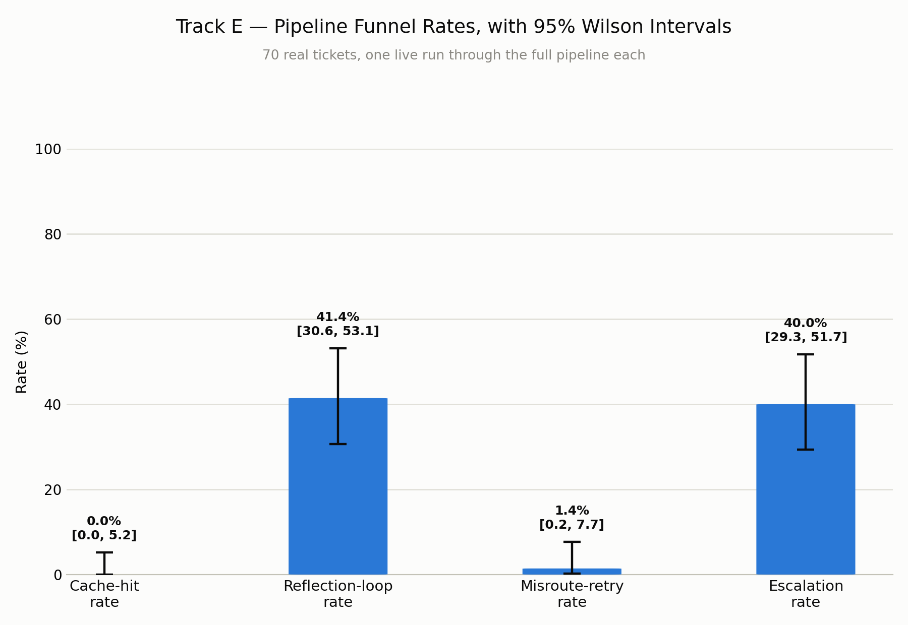
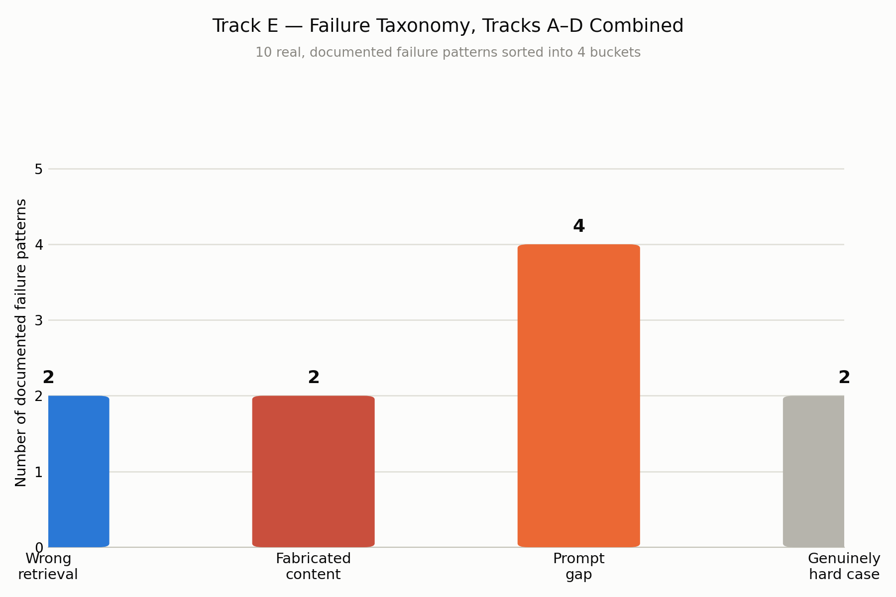
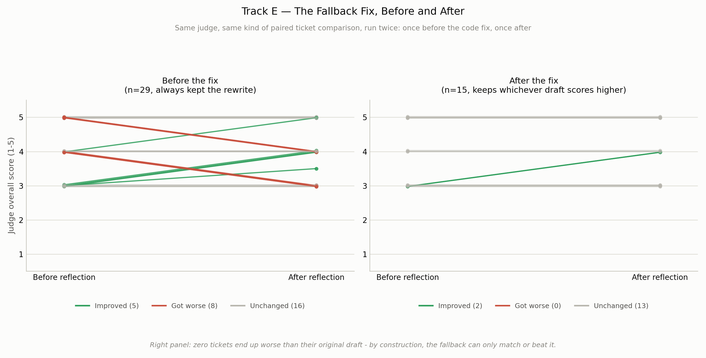

# Track E — Conclusion

**Track E (End-to-End Behaviour) is complete.** I'm Ranuga, and I did this one on my own. For the full detail — formulas, methodology, every number — see `TRACK_E_FINAL_CONCLUSION_REPORT.md`.

---

## What I was checking

Tracks A-D each checked one part of Clario's pipeline on its own: retrieval, routing, response quality, judge reliability. None of them answered the system-level question: how often does each part of the pipeline actually fire, what goes wrong most, and is the "reflection" step (the system rewriting its own answer) actually worth what it costs?

None of that data existed anywhere before this track. I had to write a script that runs the same 70 real tickets through the real, live pipeline again, capturing cache hits, reflection loops, misroute retries, and escalations — flags nothing before this had ever saved.

---

## Funnel rates (70 real tickets, one live run each)

| Funnel step | Rate | 95% confidence range |
|---|---|---|
| Cache-hit rate | 0.0% | 0.0% – 5.2% |
| Reflection-loop rate | 41.4% | 30.6% – 53.1% |
| Misroute-retry rate | 1.4% | 0.2% – 7.7% |
| Escalation rate | 40.0% | 29.3% – 51.7% |

**What I'd say showing this:** "Cache-hit is genuinely zero, and that makes sense — these are 70 different real tickets, not repeats, so there's nothing for the cache to match against. A little over 40% of tickets need at least one reflection pass. Misroute retries are rare. Escalation sits at 40%, though with only 70 tickets I'm reporting the honest range, not a falsely precise single number."

---

## Failure taxonomy — everything Tracks A-D found, in one place

10 real, already-documented failure patterns from across every earlier track, sorted into 4 buckets: 2 wrong-retrieval, 2 fabricated-content, 4 prompt-gap, 2 genuinely-hard-case. Prompt gaps are the biggest group — and every one of them turned out to be fixable once someone actually found it.

---

## Does reflection actually help?

My first attempt compared reflected tickets against non-reflected ones and found reflected tickets scoring lower — but that comparison only measured which tickets started out harder. So I built a real paired comparison instead: each ticket's score before and after reflection, from the same judge.

| | Before the fix (n=29) | After the fix (n=15) |
|---|---|---|
| Tickets that got worse | 8 | **0** |
| Tickets that improved | 5 | 2 |
| Tickets unchanged | 16 | 13 |

**This was a real bug, so I fixed it, not just reported it.** `response_judge_node.py` now scores both the original draft and the rewrite, and keeps whichever one the judge actually prefers — falling back to the original when reflection didn't help. I re-ran the same 70 tickets live to check: zero tickets ended up worse afterward, down from eight. That's not luck — keeping the higher of two scores can't produce a result lower than the better one by construction. New tests pass, the full 188-test suite passes, and the fix is mirrored to both codebases.

**A real complication along the way:** the verification run hit the project's daily Gemini quota partway through (the same limit Track C hit once before). I checked, and every ticket used in this specific comparison finished before that happened, so the result is clean.

---

## What to say in the presentation

1. **What I tested.** "Tracks A through D each checked one part of the pipeline. Track E asks how the whole thing behaves end to end, and whether reflection is worth its cost."
2. **What I had to build first.** "This data didn't exist anywhere, so I re-ran the real 70-ticket pipeline myself, capturing the flags nobody had saved before."
3. **The funnel rates.** *(Show the funnel chart.)* "Zero cache hits, over 40% of tickets reflecting, escalation at 40%."
4. **The failure taxonomy.** *(Show the taxonomy chart.)* "Every real problem Tracks A through D found, in one place, sorted into four buckets."
5. **The reflection finding, told as what actually happened — find it, fix it, prove it.** "My first comparison was misleading by construction. A real paired comparison found 8 of 29 tickets actually got worse after reflection. That's a bug, so I fixed the pipeline to keep whichever draft scores higher, and re-ran the live test to check. Zero tickets ended up worse afterward." *(Show the before/after chart.)*
6. **Close it out.** "That's Track E — real funnel numbers that never existed before, a combined failure picture, and a real bug I found, fixed in the actual code, and verified with a fresh live run."
