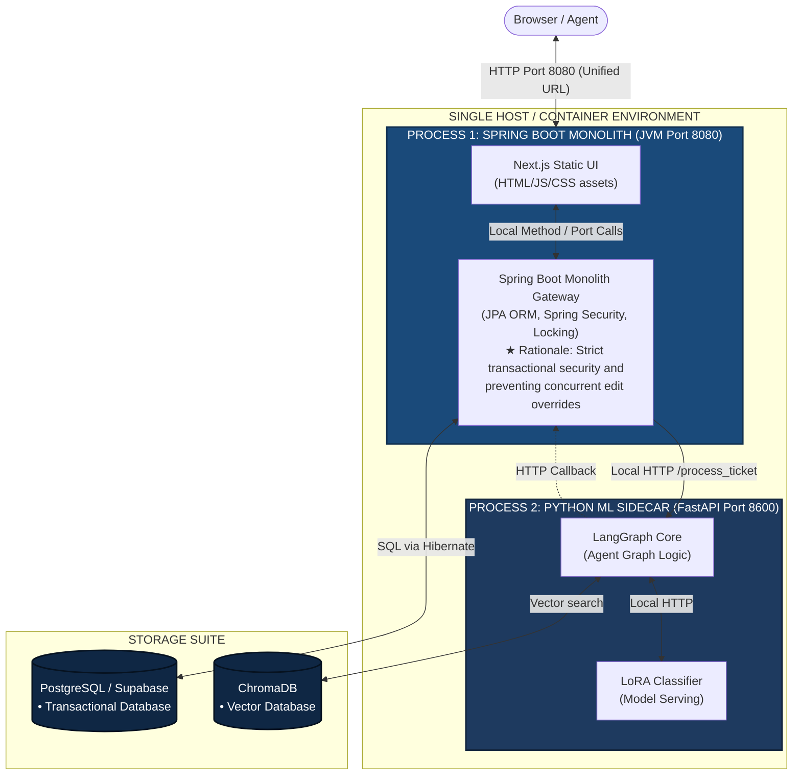

# Architecture Upgrade & Viva Defense Guide
## Modernising Clario: Transitioning to a Hybrid Monolith (Next.js + Spring Boot + Python ML Sidecar)
### CS3501 Undergrad Project Addendum

---

## 1. Executive Summary & Terminology Clarification

For our final year undergraduate project, we wanted to demonstrate industry-grade software engineering maturity by designing a system that balances **architectural robustness**, **low operational overhead**, and **performance**.

Before discussing the system structure, we must clarify a key terminological distinction often raised by examiners during project evaluations:

1.  **"Monolithic Models" (AI Architecture):** This refers to using a single, giant LLM prompt to try and handle classification, routing, and drafting all at once. **We do not use monolithic models.** We use a modular, **Multi-Agent Collaboration** pattern (using LangGraph nodes) to distribute tasks among specialized agents.
2.  **"Monolithic Architecture" (Software Deployment):** This refers to packaging the user interface, API gateway, and transactional code into a single deployment footprint. **We use a Hybrid Monolith** to run our frontend and backend together, offloading heavy machine learning processes to a local sidecar.

---

## 2. Standard Monolith vs. Hybrid Monolith: Crucial Differences

A **Standard Monolith** runs everything inside a **single OS process** using a **single programming language** (e.g., a 100% Java application or a 100% Python application). 

Our **Hybrid Monolith** (or *Sidecar Monolith*) uses **two separate processes and runtimes** running locally on the same host network. The Python ML Sidecar uses **FastAPI** to expose our RAG and LangGraph capabilities to the Spring Boot monolith:

### Local Runtime Process Isolation
```
┌─────────────────────────────────────────────────────────────────────────┐
│ SINGLE HOST MACHINE / CONTAINER                                         │
│                                                                         │
│  ┌────────────────────────────────────┐                                 │
│  │   PROCESS 1: SPRING BOOT (Java)    │                                 │
│  │   • Serves Next.js UI Pages        │                                 │
│  │   • Connects to PostgreSQL         │                                 │
│  │   • Runs JWT security & Gateway    │                                 │
│  └─────────────────┬──────────────────┘                                 │
│                    │                                                    │
│                    │ Local HTTP Requests (localhost Port 8600)          │
│                    ▼                                                    │
│  ┌────────────────────────────────────┐                                 │
│  │   PROCESS 2: FASTAPI (Python)      │                                 │
│  │   • Runs LangGraph state machine   │                                 │
│  │   • Runs ChromaDB RAG Search       │                                 │
│  │   • Serves QLoRA inference adapter │                                 │
│  └────────────────────────────────────┘                                 │
└─────────────────────────────────────────────────────────────────────────┘
```

### Architectural Comparison

| Feature | Standard Monolith | Our Hybrid Monolith | Microservices Mesh |
|---|---|---|---|
| **Process Count** | **1 Process** | **2 Processes** (Spring Boot + FastAPI) | **5+ Processes** (independent containers) |
| **Language Runtime** | **Single Runtime** (e.g., only Java/Python) | **Polyglot** (JVM for transaction, CPython/FastAPI for ML) | **Many Polyglot** runtimes |
| **Fault Isolation** | **None.** If the ML code crashes, the entire website goes offline. | **Partial.** If the FastAPI sidecar crashes, Spring Boot remains online to serve fallback responses. | **High.** A crash in the ML container has no physical effect on other services. |
| **CORS Overhead** | **None.** (Single port) | **None.** Next.js assets are served directly from Spring Boot. | **High.** Requires cross-origin resource sharing headers on all APIs. |
| **Database Access** | Direct access to a single DB. | PostgreSQL belongs to Spring Boot; ChromaDB belongs to Python/FastAPI. | Each service completely isolates its own database. |

---

## 3. Hybrid Monolithic System Flow

In this deployment model, the frontend and enterprise gateway are packaged together as a single runnable JVM unit. The Python agent service runs adjacent to it as a local FastAPI application.



---

## 4. Implementing RAG: Java vs. Python (with FastAPI)

A common question during architectural reviews is: **"Is implementing RAG a problem in Spring Boot compared to Python/FastAPI?"**

*   **No, because we separate RAG logic from Transactional logic.**
*   The actual vector similarity search and LLM context synthesis are **not** written in Java. They are handled entirely by the **Python ML Sidecar** (via `rag_tool.py` and `chromadb` clients) and exposed through a lightweight **FastAPI** web framework.
*   **Why this is an advantage:**
    *   The Python ecosystem dominates RAG development. Python libraries for vector stores (Chroma, FAISS), embeddings (sentence-transformers), and tokenization are mature, lightweight, and highly optimized.
    *   Attempting to write full RAG logic inside Spring Boot using Java libraries (like Spring AI) can be problematic. Java lacks native, lightweight, offline embedding models, meaning you would have to write complex custom wrappers or rely on external web APIs.
    *   By keeping RAG in a Python service served by FastAPI, **Java only acts as a coordinator**. Spring Boot calls the FastAPI endpoint (`POST /process_ticket`) over localhost HTTP, receives the compiled draft, and writes it to PostgreSQL.

---

## 5. Alternative Placements for Spring Boot in the Stack

If we decide not to use Spring Boot as the primary front-end serving monolith, there are two other highly professional ways to integrate it:

### Alternative A: Dedicated Relational Persistence Service (DB Microservice)
*   **Structure:** Next.js acts as the main gateway, serving the UI and communicating directly with the Python agent service. When the Python agent completes execution, it makes an HTTP call to a private **Spring Boot Database Service**.
*   **Why:** This restricts Spring Boot strictly to database transaction security. Next.js handles routing and rendering, while Spring Boot acts as a secure, statically typed data access firewall for PostgreSQL.

### Alternative B: External Integration Adapter (Enterprise Gateway)
*   **Structure:** Spring Boot acts as the adapter between our ticketing system and external enterprise systems (such as the **Rysera STEM LMS** catalogue database).
*   **Why:** Enterprise systems expose complex, SOAP-based or legacy REST APIs. Spring Boot has robust native networking libraries (like `WebClient` and XML parsers) that handle enterprise authentication and schema transformations much more reliably than lightweight JavaScript or Python runtimes.

---

## 6. Alternative Combinations Evaluated (and Why Rejected)

During our planning phase, we evaluated several stack combinations:

### Alternative A: Pure Python Monolith (Django / FastAPI + React SPA)
*   **Why Rejected:** Dynamic scripting languages like Python struggle under high concurrent connection loads because of the Global Interpreter Lock (GIL). Writing our core enterprise gateway in Django/FastAPI does not offer the compile-time type safety, structured Dependency Injection, or robust transaction management (JPA Hibernate) that Spring Boot offers. Furthermore, Vite React SPAs expose backend REST endpoints in the browser's source code, presenting a security concern.

### Alternative B: Pure JavaScript/Node.js Monolith (Next.js Full-Stack or NestJS + React)
*   **Why Rejected:** While Next.js App Router API Routes can run server-side JavaScript, they are not designed for enterprise-grade relational database management or connection pooling. More importantly, Node.js cannot run PyTorch, HuggingFace transformers, or python-centric PEFT adapters natively, requiring complex, fragile child-process spawning to trigger our machine learning code.

### Alternative C: Spring Boot + Spring AI Monolith (No Python)
*   **Why Rejected:** Although Spring AI provides wrappers for external API calls, our project requires a **custom model training and distillation pipeline** (PII masking with spaCy, teacher-student distillation with Gemini, and custom QLoRA adapter training). The machine learning ecosystem (bitsandbytes, PEFT, PyTorch) is Python-centric. Restricting our system to Java would prevent us from serving our custom fine-tuned model offline.

### Alternative D: Distributed Microservices Architecture
*   **Why Rejected:** While microservices offer excellent scalability and independent deployment, they introduce massive operational complexity that is unjustified for our initial scope. A microservices mesh requires complex orchestration (e.g., Kubernetes), distributed tracing, managing network serialization overhead between services, and handling eventual consistency across multiple isolated databases. For Clario, adopting microservices would violate our zero-capital compute budget and dramatically slow down development velocity for a 3-person team. Our Hybrid Monolith provides the necessary logical separation between transactional data (Spring Boot) and AI compute (Python) without the DevOps burden of managing a distributed network mesh.

---

## 7. Why We Selected Next.js + Spring Boot + Python Hybrid Monolith

Our chosen combination represents a highly optimized, modern hybrid architecture:

1.  **Unified Frontend Serving:** By compiling Next.js statically and placing it in Spring Boot's `/resources/static/` folder, the entire user-facing application is served from a **single port (e.g., `8080`)**. This eliminates browser CORS issues entirely.
2.  **Enterprise-Grade Gateway Security:** Spring Boot handles database mapping via Spring Data JPA. We use JPA's `@Version` annotations to easily manage **optimistic locking** (preventing concurrent write conflicts when two human agents review the same ticket).
3.  **Strict Isolation of AI Compute:** The Python ML sidecar runs as a private, local daemon served by FastAPI. It is completely shielded from public internet traffic—all client requests hit Spring Boot first, which sanitizes, authenticates, and filters requests before passing the ticket payload to the Python sidecar.

---

## 8. Containerisation Strategy: Why We Still Use Docker

Even though we are deploying a **Hybrid Monolith** (which drastically reduces our container count compared to microservices), **we still use Docker**. 

Docker is not just for microservices; it is critical for managing **environment parity** and **dependency isolation**, especially when working with machine learning libraries and different runtime versions.

In our Hybrid Monolithic setup, we containerize the system into **three distinct services** inside a single `docker-compose.yml` file:

```
clario_net (Docker Bridge Network)
  ├── clario-app (Spring Boot Monolith + Next.js SPA)  -> Exposes Port 8080 (public)
  ├── clario-ml-sidecar (FastAPI Agent + ChromaDB)     -> Port 8600 (private internal)
  └── postgres (PostgreSQL / Supabase Database)       -> Port 5432 (private internal)
```

### What We Containerise & Why:

1.  **The Spring Boot Monolith (`clario-app`):** Contains the Java JRE and the compiled application `.jar` (with Next.js static files). Ensures JVM versions are identical across laptops and demo hardware.
2.  **The Python ML Sidecar (`clario-ml-sidecar`):** Contains CPython 3.11, FastAPI, PyTorch, LangGraph, and spaCy. Containerisation solves the fragile environment compilation issue of ML packages across OS platforms.
3.  **The Relational Database (`postgres`):** Contains PostgreSQL 16. Avoids requiring native installation on local dev systems and manages volume persistence.

---

## 9. Scaling Roadmap: When and Why to Transition to Microservices

During the viva evaluation, examiners often ask about **future scalability**. A common mistake is saying, *"To scale this project, we must immediately convert it to microservices."* 

In reality, our Hybrid Monolith can scale vertically (larger servers) and horizontally (running multiple instances behind a load balancer with a shared database) to handle hundreds of thousands of tickets. 

However, as Clario reaches enterprise scale, we would trigger a **planned migration to a Polyglot Microservices architecture** for three specific reasons:

### 1. Scaling Asymmetry (Compute vs. Hardware Constraints)
*   **The Problem:** The transactional database access (Spring Boot) requires high memory and CPU, whereas the ML classifier and agent drafting (Python/LangGraph) require specialized GPU acceleration (VRAM/CUDA).
*   **The Microservices Solution:** In a microservices mesh, we can deploy the Spring Boot gateway on cheap, CPU-only instances (like AWS EC2 t3.large), while isolating the Python ML service onto dedicated GPU instances (like AWS EC2 g4dn). This avoids paying for expensive, idle GPU hardware just to process simple user logins.

### 2. Knowledge Base & Vector Store Scaling
*   **The Problem:** As the knowledge base grows from a few dozen files to millions of documents, a local ChromaDB database will run out of memory and slow down.
*   **The Microservices Solution:** We would spin the vector store out into its own microservice layer using a managed cloud database (like Pinecone, Milvus, or Supabase pgvector) that supports sharding, indexing, and distributed vector lookups.

### 3. Team Scaling & Development Velocity
*   **The Problem:** As the engineering team grows from 3 members to 30, committing to a single monolithic repository leads to build bottlenecks, CI/CD queue delays, and git merge conflicts.
*   **The Microservices Solution:** We would split the codebase into three separate repositories (Frontend, Gateway, and Agent Core). Each team can build, test, and deploy their service independently without affecting the other two.

---

## 10. Viva Defense Q&A Prep

### Q1: "Why did you build a hybrid monolith instead of a distributed microservice mesh?"
*   **Defense:** *"While a distributed microservice mesh is theoretically scalable, it introduces massive network serialization overhead, complex container orchestration, and points of failure. For Clario, we opted for a **Hybrid Monolith**. The frontend (Next.js) is compiled statically and served directly by the backend (Spring Boot) from a single port, eliminating network latency and CORS configurations. We kept Python isolated as a local sidecar process strictly because Java cannot natively execute Python ML libraries (PyTorch, PEFT, spaCy). This hybrid model gives us monolithic simplicity for deployment, but runtime isolation for heavy machine learning computations."*

### Q2: "Since Next.js is statically exported to Spring Boot, don't you lose Server-Side Rendering (SSR)?"
*   **Defense:** *"Yes, static export (`output: 'export'`) turns Next.js into a highly optimized Single Page Application (SPA). For a support ticket submitter or human reviewer dashboard, SEO is not a priority, and all data is dynamic. Therefore, SSR is unnecessary. Serving the frontend as a static SPA directly from the Spring Boot JVM minimizes initial server load and allows the client to fetch data asynchronously via Spring Boot's REST endpoints, which is the most efficient pattern for this dashboard workflow."*

### Q3: "How does the Spring Boot backend communicate with the Python ML sidecar?"
*   **Defense:** *"The communication is handled locally via a private, high-speed loopback HTTP interface (or gRPC) served by **FastAPI** on the Python side. When a ticket is submitted, Spring Boot writes it to PostgreSQL, returns a `202 Accepted` to the client, and launches a background thread that makes a local HTTP call to the FastAPI `/process_ticket` endpoint. This design ensures that the public never interacts with our Python ML daemon directly, securing our model serving and vector search layers from direct exposure."*

### Q4: "Do you need to migrate to microservices to scale this project?"
*   **Defense:** *"No, we do not need to migrate immediately. Our Hybrid Monolith scales very efficiently horizontally by running multiple instances of the Spring Boot application behind a load balancer and sharing a central database. However, if the project reached enterprise scale, we would migrate to microservices specifically to **decouple hardware dependencies**. This would allow us to run the CPU-intensive database gateway on cheap cloud nodes, while scaling the GPU-intensive ML classification engine independently on GPU-accelerated cloud nodes when ticket volume spikes."*

### Q5: "If your deployment is a monolith, why did you still containerise it with Docker?"
*   **Defense:** *"We used Docker to solve the **'it works on my machine'** environment parity problem. Our Python ML sidecar has complex native C++ and CUDA machine learning dependencies (PyTorch, PEFT, bitsandbytes, and spaCy language model packages) that compile differently on Windows, macOS, and Linux. Containerising the Spring Boot monolith, the Python FastAPI sidecar, and the PostgreSQL database ensures the exact same runtime versions, package builds, and loopback network configurations execute on all developer laptops and symposium evaluation rigs without requiring manual installation."*

### Q6: "Why is Spring Boot used in the Gateway, and does this affect RAG implementation?"
*   **Defense:** *"Spring Boot is used in the gateway because of its mature security (JWT verification), connection pool management (HikariCP), and transactional integrity (Hibernate ORM for optimistic locking). This does not complicate RAG because Spring Boot does not perform RAG searches itself. Spring Boot merely coordinates the call—database logging is handled in Java, while RAG vector lookup and LLM response drafting remain isolated in our Python ML sidecar daemon exposed via FastAPI. This gives us the security of Java and the ML agility of Python without language-level coupling."*

---

## 11. Project Setup & Directory Layout

To maintain this hybrid monolithic setup, your folder structure will be organized as follows:

```
clario/
├── clario-app/                      <- Spring Boot Monolith + Next.js Frontend
│   ├── src/
│   │   ├── main/
│   │   │   ├── java/com/clario/     <- Spring Controllers, Entities, Repositories
│   │   │   └── resources/
│   │   │       ├── application.yml
│   │   │       └── static/          <- Next.js static UI assets
│   └── pom.xml
├── clario-ml-sidecar/               <- Python ML Sidecar Daemon (FastAPI App)
│   ├── app/
│   │   ├── graph/                   <- LangGraph definitions (SurrogateShield, EGC, etc.)
│   │   └── main.py                  <- Exposes FastAPI endpoint /process_ticket
│   └── requirements.txt
├── legacy/                          <- Archived old codebase (FastAPI gateway, old frontend)
```
