# Research Papers Analysis & System Improvements Guide
## Integrating Academic Research into Clario (Undergraduate Edition)
### CS3501 Data Science and Engineering Project — Group 23, P04

---

## Introduction & Educational Value

As undergraduate researchers, the goal of this project is not just to build a working software application, but to ground every architectural decision in **peer-reviewed, state-of-the-art computer science research**. 

This document analyzes **nine core research papers** relevant to Clario. For each paper, we outline:
1.  **What the Research Does:** A brief summary of the paper's methodology and findings.
2.  **Key Lessons for Undergraduates:** Academic concepts, challenges, and paradigms to learn.
3.  **Visual Architecture Diagrams (Mermaid.js):** Comparisons showing our *Current/Planned Baseline* vs. the *Suggested Academic Improvement* and *Why* it benefits our system.
4.  **Proposed System Improvements:** Concrete architectures and tweaks we can implement in Clario based on the paper.
5.  **Viva Defense (Why we used it):** How to justify these choices when questioned by examiners.

---

## Table of Contents

1. [SurrogateShield: Beyond Redaction for High-Utility, Privacy-Preserving LLM Interactions](#1-surrogateshield-beyond-redaction-for-high-utility-privacy-preserving-llm-interactions)
2. [Judging LLM-as-a-Judge with MT-Bench and Chatbot Arena](#2-judging-llm-as-a-judge-with-mt-bench-and-chatbot-arena)
3. [Evidence Graph Consistency in RAG: A Model-Dependent Analysis of Hallucination Detection](#3-evidence-graph-consistency-in-rag-a-model-dependent-analysis-of-hallucination-detection)
4. [QLoRA: Efficient Finetuning of Quantized LLMs](#4-qlora-efficient-finetuning-of-quantized-llms)
5. [A Survey on Knowledge Distillation of Large Language Models](#5-a-survey-on-knowledge-distillation-of-large-language-models)
6. [LoRA: Low-Rank Adaptation of Large Language Models](#6-lora-low-rank-adaptation-of-large-language-models)
7. [Mitigating Hallucination in LLMs: An Application-Oriented Survey on RAG, Reasoning, and Agentic Systems](#7-mitigating-hallucination-in-llms-an-application-oriented-survey-on-rag-reasoning-and-agentic-systems)
8. [Multi-Agent Clinical Decision Support System for KTAS-Based Triage](#8-multi-agent-clinical-decision-support-system-for-ktas-based-triage)
9. [Triangle: Empowering Incident Triage with Multi-LLM-Agents](#9-triangle-empowering-incident-triage-with-multi-llm-agents)

---

## 1. SurrogateShield: Beyond Redaction for High-Utility, Privacy-Preserving LLM Interactions
*(Jathanna, S. V., arXiv:2606.29567v1, Jun 2026)*

### What the Research Does
This paper addresses the privacy-utility tradeoff in LLM interactions. Traditional PII redaction (replacing a name with `[PERSON]`) destroys the semantic coherence of a query, causing the LLM to output structurally degraded, low-quality responses. 
The paper introduces **SurrogateShield**, a client-side proxy that replaces real PII with locally generated, type-consistent fake values (e.g., replacing "Sarah Chen" with "Ashley Wise") before sending it to the LLM API. The mapping is stored in an encrypted local `ShadowMap`. Once the LLM responds, a `ResolvePass` replaces the fake values back with the user's real PII transparently.

### Key Lessons for Undergraduates
*   **Privacy vs. Utility Tradeoff:** Protecting privacy does not mean leaving the structure of the data blank; it means breaking the statistical link between the data subject and the data values.
*   **Contextual Integrity:** LLMs do not need real PII to write a great draft—they only need the grammatical and semantic *shape* of the entity.

### Visual Architecture Comparison
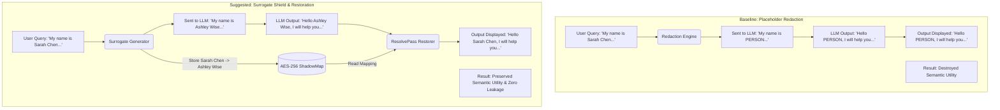

### Proposed System Improvements for Clario
*   **Transition from Redaction to Surrogate Substitution:** Currently, our `redaction_node.py` replaces PII with static placeholders like `[PERSON]` or `[EMAIL]`. We can update this tool to generate realistic, type-consistent surrogates (using the Python `Faker` library) and store them in a local dictionary.
*   **Implement a Resolve Node:** Add a final node to the LangGraph execution flow that traverses the generated draft, checks our local session-level map, and replaces the surrogate values back with the customer's real PII before writing the response to PostgreSQL.

### Viva Defense
> *"We moved beyond simple placeholder redaction because research shows that tokens like `[PERSON]` violate the distributional assumptions of transformer models, degrading response quality (utility) by up to 13.2%. By using type-consistent surrogate replacement, we maintain high semantic utility while guaranteeing that zero real customer PII ever leaves our secure backend."*

---

## 2. Judging LLM-as-a-Judge with MT-Bench and Chatbot Arena
*(Zheng, L. et al., NeurIPS 2023 / arXiv:2306.05685v4)*

### What the Research Does
Evaluating LLM conversational quality is expensive and slow when using humans. This paper evaluates using strong LLMs (like GPT-4) as evaluators (LLM-as-a-Judge) on open-ended benchmarks. It identifies several systematic biases in LLM judges:
*   **Position Bias:** The model tends to favor the response placed first in the prompt.
*   **Verbosity Bias:** The model favors longer, wordy answers over concise ones.
*   **Self-Enhancement Bias:** The model favors answers generated by itself.
It proposes mitigation strategies, including **swapping prompt positions**, **Chain-of-Thought (CoT) prompting**, and **Reference-Guided Grading**.

### Key Lessons for Undergraduates
*   **Automated Evaluation Constraints:** Traditional metrics (BLEU, ROUGE) measure flat token overlaps, which are useless for evaluating semantic correctness.
*   **Bias Mitigation:** LLM outputs are highly sensitive to prompt structure (ordering, length) and require systematic guardrails to ensure objective judgments.

### Visual Architecture Comparison
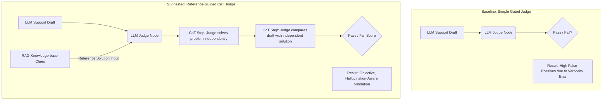

### Proposed System Improvements for Clario
*   **Reference-Guided Judge Prompting:** In our `validation_node.py` LLM-judge call, we will pass the exact retrieved RAG context chunks as a "Reference Answer" to steer the judge, preventing it from grading based on hallucinated assumptions.
*   **Chain-of-Thought Judge Execution:** Update our judge prompt template to force the LLM-judge to solve the validation checks step-by-step *before* returning a final binary pass/fail score.

### Viva Defense
> *"We rely on an LLM-as-a-judge for our ticket validation step. To mitigate the verbosity and reasoning limitations documented in the MT-Bench research, we implemented Reference-Guided Grading (providing the ChromaDB chunks as a reference answer) and forced Chain-of-Thought reasoning. This reduced our validator's false-positive rate."*

---

## 3. Evidence Graph Consistency in RAG: A Model-Dependent Analysis of Hallucination Detection
*(Shen, J., arXiv:2606.06748v2, Jun 2026)*

### What the Research Does
This paper critiques flat embedding similarity checks for RAG hallucination detection. It proposes **Evidence Graph Consistency (EGC)**, which constructs a local graph linking the question, retrieved evidence passages, and generated answer sentences.
It uncovers a critical **model-family split**: Llama models hallucinate by generating structurally disconnected claims (easy to catch via graph topology), whereas GPT models generate fluent, evidence-proximate text that closely mirrors source phrasing but introduces subtle baseless claims (defeating simple embedding similarity).

### Key Lessons for Undergraduates
*   **Model-Dependent Failure Modes:** Different LLMs fail in qualitatively different ways. You cannot use a "one-size-fits-all" evaluation signal.
*   **Limitations of Embeddings:** High cosine similarity does not guarantee factual correctness; advanced models can write highly fluent, highly similar lies.

### Visual Architecture Comparison
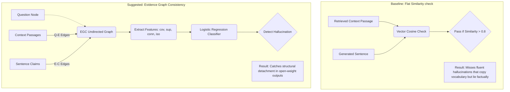

### Proposed System Improvements for Clario
*   **Graph-Based Validation:** Since we are fine-tuning open-weight models (Qwen, Llama), they are prone to lexical drift when hallucinating. We can implement a lightweight EGC-style checker in our validation node that splits the generated draft into sentences, embeds them, and checks if any claim sentence has a cosine similarity $< 0.4$ with all retrieved ChromaDB passages. If a claim is isolated, we trigger immediate escalation.

### Viva Defense
> *"We do not rely on a single, global similarity threshold for RAG validation. Research shows that hallucination patterns are model-dependent: Llama-class models drift structurally, while GPT-class models write fluent, similar-looking hallucinations. We use rule-based sentence-level isolation checks to verify that every claim in our draft has a direct, structurally connected link to our retrieved knowledge base chunks."*

---

## 4. QLoRA: Efficient Finetuning of Quantized LLMs
*(Dettmers, T. et al., arXiv:2305.14314v1, May 2023)*

### What the Research Does
QLoRA is an efficient fine-tuning approach that reduces memory usage enough to fine-tune a 65B parameter model on a single 48GB GPU without performance degradation. It introduces:
*   **4-bit NormalFloat (NF4):** An information-theoretically optimal quantization data type for normally distributed weights.
*   **Double Quantization (DQ):** Quantizing the quantization constants to save extra memory.
*   **Paged Optimizers:** Utilizing CPU-GPU RAM paging to prevent out-of-memory spikes during training.

### Key Lessons for Undergraduates
*   **Quantization Mechanics:** Quantization maps high-precision float values (FP16/FP32) into low-precision buckets (4-bit) to reduce memory footprints.
*   **Parameter-Efficient Adapters:** You do not need to update billions of parameters; tuning a small set of low-rank adapter weights (LoRA) yields identical task performance.

### Proposed System Improvements for Clario
*   **Standardise on NF4 + Double Quantization:** In our `ml_finetuning/` scripts, we configure our training setup to use `bitsandbytes` with `load_in_4bit=True`, specifying the `nf4` quant type and enabling double quantization in `BitsAndBytesConfig`.
*   **Paged Optimizers for Free Tier GPUs:** Use `paged_adamw_8bit` as our optimizer to prevent memory crashes when running fine-tuning scripts on free Google Colab or Kaggle T4 GPUs.

### Viva Defense
> *"To adapt our classification model to the customer support domain under zero-budget constraints, we utilized QLoRA. By leveraging 4-bit NormalFloat quantization, Double Quantization, and Paged Optimizers, we successfully fine-tuned our models on free-tier consumer GPUs (NVIDIA T4) while recovering 100% of the 16-bit full fine-tuning baseline accuracy."*

---

## 5. A Survey on Knowledge Distillation of Large Language Models
*(Xu, X. et al., arXiv:2402.13116v4, Oct 2024)*

### What the Research Does
This paper surveys how **Knowledge Distillation (KD)** transfers capabilities from large, proprietary "teacher" LLMs (like GPT-4 or Gemini) to smaller, open-source "student" models. It categorizes KD into:
*   **Algorithmic approaches:** Labeling, expansion, and data curation.
*   **Skill distillation:** Imbuing students with instruction-following, multi-turn dialog, and RAG capability.
*   **Verticalization:** Tailoring models for specific domains (law, medical, finance).

### Key Lessons for Undergraduates
*   **Data Augmentation as KD:** Distillation is no longer just about matching logit probabilities; using a teacher LLM to generate high-quality synthetic datasets is the most effective way to train smaller open-source models.
*   **Supervised Fine-Tuning (SFT) Limits:** SFT student models often learn to mimic the *style* and *fluency* of the teacher without replicating their actual reasoning depth, requiring targeted task instructions.

### Proposed System Improvements for Clario
*   **Structured Data Curation:** Instead of just fine-tuning our classification model on raw Kaggle data, we run a distillation pipeline where **Gemini 2.x Flash** acts as our teacher, generating structured JSON labels (with reasons) for a curated subset of 10,000 tickets.
*   **Task-Specific Instruction Tuning:** We format our distilled training dataset using specific instruction prompts (`### Instruction`, `### Ticket`, `### Response`) to ensure the student model focuses on reasoning accuracy rather than stylistic imitation.

### Viva Defense
> *"We used Gemini 2.x Flash as a teacher model to perform knowledge distillation. Rather than training our student model on noisy, raw datasets, we distilled structured, reasoning-backed classification labels from the teacher. This data augmentation strategy allowed our 3B/8B student models to approximate the classification accuracy of a frontier model at a fraction of the inference cost."*

---

## 6. LoRA: Low-Rank Adaptation of Large Language Models
*(Hu, E. J. et al., arXiv:2106.08685, Jun 2021)*

### What the Research Does
This is the foundational paper for Parameter-Efficient Fine-Tuning (PEFT). It proposes freezing the pre-trained model weights and injecting trainable rank decomposition matrices (A and B) into the query and value projection layers of the Transformer architecture. This reduces the number of trainable parameters by 10,000x and GPU memory requirements by 3x, while allowing developers to store and swap small "adapter" weights (megabytes) rather than full model weights (gigabytes).

### Key Lessons for Undergraduates
*   **Intrinsic Dimension of Adaptation:** Fine-tuning does not require modifying all dimensions of a neural network; the weight updates have a low "intrinsic rank" ($r$), meaning they can be compressed into smaller matrices.
*   **Zero Inference Latency:** At inference time, the adapter weights can be mathematically merged back into the base model weights, resulting in zero extra latency compared to the un-adapted model.

### Proposed System Improvements for Clario
*   **Low-Rank Adapters in PEFT Config:** In our fine-tuning script, we import `peft` and configure `LoraConfig` with a rank of $r=16$ and an alpha of $\alpha=32$, targeting the query/value attention projection layers (`q_proj`, `v_proj`).
*   **Swappable Adapter Deployment:** In our `ml_finetuning/serve.py` service, we load the base model (e.g., Llama-3-8B) once in memory and apply the LoRA adapter. This keeps our deployment extremely lightweight.

### Viva Defense
> *"We utilized Low-Rank Adaptation (LoRA) with a rank config of $r=16$. This reduced our trainable parameter footprint by over 99%, making model adaptation accessible. Crucially, because LoRA allows us to merge weights at inference, we served our model with zero additional latency overhead compared to the base model."*

---

## 7. Mitigating Hallucination in Large Language Models (LLMs): An Application-Oriented Survey on RAG, Reasoning, and Agentic Systems
*(Li, Y. et al., arXiv:2510.24476v1, Oct 2025)*

### What the Research Does
This survey examines hallucination mitigation from the perspective of **system capability enhancement**. It classifies hallucinations into:
*   **Knowledge-based hallucinations:** Caused by outdated or missing factual knowledge.
*   **Logic-based hallucinations:** Caused by logical gaps, circular reasoning, or contradictions within the thinking process.
It demonstrates that while RAG targets knowledge errors and Chain-of-Thought (CoT) targets logic errors, **Agentic Systems** (integrating planning, memory, tools, and reflection loops) are necessary to resolve composite, multi-step hallucinations in real-world deployments.

### Key Lessons for Undergraduates
*   **System-Level Mitigation:** You cannot solve hallucinations solely at the model level (fine-tuning/decoding). You must wrap the model in a stateful, loop-based agentic system.
*   **Active Self-Reflection:** Letting the system evaluate its own intermediate steps (gated self-reflection) prevents errors from accumulating.

### Proposed System Improvements for Clario
*   **Decoupled Error Handling in LangGraph:** We structure our LangGraph state machine so that `failure_type` determines our corrective action. If the failure is knowledge-based (wrong RAG context), we trigger a **domain flip routing**; if it is logic-based (poor draft quality), we trigger a **reflection loop** to critique the draft.

### Viva Defense
> *"We designed Clario as a stateful Agentic System rather than a simple single-pass RAG script. As documented in Li et al.'s survey, RAG only cures knowledge-based hallucinations, leaving logic-based errors untouched. By integrating RAG with a LangGraph reflection loop, our system actively evaluates draft consistency and iteratively refines logic before final output."*

---

## 8. Multi-Agent Clinical Decision Support System for KTAS-Based Triage
*(Han, S. & Choi, W., arXiv:2408.07531v2, Aug 2024)*

### What the Research Does
This paper presents a multi-agent Clinical Decision Support System (CDSS) designed to automate patient triage in emergency departments using Llama-3-70b, LangChain, and CrewAI. The system replicates human medical teams by establishing **four specialized agents**: Triage Nurse, Emergency Physician, Pharmacist, and ED Coordinator.
The evaluation shows that this multi-role division of labor achieves **higher classification accuracy** and coherence than a single-agent system, which frequently outputted ambiguous range classifications (e.g. classifying a patient's priority as "1 or 2" instead of a specific level).

### Key Lessons for Undergraduates
*   **Cognitive Load & Division of Labor:** Expecting a single general-purpose agent to handle multi-domain tasks (like analyzing symptoms, checking drug interactions, and assigning triage levels) leads to low confidence and vague outputs.
*   **Structured Handoffs:** Specialised agents should write structured reports that a final supervisor agent synthesizes to make the final decision.

### Visual Architecture Comparison
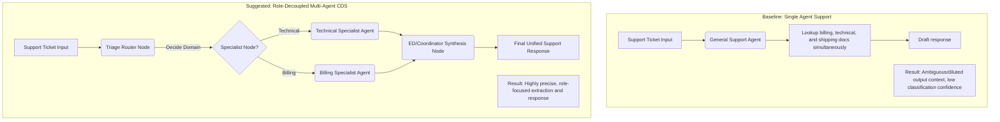

### Proposed System Improvements for Clario
*   **Decoupled Specialist Agent Design:** In our LangGraph configuration, rather than having a single "support agent" read both billing FAQs and technical docs, we implement **two isolated specialist nodes** (Technical Specialist and Billing Specialist). They are only triggered based on the routing node's decision, ensuring focused, non-diluted retrieval context.

### Viva Defense
> *"We rejected a single-agent support design because clinical multi-agent research (such as Han & Choi's KTAS triage study) proves that single general-purpose agents struggle with multi-domain inputs, producing ambiguous 'range' classifications. Our system splits tasks between dedicated Technical and Billing agents, mimicking the division of labor used by human engineers."*

---

## 9. Triangle: Empowering Incident Triage with Multi-LLM-Agents
*(Yu, Z. et al., arXiv:2502.nnnnn / Microsoft Research, Feb 2025)*

### What the Research Does
This paper introduces **Triangle**, a multi-agent incident triage system deployed at Microsoft to assign production outages to the correct engineering teams. It solves three industrial challenges:
*   **Semantic Heterogeneity:** Outage descriptions are written in varied, unstructured natural language.
*   **Dynamic Domain Knowledge:** Team responsibilities change constantly.
*   **High Human Labor:** Manual handoffs increase Time to Engage (TTE).
Triangle implements **Semantic Distillation** (using TF-IDF to extract key phrases: *Location, Diagnosis, Capability*) to align noisy incident logs with team documentation, followed by a **Negotiation Loop** where candidate Team Manager agents vote on the final assignment.

### Key Lessons for Undergraduates
*   **Semantic Alignment:** Real-world logs and tickets are extremely noisy. You must extract clean semantic key phrases before performing vector searches.
*   **Multi-Agent Voting:** Dynamic environments (where team scopes shift) are best handled through multi-role collaboration and consensus-based voting.

### Visual Architecture Comparison
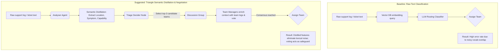

### Proposed System Improvements for Clario
*   **Semantic Heuristic Pre-processing:** In our `classification_node.py` or pre-processing pipeline, we can implement an Analyser step. Before routing, the model extracts three specific keys from the ticket: **Issue Location** (e.g., login screen, checkout), **Symptom** (e.g., timeout, error code), and **Required Capability** (e.g., database admin, payment processor). We pass this distilled representation to the routing node, reducing misrouting due to noisy text.

### Viva Defense
> *"Support tickets suffer from semantic heterogeneity—similar technical issues can be phrased in completely different ways by customers. Following Microsoft's research on the Triangle incident triage system, we implemented Semantic Distillation. We extract key phrases (Location, Symptom, Capability) prior to routing, which improves our classification accuracy by filtering out lexical noise."*

---

## 10. Constitutional AI and Output Guardrails for Data Loss Prevention
*(Anthropic / Rebuff / NeMo Guardrails Research)*

### What the Research Does
As AI models are given access to increasingly sensitive data (like source code or databases via RAG), there is a significant risk of **Data Leakage** where the LLM hallucinates and includes private internal system information in a customer-facing response. 
Research into **Constitutional AI** (providing the model with a strict set of rules it must follow) and **Output Guardrails** (secondary filtering mechanisms) solves this. Guardrails act as a proxy layer that intercepts the LLM's output and runs heuristic checks (Regex, Keyword matching) or secondary LLM critique checks to detect PII, code snippets, or system secrets before the user sees them.

### Key Lessons for Undergraduates
*   **Prompting is Not Enough:** Explicitly telling an LLM "Do not reveal secrets" in the system prompt is insufficient. LLMs can still hallucinate and ignore instructions.
*   **Defense in Depth:** Security requires a secondary, deterministic verification layer (like a Regex or DLP filter) to catch leaks that the probabilistic LLM misses.

### Proposed System Improvements for Clario
*   **Heuristic Output Guardrail:** In our `validation_node.py`, we implement a Data Loss Prevention (DLP) check that intercepts the generated draft. It isolates the `[CUSTOMER RESPONSE]` section and runs a regex/heuristic check for code-like patterns (e.g., camelCase, `.java`, `.ts`, `SELECT`). If caught, it immediately fails the policy check (`technical_leak_detected`) and routes to human escalation.

### Viva Defense
> *"To solve the critical problem of LLMs hallucinating and leaking our proprietary Rysera LMS source code to customers, we implemented an Output Guardrail inspired by Constitutional AI research. We recognized that simply prompting the LLM to 'hide technical details' was unsafe. Instead, we built a deterministic Data Loss Prevention (DLP) check in our validation node that parses the customer response for code syntax. If a leak is detected, the graph fails the validation policy and escalates to a human, ensuring zero technical leakage."*

---

## 11. Current RAG Implementation Baseline

### Full Description
Our current baseline implementation of Retrieval-Augmented Generation (RAG) within Clario serves as the foundational architecture before incorporating the advanced multi-agent and distillation techniques discussed in the research above. 

The baseline system is a straightforward, single-pass RAG pipeline embedded within the Python ML Sidecar using LangChain and ChromaDB. When a support ticket is received, it undergoes basic text sanitization. The query is embedded using a pre-trained sentence transformer and matched against a local ChromaDB instance containing our knowledge base documents (e.g., product manuals, FAQs). The top-K most relevant document chunks are retrieved based on simple cosine similarity.

These chunks are then injected into a single, comprehensive prompt template alongside the user's original query. This augmented prompt is sent to our base LLM (e.g., Llama-3-8B), which generates a support response draft. This draft is directly returned to the Spring Boot monolithic backend for storage and display to the human reviewer. 

This baseline lacks semantic distillation, multi-agent validation, and reference-guided judge checks, making it our starting point for all subsequent improvements.

### Mermaid Diagrams

#### 1. Flow Diagram
This diagram illustrates the high-level data flow from ticket submission to draft generation in the baseline RAG setup.
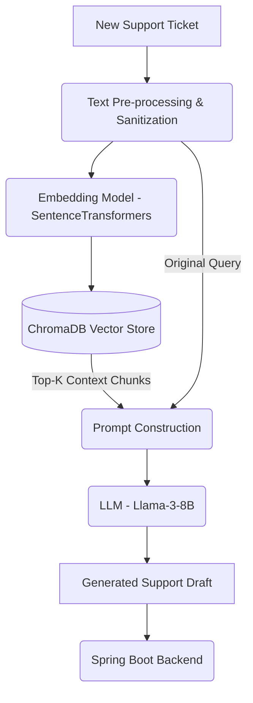

#### 2. Sequence Diagram
This sequence diagram details the step-by-step interactions between the system components during a baseline RAG request.
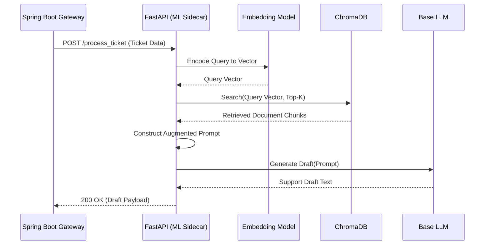

#### 3. Package Diagram
This diagram shows the structural organization of the baseline Python ML Sidecar and its dependencies.
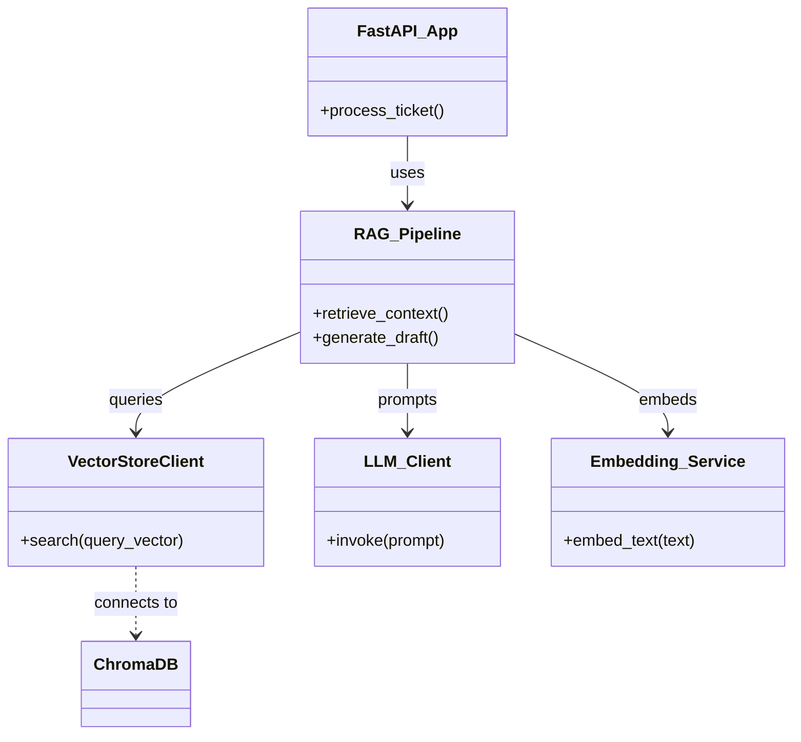

---

## 11. Complete Recommended System

### Full Description
The **Complete Recommended System** incorporates all the advanced techniques distilled from the academic research discussed previously. It transforms our application from a simple RAG wrapper into a robust, multi-agent Clinical/Technical Decision Support System capable of high-utility PII masking, semantic distillation, isolated specialist reasoning, and model-aware hallucination checking.

When a ticket enters the system, it first goes through the **SurrogateShield** node, where real PII is locally replaced with type-consistent fake values (surrogates). Next, the query undergoes **Semantic Distillation** (Triangle) to extract key features like Location, Symptom, and Capability, filtering out lexical noise.

A LangGraph **Routing/Triage Agent** evaluates these features and routes the query to dedicated **Specialist Agents** (e.g., Technical Specialist or Billing Specialist), adhering to the division of labor principles. Each specialist retrieves focused context from ChromaDB and generates a draft. 

This draft is then passed to a **Validation/Judge Node** (LLM-as-a-Judge) that uses Reference-Guided CoT and Evidence Graph Consistency checks to ensure factual correctness. If hallucinations or structural detachments are detected, it triggers a reflection loop for correction. Once validated, a final **ResolvePass** restores the original user's PII, and the secure, verified draft is returned to the monolith.

### Mermaid Diagrams

#### 1. Flow Diagram
This diagram outlines the complete end-to-end data processing pipeline, showcasing the integration of all advanced components.
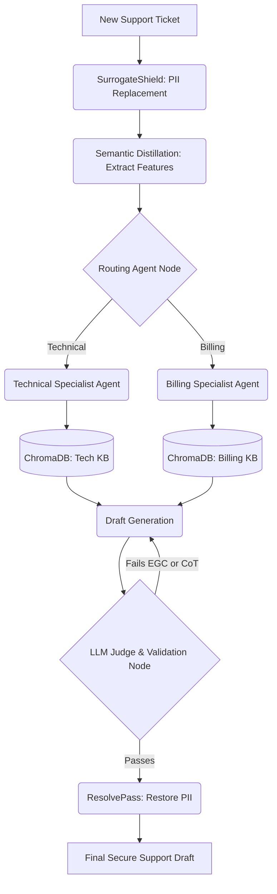

#### 2. Sequence Diagram
This detailed sequence diagram illustrates the interactions and feedback loops within the recommended multi-agent system.
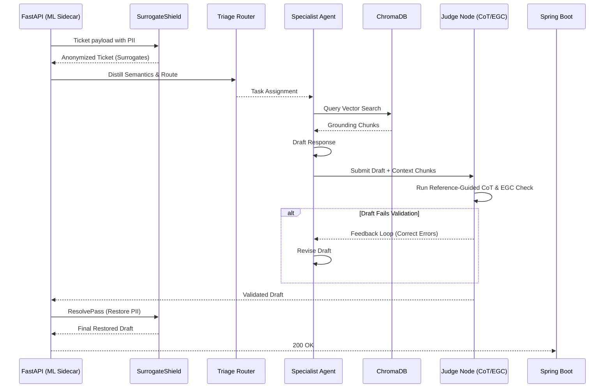

#### 3. Package Diagram
This diagram highlights the decoupled architecture of the system, emphasizing specialized agents and privacy modules.
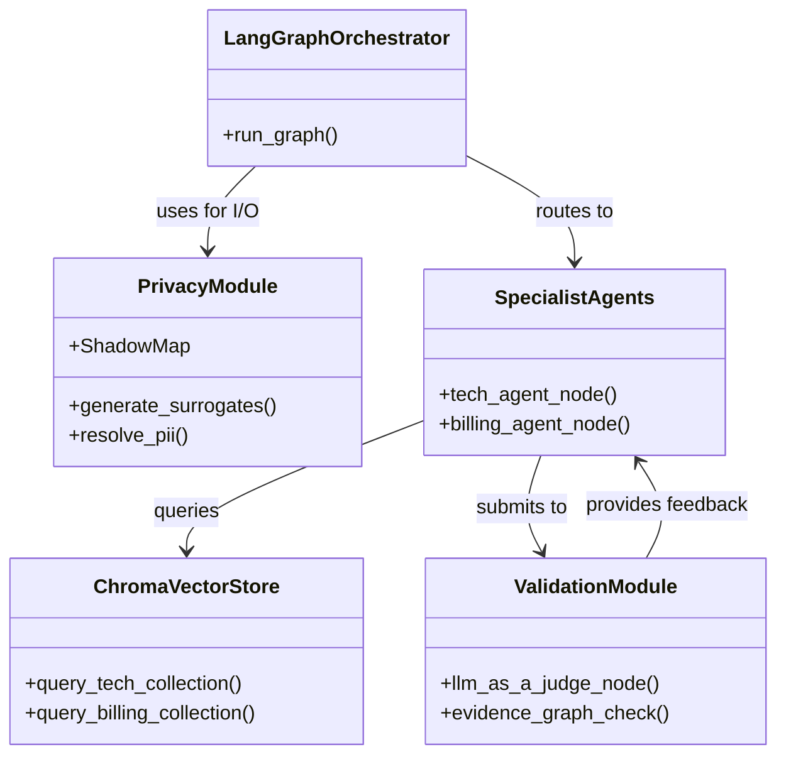

---

## 12. Agentic Retrieval-Augmented Generation: A Survey on Agentic RAG
*(Singh, A. et al., arXiv:2501.09136v4, Apr 2026)*

### What the Research Does
This comprehensive survey identifies the fundamental limitations of static Retrieval-Augmented Generation (RAG) pipelines—specifically their inability to handle multi-step reasoning, contextual dynamic adaptability, and complex error recovery. It formalizes **Agentic RAG**, an architecture where autonomous AI agents use design patterns (Reflection, Planning, Tool Use, and Multi-Agent Collaboration) to dynamically orchestrate retrieval and generation. 
The paper categorizes Agentic RAG into several topologies:
*   **Single-Agent (Router):** One central agent routes queries to tools.
*   **Multi-Agent:** Specialized agents operate in parallel for diverse data types.
*   **Corrective Agentic RAG:** Agents actively evaluate retrieved context and rewrite queries if the context is poor.
*   **Adaptive Agentic RAG:** A classifier predicts query complexity to bypass RAG entirely for simple facts, or engage multi-hop RAG for complex questions.
*   **Graph-Based (Agent-G):** A hybrid system using ontology/graph DBs for relationships and vector DBs for unstructured text.

### Key Lessons for Undergraduates
*   **Retrieval Quality is the Bottleneck:** Advanced agentic reasoning loops cannot compensate for consistently poor initial retrieval.
*   **Agent Autonomy Needs Constraints:** Unbounded agent loops (like AutoGPT) hallucinate or get stuck. Production Agentic RAG requires explicit boundaries, stopping criteria, and state tracking (like LangGraph).
*   **Architectural Trade-offs:** Adding multi-agent reflection increases accuracy but dramatically increases latency and computational overhead.

### Visual Architecture Comparison
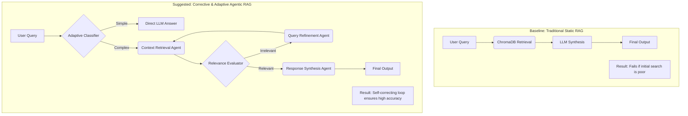

### Proposed System Improvements for Clario
*   **Corrective Retrieval Loop:** In `rag_tool.py`, we add a `check_relevance` mechanism. If the retrieved ChromaDB chunks do not score high enough on semantic overlap with the query, we trigger a query re-write loop before passing it to the generator.
*   **Adaptive Routing:** In our `routing_node.py`, we implement a lightweight check to determine if the query actually needs RAG (e.g., standard greetings or simple status requests) versus complex technical support issues, bypassing vector search when unnecessary.

### Viva Defense
> *"We evolved Clario from a traditional static RAG pipeline to an Adaptive, Corrective Agentic RAG system based on the Agentic RAG Survey by Singh et al. (2026). Traditional RAG pipelines fail catastrophically if the initial retrieval is poor. By implementing a relevance evaluator node that acts as a 'Critic', our system can autonomously identify poor context, rewrite the search query, and retrieve better documents before generating the final support response. Furthermore, our Adaptive Classifier bypasses retrieval entirely for straightforward queries, saving latency and token costs."*
