# Software Architecture Document (SAD)
## Clario — Multi-Agent Customer Support Triage and Response System
### CS3501 Data Science and Engineering Project — Group 23, P04
### Version 2.0 (Aligned with Supervisor Template) | July 2026

---

## Table of Contents
1. [Introduction](#1-introduction)
   - 1.1 [Purpose](#11-purpose)
   - 1.2 [Scope](#12-scope)
   - 1.3 [Definitions, Acronyms, and Abbreviations](#13-definitions-acronyms-and-abbreviations)
   - 1.4 [References](#14-references)
   - 1.5 [Overview](#15-overview)
2. [Architectural Representation](#2-architectural-representation)
3. [Architectural Goals and Constraints](#3-architectural-goals-and-constraints)
4. [Use-Case View](#4-use-case-view)
   - 4.1 [Use-Case Realizations](#41-use-case-realizations)
5. [Logical View](#5-logical-view)
   - 5.1 [Overview](#51-overview)
   - 5.2 [Architecturally Significant Design Packages](#52-architecturally-significant-design-packages)
6. [Process View](#6-process-view)
7. [Deployment View](#7-deployment-view)
8. [Implementation View](#8-implementation-view)
   - 8.1 [Overview](#81-overview)
   - 8.2 [Layers](#82-layers)
9. [Data View](#9-data-view)
10. [Size and Performance](#10-size-and-performance)
11. [Quality](#11-quality)
12. [References](#12-references)
[Appendices](#appendices)

---

## 1. Introduction

### 1.1 Purpose
This document provides a comprehensive architectural overview of the system, using a number of different architectural views to depict different aspects of the system. It is intended to capture and convey the significant architectural decisions which have been made on the system. This document is the single source of truth for all architectural decisions. All cross-team contracts (state shapes, API schemas, JSON payloads) are defined here and must be communicated as a team before implementation.

### 1.2 Scope
This Software Architecture Document applies to the Clario platform, an end-to-end automated support pipeline built on a **multi-agent collaboration** pattern, deployed as a **Hybrid Monolith** (Spring Boot + Python Sidecar). It covers the inbound ticket processing, PII redaction (SurrogateShield), semantic distillation, LLM classification, LangGraph agent routing, RAG execution, validation (EGC), and escalation handoffs.

### 1.3 Definitions, Acronyms, and Abbreviations
- **EGC**: Evidence Graph Consistency.
- **LLM**: Large Language Model.
- **PII**: Personally Identifiable Information.
- **QLoRA**: Quantized Low-Rank Adaptation (fine-tuning method).
- **RAG**: Retrieval-Augmented Generation.
- **SurrogateShield**: A custom PII anonymization module.
- **Hybrid Monolith**: An architecture combining a Spring Boot gateway and a Python ML Sidecar running locally.
- **LangGraph**: Framework for building stateful, multi-actor applications with LLMs.

### 1.4 References
- Tools used for drawing diagrams: Mermaid.js ([mermaid.live](https://mermaid.live)) for all Use-Case, Component, Class, Sequence, and Deployment diagrams.

### 1.5 Overview
This document describes what the rest of the Software Architecture Document contains and explains how the Software Architecture Document is organized. It uses the standard 4+1 View Model views (Use-Case, Logical, Process, Deployment, and Implementation) mixed with C4 methodology to provide comprehensive documentation of the Clario platform.

---

## 2. Architectural Representation
The software architecture for Clario is represented using a mix of UML and C4 model diagrams:
- **Use-Case View**: Represented by UML Use-Case diagrams to show actor interactions and realizations.
- **Logical View**: Represented by UML Class diagrams and Component Context diagrams (C1/C2/C3) to show structural decomposition.
- **Process View**: Represented by UML Activity and Sequence diagrams to show runtime behavior and synchronization.
- **Deployment View**: Represented by UML Deployment diagrams showing physical nodes and containers.
- **Implementation View**: Represented by Package and Component diagrams.
All diagrams are rendered using Mermaid.js syntax.

---

## 3. Architectural Goals and Constraints
### Goals:
- Automate routine ticket responses using multi-agent pipelines (LangGraph).
- Prevent PII leakage using SurrogateShield.
- Ensure grounded, non-hallucinated responses via RAG with relevance thresholding.
- Handle multi-domain tickets concurrently.
- Provide a clear handoff package for Human Support Agents for conflict-free concurrent editing.

### Constraints:
- Open-weight LLM fine-tuning using QLoRA (academic GPU accessible).
- Must utilize a Hybrid Monolith (Spring Boot gateway + Python FastAPI ML Sidecar) instead of a microservice mesh to reduce operational overhead.
- Race condition safety enforced via Optimistic locking (version column + HTTP 409).
- PII never stored raw after SurrogateShield; no training data leakage.

---

## 4. Use-Case View
This section lists the significant use cases representing the central functionality of the Clario platform.

> **Paste into [mermaid.live](https://mermaid.live) to render.**
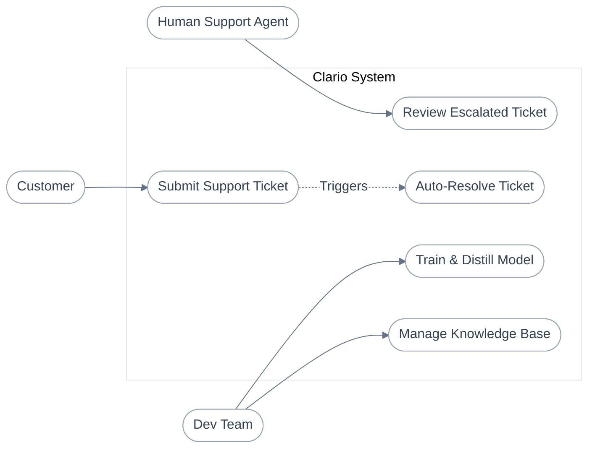
```mermaid
%%{init: {'theme': 'base', 'themeVariables': { 'primaryColor': '#ffffff', 'primaryTextColor': '#334155', 'primaryBorderColor': '#94a3b8', 'lineColor': '#64748b', 'fontFamily': 'Inter, sans-serif'}}}%%
flowchart LR
    Customer(["Customer"])
    HumanAgent(["Human Support Agent"])
    DevTeam(["Dev Team"])

    subgraph Clario System
        direction TB
        UC1(["Submit Support Ticket"])
        UC2(["Review Escalated Ticket"])
        UC3(["Auto-Resolve Ticket"])
        UC4(["Train & Distill Model"])
        UC5(["Manage Knowledge Base"])
    end

    Customer --> UC1
    HumanAgent --> UC2
    UC1 -.->|"Triggers"| UC3
    DevTeam --> UC4
    DevTeam --> UC5
```

### 4.1 Use-Case Realizations
- **Submit Support Ticket**: When a customer submits a ticket via the Next.js frontend, the Spring Boot gateway persists it and triggers the ML Sidecar asynchronously.
- **Review Escalated Ticket**: Human agents receive a handoff package containing the redacted text, drafts, and validation results. They resolve the ticket using an optimistic locking mechanism to prevent concurrent overwrites.
- **Auto-Resolve Ticket**: The LangGraph state machine autonomously routes, drafts, and validates responses, vectorising resolved tickets into precedent memory upon success.

---

## 5. Logical View
### 5.1 Overview
The logical design is decomposed into three major tiers: the API Gateway (Spring Boot), the ML Sidecar (Python/FastAPI), and the Frontend Application (Next.js).

### 5.2 Architecturally Significant Design Packages

#### Core Domain Model (UML Class Diagram)
> **Paste into [mermaid.live](https://mermaid.live) to render.**
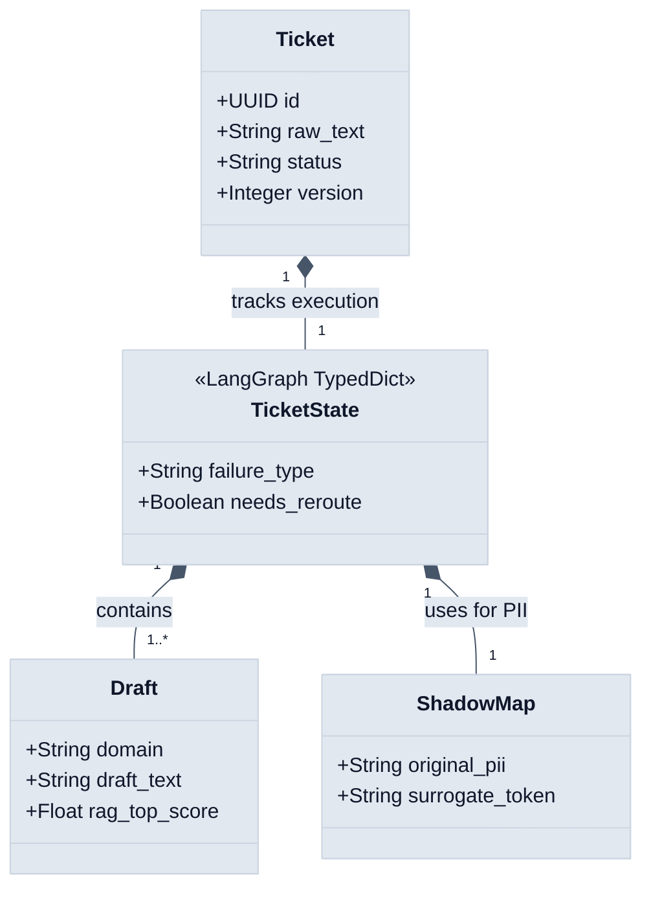
```mermaid
%%{init: {'theme': 'base', 'themeVariables': { 'primaryColor': '#e2e8f0', 'primaryTextColor': '#0f172a', 'primaryBorderColor': '#cbd5e1', 'lineColor': '#475569', 'secondaryColor': '#f1f5f9', 'tertiaryColor': '#ffffff', 'fontFamily': 'Inter, sans-serif'}}}%%
classDiagram
    class Ticket {
        +UUID id
        +String raw_text
        +String status
        +Integer version
    }
    class TicketState {
        <<LangGraph TypedDict>>
        +String failure_type
        +Boolean needs_reroute
    }
    class Draft {
        +String domain
        +String draft_text
        +Float rag_top_score
    }
    class ShadowMap {
        +String original_pii
        +String surrogate_token
    }

    Ticket "1" *-- "1" TicketState : tracks execution
    TicketState "1" *-- "1..*" Draft : contains
    TicketState "1" *-- "1" ShadowMap : uses for PII
```

#### System Context (C1)
> **Paste into [mermaid.live](https://mermaid.live) to render.**

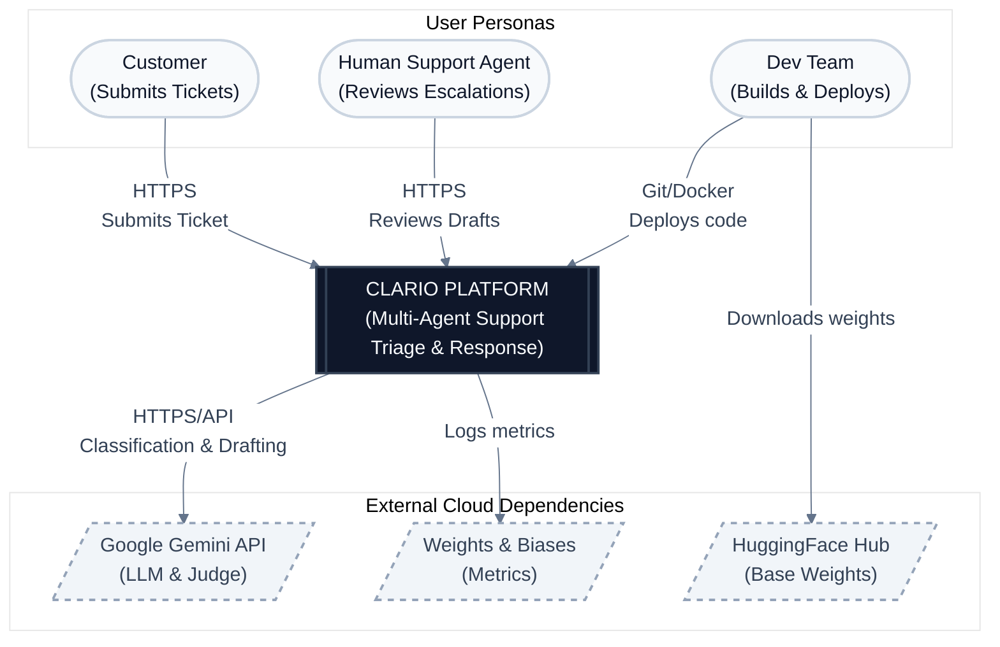
```mermaid
%%{init: {'theme': 'base', 'themeVariables': { 'primaryColor': '#ffffff', 'primaryTextColor': '#334155', 'primaryBorderColor': '#94a3b8', 'lineColor': '#64748b', 'fontFamily': 'Inter, sans-serif'}}}%%
flowchart TB
    classDef actor fill:#f8fafc,stroke:#cbd5e1,stroke-width:2px,color:#0f172a,shape:rect,rx:10
    classDef system fill:#0f172a,stroke:#334155,stroke-width:2px,color:#f8fafc,rx:5
    classDef external fill:#f1f5f9,stroke:#94a3b8,stroke-width:2px,color:#334155,rx:5,stroke-dasharray: 5 5

    %% Actors
    subgraph Users ["User Personas"]
        direction LR
        Customer(["Customer\n(Submits Tickets)"]):::actor
        Agent(["Human Support Agent\n(Reviews Escalations)"]):::actor
        Team(["Dev Team\n(Builds & Deploys)"]):::actor
    end

    %% Core System
    Clario[["CLARIO PLATFORM\n(Multi-Agent Support Triage & Response)"]]:::system

    %% External Systems
    subgraph ThirdParty ["External Cloud Dependencies"]
        direction LR
        Gemini[/"Google Gemini API\n(LLM & Judge)"/]:::external
        HF[/"HuggingFace Hub\n(Base Weights)"/]:::external
        WandB[/"Weights & Biases\n(Metrics)"/]:::external
    end

    %% Relationships
    Customer -- "HTTPS\nSubmits Ticket" --> Clario
    Agent -- "HTTPS\nReviews Drafts" --> Clario
    Team -- "Git/Docker\nDeploys code" --> Clario

    Clario -- "HTTPS/API\nClassification & Drafting" --> Gemini
    Team -- "Downloads weights" --> HF
    Clario -- "Logs metrics" --> WandB
```

---

#### Container Architecture (C2)
> **Paste into [mermaid.live](https://mermaid.live) to render.**

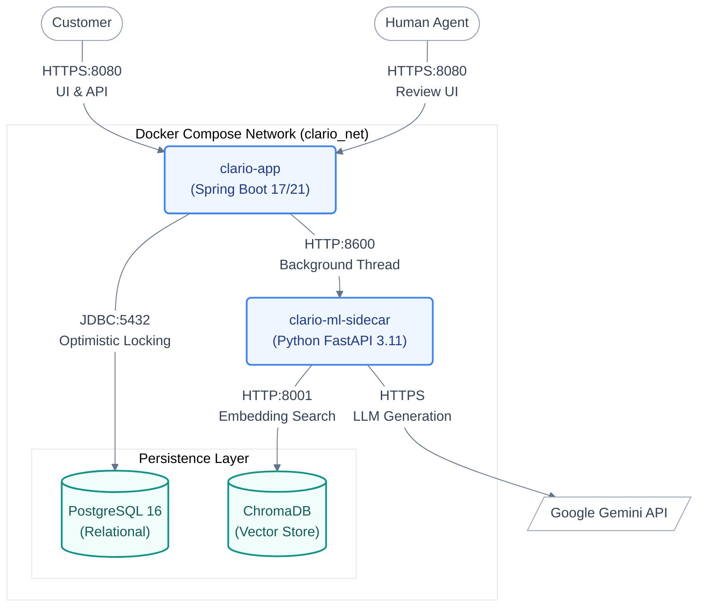
```mermaid
%%{init: {'theme': 'base', 'themeVariables': { 'primaryColor': '#ffffff', 'primaryTextColor': '#334155', 'primaryBorderColor': '#94a3b8', 'lineColor': '#64748b', 'fontFamily': 'Inter, sans-serif'}}}%%
flowchart TB
    classDef container fill:#eff6ff,stroke:#3b82f6,stroke-width:2px,color:#1e3a8a,rx:5
    classDef database fill:#f0fdfa,stroke:#0d9488,stroke-width:2px,color:#115e59,shape:cylinder
    classDef network fill:#f8fafc,stroke:#94a3b8,stroke-width:1px,stroke-dasharray: 4 4

    Customer(["Customer"])
    Agent(["Human Agent"])

    subgraph DockerCompose ["Docker Compose Network (clario_net)"]
        direction TB
        
        Gateway["clario-app\n(Spring Boot 17/21)"]:::container
        Sidecar["clario-ml-sidecar\n(Python FastAPI 3.11)"]:::container
        
        subgraph Databases ["Persistence Layer"]
            direction LR
            PG[("PostgreSQL 16\n(Relational)")]:::database
            Chroma[("ChromaDB\n(Vector Store)")]:::database
        end
    end

    Gemini[/"Google Gemini API"/]

    %% External routing
    Customer -- "HTTPS:8080\nUI & API" --> Gateway
    Agent -- "HTTPS:8080\nReview UI" --> Gateway
    
    %% Internal networking
    Gateway -- "JDBC:5432\nOptimistic Locking" --> PG
    Gateway -- "HTTP:8600\nBackground Thread" --> Sidecar
    Sidecar -- "HTTP:8001\nEmbedding Search" --> Chroma
    Sidecar -- "HTTPS\nLLM Generation" --> Gemini
```

**Port Map (no collisions):**

| Service | Internal port | Host-mapped port |
|---|---|---|
| clario-app (Spring Boot + UI) | 8080 | 8080 |
| clario-ml-sidecar | 8600 | 8600 |
| chromadb | 8000 (internal) | 8001 |
| postgres | 5432 | 5432 |

---

#### Component Architecture & LangGraph State Machine
### 8.1 ML Fine-Tuning Service

> **Paste into [mermaid.live](https://mermaid.live) to render.**

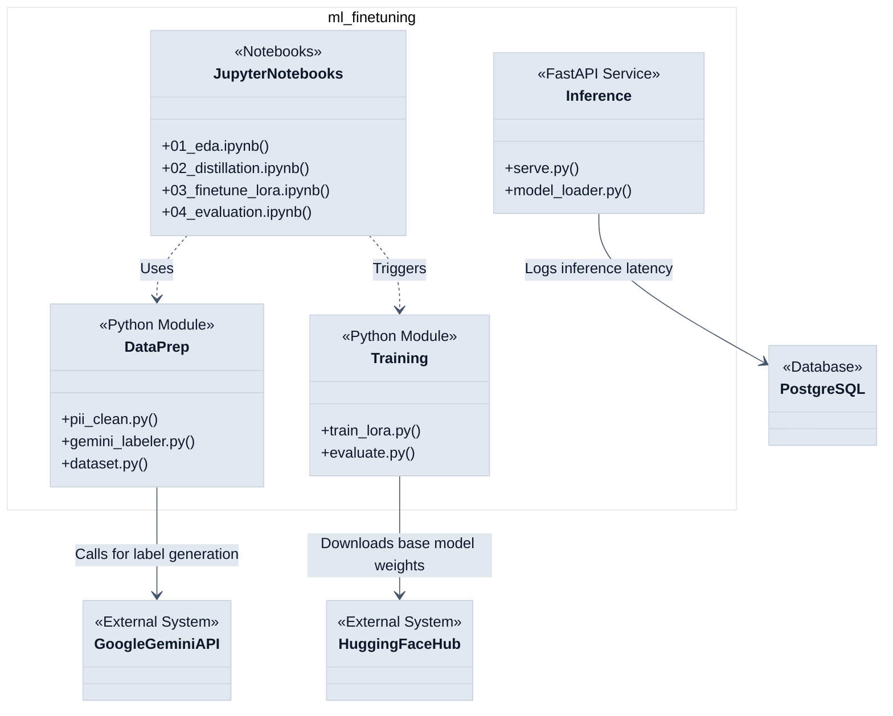
```mermaid
%%{init: {'theme': 'base', 'themeVariables': { 'primaryColor': '#e2e8f0', 'primaryTextColor': '#0f172a', 'primaryBorderColor': '#cbd5e1', 'lineColor': '#475569', 'secondaryColor': '#f1f5f9', 'tertiaryColor': '#ffffff', 'fontFamily': 'Inter, sans-serif'}}}%%
classDiagram
    direction TB
    namespace ml_finetuning {
        class JupyterNotebooks {
            <<Notebooks>>
            +01_eda.ipynb()
            +02_distillation.ipynb()
            +03_finetune_lora.ipynb()
            +04_evaluation.ipynb()
        }
        class DataPrep {
            <<Python Module>>
            +pii_clean.py()
            +gemini_labeler.py()
            +dataset.py()
        }
        class Training {
            <<Python Module>>
            +train_lora.py()
            +evaluate.py()
        }
        class Inference {
            <<FastAPI Service>>
            +serve.py()
            +model_loader.py()
        }
    }

    class PostgreSQL {
        <<Database>>
    }
    class GoogleGeminiAPI {
        <<External System>>
    }
    class HuggingFaceHub {
        <<External System>>
    }

    DataPrep --> GoogleGeminiAPI : Calls for label generation
    Training --> HuggingFaceHub : Downloads base model weights
    Inference --> PostgreSQL : Logs inference latency
    JupyterNotebooks ..> DataPrep : Uses
    JupyterNotebooks ..> Training : Triggers
```

---

### 8.2 ML Sidecar (Python ML Sidecar)

> **Paste into [mermaid.live](https://mermaid.live) to render.**

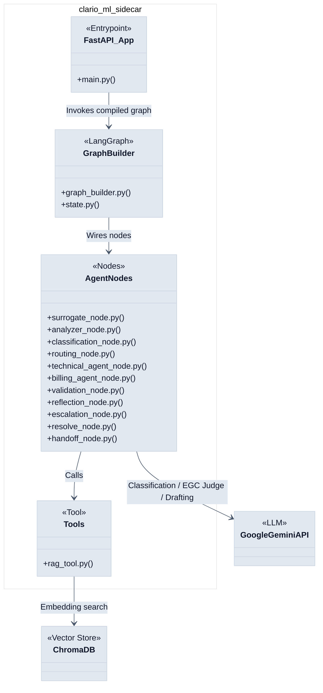
```mermaid
%%{init: {'theme': 'base', 'themeVariables': { 'primaryColor': '#e2e8f0', 'primaryTextColor': '#0f172a', 'primaryBorderColor': '#cbd5e1', 'lineColor': '#475569', 'secondaryColor': '#f1f5f9', 'tertiaryColor': '#ffffff', 'fontFamily': 'Inter, sans-serif'}}}%%
classDiagram
    direction TB
    namespace clario_ml_sidecar {
        class FastAPI_App {
            <<Entrypoint>>
            +main.py()
        }
        class GraphBuilder {
            <<LangGraph>>
            +graph_builder.py()
            +state.py()
        }
        class AgentNodes {
            <<Nodes>>
            +surrogate_node.py()
            +analyzer_node.py()
            +classification_node.py()
            +routing_node.py()
            +technical_agent_node.py()
            +billing_agent_node.py()
            +validation_node.py()
            +reflection_node.py()
            +escalation_node.py()
            +resolve_node.py()
            +handoff_node.py()
        }
        class Tools {
            <<Tool>>
            +rag_tool.py()
        }
    }

    class ChromaDB {
        <<Vector Store>>
    }
    class GoogleGeminiAPI {
        <<LLM>>
    }

    FastAPI_App --> GraphBuilder : Invokes compiled graph
    GraphBuilder --> AgentNodes : Wires nodes
    AgentNodes --> Tools : Calls
    Tools --> ChromaDB : Embedding search
    AgentNodes --> GoogleGeminiAPI : Classification / EGC Judge / Drafting
```

---

### 8.3 API Gateway Service (Spring Boot Monolith)

> **Paste into [mermaid.live](https://mermaid.live) to render.**

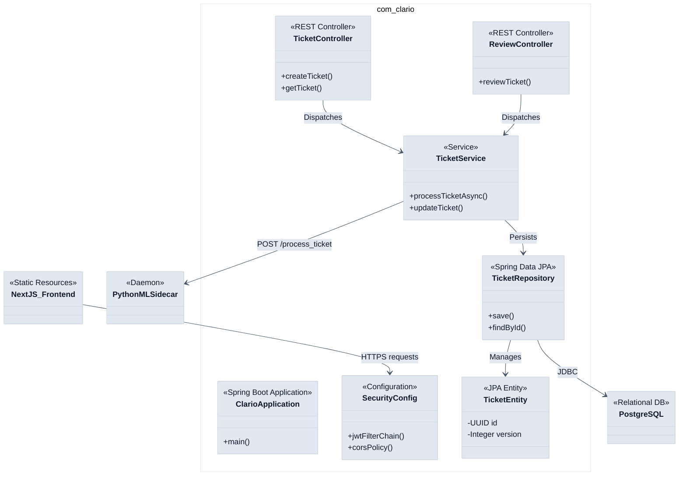
```mermaid
%%{init: {'theme': 'base', 'themeVariables': { 'primaryColor': '#e2e8f0', 'primaryTextColor': '#0f172a', 'primaryBorderColor': '#cbd5e1', 'lineColor': '#475569', 'secondaryColor': '#f1f5f9', 'tertiaryColor': '#ffffff', 'fontFamily': 'Inter, sans-serif'}}}%%
classDiagram
    direction TB
    namespace com_clario {
        class ClarioApplication {
            <<Spring Boot Application>>
            +main()
        }
        class SecurityConfig {
            <<Configuration>>
            +jwtFilterChain()
            +corsPolicy()
        }
        class TicketController {
            <<REST Controller>>
            +createTicket()
            +getTicket()
        }
        class ReviewController {
            <<REST Controller>>
            +reviewTicket()
        }
        class TicketService {
            <<Service>>
            +processTicketAsync()
            +updateTicket()
        }
        class TicketRepository {
            <<Spring Data JPA>>
            +save()
            +findById()
        }
        class TicketEntity {
            <<JPA Entity>>
            -UUID id
            -Integer version
        }
    }

    class PostgreSQL {
        <<Relational DB>>
    }
    class PythonMLSidecar {
        <<Daemon>>
    }
    class NextJS_Frontend {
        <<Static Resources>>
    }

    NextJS_Frontend --> SecurityConfig : HTTPS requests
    TicketController --> TicketService : Dispatches
    ReviewController --> TicketService : Dispatches
    TicketService --> TicketRepository : Persists
    TicketRepository --> TicketEntity : Manages
    TicketRepository --> PostgreSQL : JDBC
    TicketService --> PythonMLSidecar : POST /process_ticket
```

---

### 8.4 Frontend Application

> **Paste into [mermaid.live](https://mermaid.live) to render.**

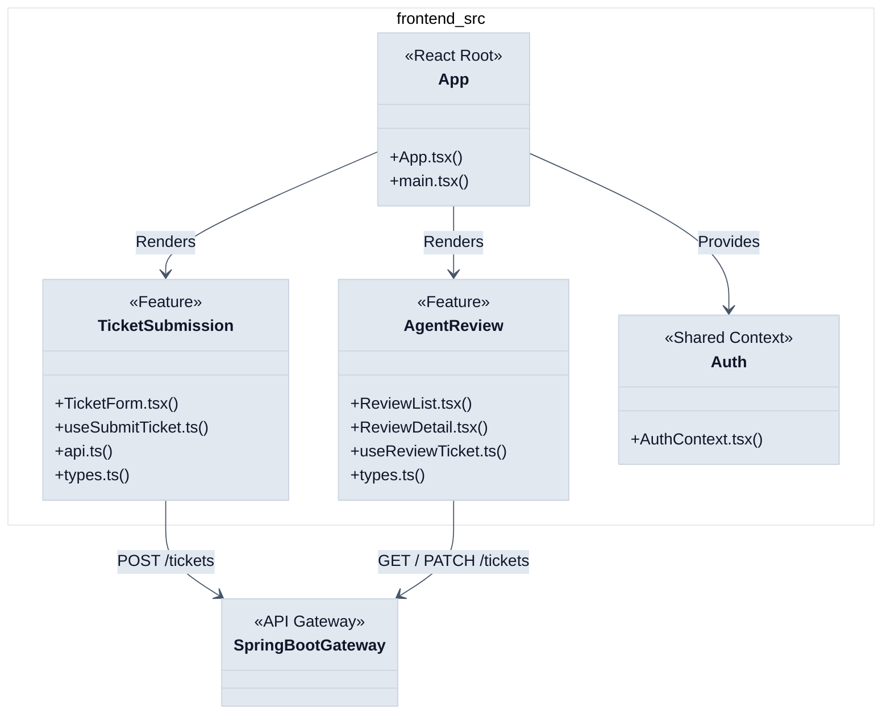
```mermaid
%%{init: {'theme': 'base', 'themeVariables': { 'primaryColor': '#e2e8f0', 'primaryTextColor': '#0f172a', 'primaryBorderColor': '#cbd5e1', 'lineColor': '#475569', 'secondaryColor': '#f1f5f9', 'tertiaryColor': '#ffffff', 'fontFamily': 'Inter, sans-serif'}}}%%
classDiagram
    direction TB
    namespace frontend_src {
        class App {
            <<React Root>>
            +App.tsx()
            +main.tsx()
        }
        class TicketSubmission {
            <<Feature>>
            +TicketForm.tsx()
            +useSubmitTicket.ts()
            +api.ts()
            +types.ts()
        }
        class AgentReview {
            <<Feature>>
            +ReviewList.tsx()
            +ReviewDetail.tsx()
            +useReviewTicket.ts()
            +types.ts()
        }
        class Auth {
            <<Shared Context>>
            +AuthContext.tsx()
        }
    }

    class SpringBootGateway {
        <<API Gateway>>
    }

    App --> TicketSubmission : Renders
    App --> AgentReview : Renders
    App --> Auth : Provides
    TicketSubmission --> SpringBootGateway : POST /tickets
    AgentReview --> SpringBootGateway : GET / PATCH /tickets
```

---

### 8.5 Vector Store Service

> **Paste into [mermaid.live](https://mermaid.live) to render.**

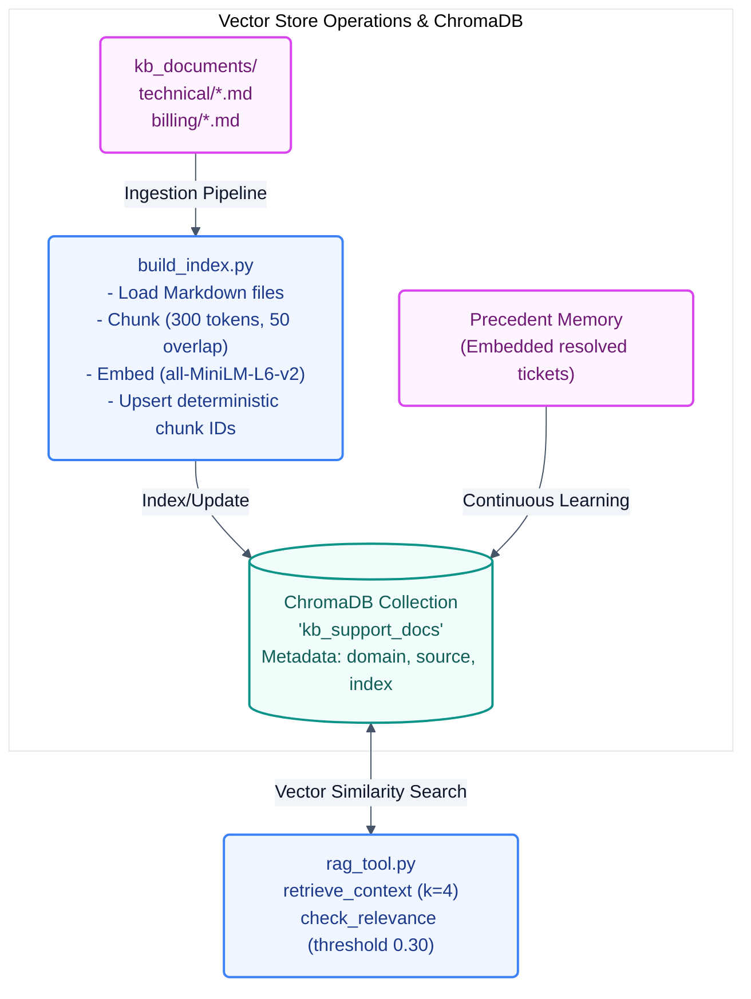
```mermaid
%%{init: {'theme': 'base', 'themeVariables': { 'primaryColor': '#e2e8f0', 'primaryTextColor': '#0f172a', 'primaryBorderColor': '#cbd5e1', 'lineColor': '#475569', 'secondaryColor': '#f1f5f9', 'tertiaryColor': '#ffffff', 'fontFamily': 'Inter, sans-serif'}}}%%
flowchart TD
    classDef process fill:#eff6ff,stroke:#3b82f6,stroke-width:2px,color:#1e3a8a,rx:5
    classDef database fill:#f0fdfa,stroke:#0d9488,stroke-width:2px,color:#115e59,shape:cylinder
    classDef file fill:#fdf4ff,stroke:#d946ef,stroke-width:2px,color:#701a75,rx:5

    subgraph VectorStore ["Vector Store Operations & ChromaDB"]
        direction TB
        KB["kb_documents/\ntechnical/*.md\nbilling/*.md"]:::file
        BUILD["build_index.py\n- Load Markdown files\n- Chunk (300 tokens, 50 overlap)\n- Embed (all-MiniLM-L6-v2)\n- Upsert deterministic chunk IDs"]:::process
        COLL[("ChromaDB Collection\n'kb_support_docs'\nMetadata: domain, source, index")]:::database
        PREC["Precedent Memory\n(Embedded resolved tickets)"]:::file
    end

    KB -->|"Ingestion Pipeline"| BUILD
    BUILD -->|"Index/Update"| COLL
    PREC -->|"Continuous Learning"| COLL

    RAG["rag_tool.py\nretrieve_context (k=4)\ncheck_relevance (threshold 0.30)"]:::process
    COLL <-->|"Vector Similarity Search"| RAG
```

---

### 8.6 Relational Database

See [Section 17 — Database Schema (ERD)](#17-database-schema-erd) for the full ERD diagram.

---

## 9. LangGraph State Machine

### 9.1 TicketState — Shared Blackboard

The `TicketState` TypedDict is the single shared contract between all nodes. The **`failure_type`** field is the sole routing signal used by `graph_builder`'s conditional edges.

| `failure_type` value | Next Step |
|---|---|
| `"none"` | Proceed to escalation check (normal path) |
| `"misroute"` | Reroute (flip domain) — **capped at 1 attempt** |
| `"quality"` or `"policy"` | Bounded reflection retry to escalate if cap reached |
| `"dependency_failure"` | Immediate escalation (external call failed after retries) |

### 9.2 LangGraph State Graph

> **Paste into [mermaid.live](https://mermaid.live) to render.**

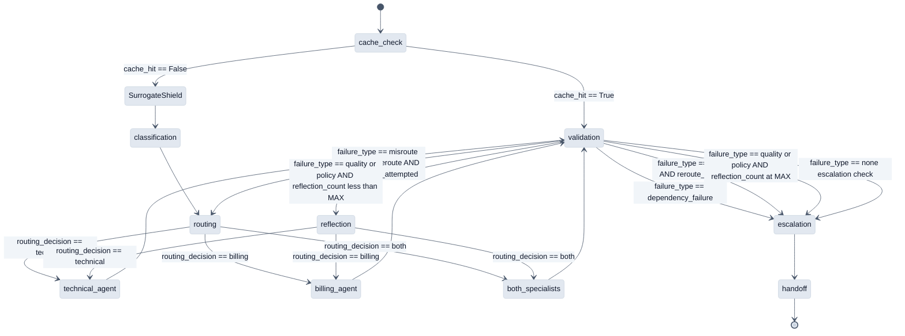
```mermaid
%%{init: {'theme': 'base', 'themeVariables': { 'primaryColor': '#e2e8f0', 'primaryTextColor': '#0f172a', 'primaryBorderColor': '#cbd5e1', 'lineColor': '#475569', 'secondaryColor': '#f1f5f9', 'tertiaryColor': '#ffffff', 'fontFamily': 'Inter, sans-serif'}}}%%
stateDiagram-v2
    [*] --> cache_check

    cache_check --> validation : cache_hit == True
    cache_check --> SurrogateShield : cache_hit == False

    SurrogateShield --> classification
    classification --> routing

    routing --> technical_agent : routing_decision == technical
    routing --> billing_agent : routing_decision == billing
    routing --> both_specialists : routing_decision == both

    technical_agent --> validation
    billing_agent --> validation
    both_specialists --> validation

    validation --> escalation : failure_type == dependency_failure
    validation --> routing : failure_type == misroute AND needs_reroute AND NOT reroute_attempted
    validation --> escalation : failure_type == misroute AND reroute_attempted
    validation --> reflection : failure_type == quality or policy AND reflection_count less than MAX
    validation --> escalation : failure_type == quality or policy AND reflection_count at MAX
    validation --> escalation : failure_type == none escalation check

    reflection --> technical_agent : routing_decision == technical
    reflection --> billing_agent : routing_decision == billing
    reflection --> both_specialists : routing_decision == both

    escalation --> handoff
    handoff --> [*]
```

### 9.3 Reroute Logic (v3 — Explicit Domain Flip)

> **Critical v3 fix:** the reroute does NOT re-run `decide_routing()`. It unconditionally flips the domain to ensure the *other* specialist is actually tried.

> **Paste into [mermaid.live](https://mermaid.live) to render.**

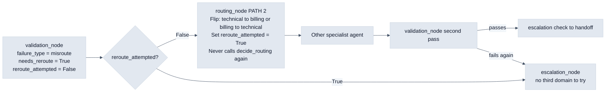
```mermaid
%%{init: {'theme': 'base', 'themeVariables': { 'primaryColor': '#e2e8f0', 'primaryTextColor': '#0f172a', 'primaryBorderColor': '#cbd5e1', 'lineColor': '#475569', 'secondaryColor': '#f1f5f9', 'tertiaryColor': '#ffffff', 'fontFamily': 'Inter, sans-serif'}}}%%
flowchart LR
    A["validation_node\nfailure_type = misroute\nneeds_reroute = True\nreroute_attempted = False"] --> B{"reroute_attempted?"}
    B -- "False" --> C["routing_node PATH 2\nFlip: technical to billing or billing to technical\nSet reroute_attempted = True\nNever calls decide_routing again"]
    B -- "True" --> D["escalation_node\nno third domain to try"]
    C --> E["Other specialist agent"]
    E --> F["validation_node second pass"]
    F -- "passes" --> G["escalation check to handoff"]
    F -- "fails again" --> D
```

---

---

## 6. Process View
This section describes the system's runtime behavior, synchronization, and data flow.

#### Ticket Lifecycle Activity Diagram (LangGraph Flow)
> **Paste into [mermaid.live](https://mermaid.live) to render.**
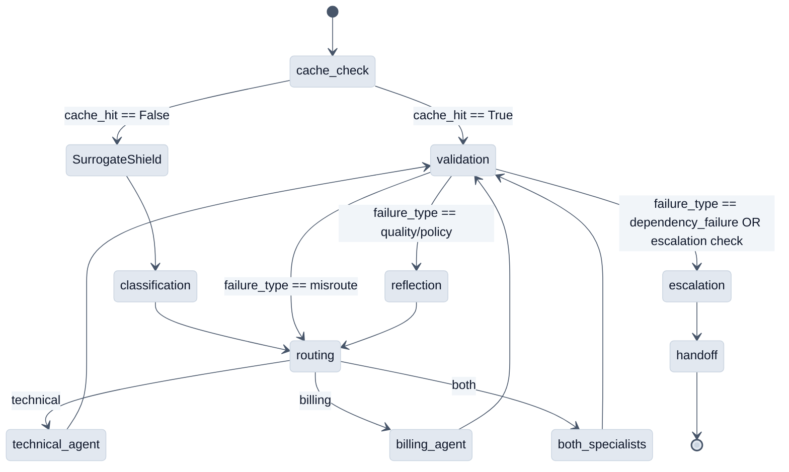
```mermaid
%%{init: {'theme': 'base', 'themeVariables': { 'primaryColor': '#e2e8f0', 'primaryTextColor': '#0f172a', 'primaryBorderColor': '#cbd5e1', 'lineColor': '#475569', 'secondaryColor': '#f1f5f9', 'tertiaryColor': '#ffffff', 'fontFamily': 'Inter, sans-serif'}}}%%
stateDiagram-v2
    [*] --> cache_check
    cache_check --> validation : cache_hit == True
    cache_check --> SurrogateShield : cache_hit == False
    SurrogateShield --> classification
    classification --> routing
    routing --> technical_agent : technical
    routing --> billing_agent : billing
    routing --> both_specialists : both
    technical_agent --> validation
    billing_agent --> validation
    both_specialists --> validation
    validation --> reflection : failure_type == quality/policy
    validation --> routing : failure_type == misroute
    validation --> escalation : failure_type == dependency_failure OR escalation check
    reflection --> routing
    escalation --> handoff
    handoff --> [*]
```

#### Data Flow
> **Paste into [mermaid.live](https://mermaid.live) to render.**

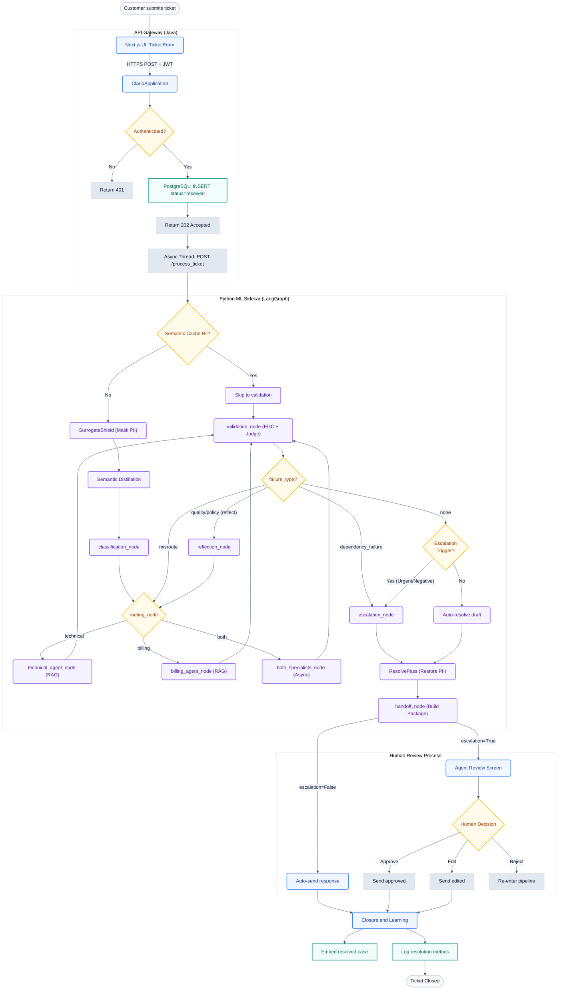
```mermaid
%%{init: {'theme': 'base', 'themeVariables': { 'primaryColor': '#e2e8f0', 'primaryTextColor': '#0f172a', 'primaryBorderColor': '#cbd5e1', 'lineColor': '#475569', 'secondaryColor': '#f1f5f9', 'tertiaryColor': '#ffffff', 'fontFamily': 'Inter, sans-serif'}}}%%
flowchart TD
    classDef actor fill:#f8fafc,stroke:#cbd5e1,stroke-width:2px,color:#0f172a,shape:rect,rx:10
    classDef gateway fill:#eff6ff,stroke:#3b82f6,stroke-width:2px,color:#1e3a8a,rx:5
    classDef agent fill:#f5f3ff,stroke:#8b5cf6,stroke-width:2px,color:#4c1d95,rx:5
    classDef decision fill:#fffbeb,stroke:#fbbf24,stroke-width:2px,color:#92400e,shape:diamond
    classDef database fill:#f0fdfa,stroke:#0d9488,stroke-width:2px,color:#115e59,shape:cylinder

    A(["Customer submits ticket"]):::actor --> B["Next.js UI: Ticket Form"]:::gateway
    
    subgraph SpringBoot ["API Gateway (Java)"]
        direction TB
        B -->|HTTPS POST + JWT| C["ClarioApplication"]:::gateway
        C --> D{"Authenticated?"}:::decision
        D -- "No" --> E["Return 401"]
        D -- "Yes" --> F["PostgreSQL: INSERT status=received"]:::database
        F --> G["Return 202 Accepted"]
        G --> H["Async Thread: POST /process_ticket"]
    end

    subgraph Sidecar ["Python ML Sidecar (LangGraph)"]
        direction TB
        H --> I{"Semantic Cache Hit?"}:::decision
        I -- "Yes" --> K["Skip to validation"]:::agent
        I -- "No" --> L["SurrogateShield (Mask PII)"]:::agent
        
        L --> SD["Semantic Distillation"]:::agent
        SD --> M["classification_node"]:::agent
        M --> N{"routing_node"}:::decision
        
        N -- "technical" --> O["technical_agent_node (RAG)"]:::agent
        N -- "billing" --> P["billing_agent_node (RAG)"]:::agent
        N -- "both" --> Q["both_specialists_node (Async)"]:::agent
        
        O & P & Q & K --> R["validation_node (EGC + Judge)"]:::agent
        R --> S{"failure_type?"}:::decision
        
        S -- "dependency_failure" --> Esc["escalation_node"]:::agent
        S -- "misroute" --> N
        S -- "quality/policy (reflect)" --> T["reflection_node"]:::agent
        T --> N
        
        S -- "none" --> U{"Escalation\nTrigger?"}:::decision
        U -- "Yes (Urgent/Negative)" --> Esc
        U -- "No" --> V["Auto-resolve draft"]:::agent
        
        Esc & V --> RP1["ResolvePass (Restore PII)"]:::agent
        RP1 --> W["handoff_node (Build Package)"]:::agent
    end

    subgraph HumanLoop ["Human Review Process"]
        direction TB
        W -- "escalation=False" --> X["Auto-send response"]:::gateway
        W -- "escalation=True" --> Y["Agent Review Screen"]:::gateway
        Y --> Z{"Human Decision"}:::decision
        Z -- "Approve" --> AA["Send approved"]
        Z -- "Edit" --> AB["Send edited"]
        Z -- "Reject" --> AC["Re-enter pipeline"]
    end
    
    X & AA & AB --> AD["Closure and Learning"]:::gateway
    AD --> AE["Embed resolved case"]:::database
    AD --> AF["Log resolution metrics"]:::database
    AF --> AG(["Ticket Closed"]):::actor
```

---

### 14.1 Happy Path (Auto-Send)

> **Paste into [mermaid.live](https://mermaid.live) to render.**

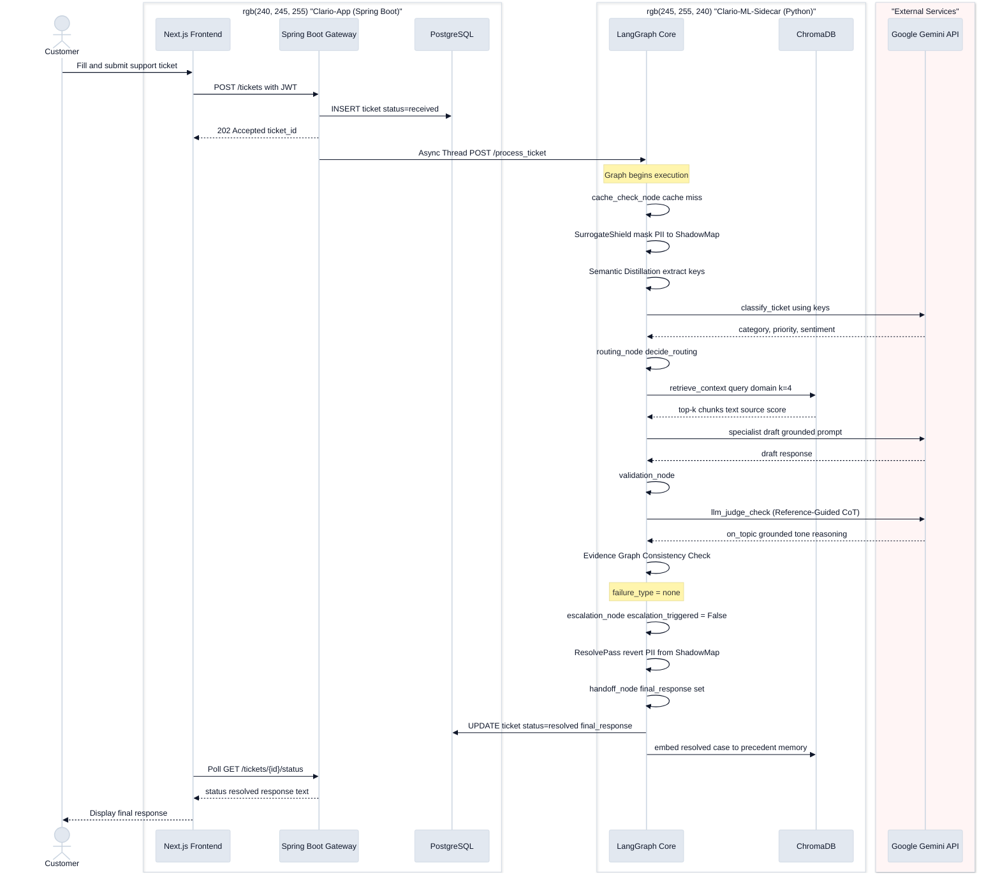
```mermaid
%%{init: {'theme': 'base', 'themeVariables': { 'primaryColor': '#e2e8f0', 'primaryTextColor': '#0f172a', 'primaryBorderColor': '#cbd5e1', 'lineColor': '#475569', 'secondaryColor': '#f1f5f9', 'tertiaryColor': '#ffffff', 'fontFamily': 'Inter, sans-serif'}}}%%
sequenceDiagram
    actor Customer
    box rgb(240, 245, 255) "Clario-App (Spring Boot)"
        participant FE as Next.js Frontend
        participant GW as Spring Boot Gateway
        participant PG as PostgreSQL
    end
    box rgb(245, 255, 240) "Clario-ML-Sidecar (Python)"
        participant ORC as LangGraph Core
        participant CHROMA as ChromaDB
    end
    box rgb(255, 245, 245) "External Services"
        participant GEMINI as Google Gemini API
    end

    Customer->>FE: Fill and submit support ticket
    FE->>GW: POST /tickets with JWT
    GW->>PG: INSERT ticket status=received
    GW-->>FE: 202 Accepted ticket_id
    GW->>ORC: Async Thread POST /process_ticket

    Note over ORC: Graph begins execution
    ORC->>ORC: cache_check_node cache miss
    ORC->>ORC: SurrogateShield mask PII to ShadowMap
    ORC->>ORC: Semantic Distillation extract keys
    ORC->>GEMINI: classify_ticket using keys
    GEMINI-->>ORC: category, priority, sentiment
    ORC->>ORC: routing_node decide_routing

    ORC->>CHROMA: retrieve_context query domain k=4
    CHROMA-->>ORC: top-k chunks text source score
    ORC->>GEMINI: specialist draft grounded prompt
    GEMINI-->>ORC: draft response

    ORC->>ORC: validation_node
    ORC->>GEMINI: llm_judge_check (Reference-Guided CoT)
    GEMINI-->>ORC: on_topic grounded tone reasoning
    ORC->>ORC: Evidence Graph Consistency Check
    Note over ORC: failure_type = none

    ORC->>ORC: escalation_node escalation_triggered = False
    ORC->>ORC: ResolvePass revert PII from ShadowMap
    ORC->>ORC: handoff_node final_response set

    ORC->>PG: UPDATE ticket status=resolved final_response
    ORC->>CHROMA: embed resolved case to precedent memory

    FE->>GW: Poll GET /tickets/{id}/status
    GW-->>FE: status resolved response text
    FE-->>Customer: Display final response
```

---

### 14.2 Escalation to Human Review

> **Paste into [mermaid.live](https://mermaid.live) to render.**

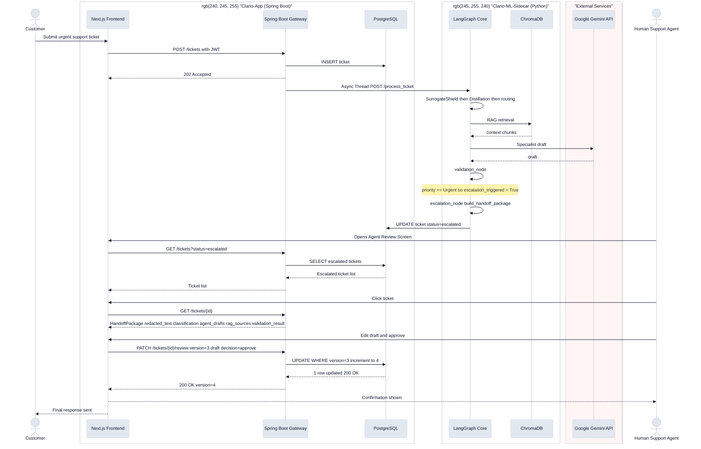
```mermaid
%%{init: {'theme': 'base', 'themeVariables': { 'primaryColor': '#e2e8f0', 'primaryTextColor': '#0f172a', 'primaryBorderColor': '#cbd5e1', 'lineColor': '#475569', 'secondaryColor': '#f1f5f9', 'tertiaryColor': '#ffffff', 'fontFamily': 'Inter, sans-serif'}}}%%
sequenceDiagram
    actor Customer
    box rgb(240, 245, 255) "Clario-App (Spring Boot)"
        participant FE as Next.js Frontend
        participant GW as Spring Boot Gateway
        participant PG as PostgreSQL
    end
    box rgb(245, 255, 240) "Clario-ML-Sidecar (Python)"
        participant ORC as LangGraph Core
        participant CHROMA as ChromaDB
    end
    box rgb(255, 245, 245) "External Services"
        participant GEMINI as Google Gemini API
    end
    actor HumanAgent as Human Support Agent

    Customer->>FE: Submit urgent support ticket
    FE->>GW: POST /tickets with JWT
    GW->>PG: INSERT ticket
    GW-->>FE: 202 Accepted

    GW->>ORC: Async Thread POST /process_ticket
    ORC->>ORC: SurrogateShield then Distillation then routing
    ORC->>CHROMA: RAG retrieval
    CHROMA-->>ORC: context chunks
    ORC->>GEMINI: Specialist draft
    GEMINI-->>ORC: draft
    ORC->>ORC: validation_node
    Note over ORC: priority == Urgent so escalation_triggered = True

    ORC->>ORC: escalation_node build_handoff_package
    ORC->>PG: UPDATE ticket status=escalated

    HumanAgent->>FE: Opens Agent Review Screen
    FE->>GW: GET /tickets?status=escalated
    GW->>PG: SELECT escalated tickets
    PG-->>GW: Escalated ticket list
    GW-->>FE: Ticket list

    HumanAgent->>FE: Click ticket
    FE->>GW: GET /tickets/{id}
    GW-->>FE: HandoffPackage redacted_text classification agent_drafts rag_sources validation_result

    HumanAgent->>FE: Edit draft and approve
    FE->>GW: PATCH /tickets/{id}/review version=3 draft decision=approve
    GW->>PG: UPDATE WHERE version=3 increment to 4
    PG-->>GW: 1 row updated 200 OK
    GW-->>FE: 200 OK version=4

    FE-->>HumanAgent: Confirmation shown
    FE-->>Customer: Final response sent
```

---

### 14.3 Optimistic Locking — 409 Conflict

> **Paste into [mermaid.live](https://mermaid.live) to render.**

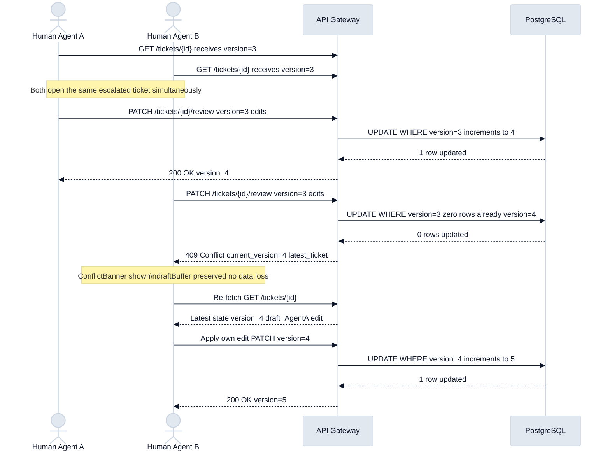
```mermaid
%%{init: {'theme': 'base', 'themeVariables': { 'primaryColor': '#e2e8f0', 'primaryTextColor': '#0f172a', 'primaryBorderColor': '#cbd5e1', 'lineColor': '#475569', 'secondaryColor': '#f1f5f9', 'tertiaryColor': '#ffffff', 'fontFamily': 'Inter, sans-serif'}}}%%
sequenceDiagram
    actor AgentA as Human Agent A
    actor AgentB as Human Agent B
    participant GW as API Gateway
    participant PG as PostgreSQL

    AgentA->>GW: GET /tickets/{id} receives version=3
    AgentB->>GW: GET /tickets/{id} receives version=3

    Note over AgentA,AgentB: Both open the same escalated ticket simultaneously

    AgentA->>GW: PATCH /tickets/{id}/review version=3 edits
    GW->>PG: UPDATE WHERE version=3 increments to 4
    PG-->>GW: 1 row updated
    GW-->>AgentA: 200 OK version=4

    AgentB->>GW: PATCH /tickets/{id}/review version=3 edits
    GW->>PG: UPDATE WHERE version=3 zero rows already version=4
    PG-->>GW: 0 rows updated
    GW-->>AgentB: 409 Conflict current_version=4 latest_ticket

    Note over AgentB: ConflictBanner shown\ndraftBuffer preserved no data loss

    AgentB->>GW: Re-fetch GET /tickets/{id}
    GW-->>AgentB: Latest state version=4 draft=AgentA edit
    AgentB->>GW: Apply own edit PATCH version=4
    GW->>PG: UPDATE WHERE version=4 increments to 5
    PG-->>GW: 1 row updated
    GW-->>AgentB: 200 OK version=5
```

---

### 14.4 Reroute Flow (v3 Fix)

> **Paste into [mermaid.live](https://mermaid.live) to render.**

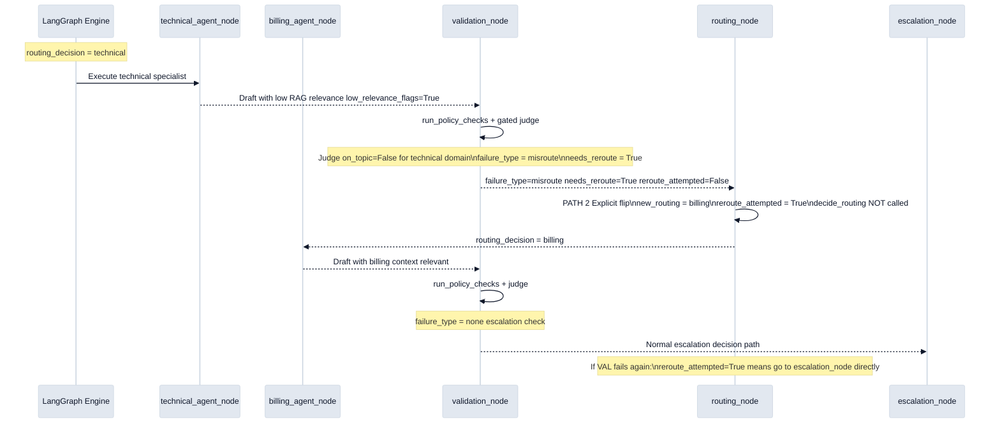
```mermaid
%%{init: {'theme': 'base', 'themeVariables': { 'primaryColor': '#e2e8f0', 'primaryTextColor': '#0f172a', 'primaryBorderColor': '#cbd5e1', 'lineColor': '#475569', 'secondaryColor': '#f1f5f9', 'tertiaryColor': '#ffffff', 'fontFamily': 'Inter, sans-serif'}}}%%
sequenceDiagram
    participant GR as LangGraph Engine
    participant TECH as technical_agent_node
    participant BILL as billing_agent_node
    participant VAL as validation_node
    participant ROUT as routing_node
    participant ESC as escalation_node

    Note over GR: routing_decision = technical
    GR->>TECH: Execute technical specialist
    TECH-->>VAL: Draft with low RAG relevance low_relevance_flags=True

    VAL->>VAL: run_policy_checks + gated judge
    Note over VAL: Judge on_topic=False for technical domain\nfailure_type = misroute\nneeds_reroute = True

    VAL-->>ROUT: failure_type=misroute needs_reroute=True reroute_attempted=False

    ROUT->>ROUT: PATH 2 Explicit flip\nnew_routing = billing\nreroute_attempted = True\ndecide_routing NOT called

    ROUT-->>BILL: routing_decision = billing
    BILL-->>VAL: Draft with billing context relevant

    VAL->>VAL: run_policy_checks + judge
    Note over VAL: failure_type = none escalation check

    VAL-->>ESC: Normal escalation decision path

    Note over ROUT: If VAL fails again:\nreroute_attempted=True means go to escalation_node directly
```

---

### 14.5 Cache Hit Shortcut

> **Paste into [mermaid.live](https://mermaid.live) to render.**

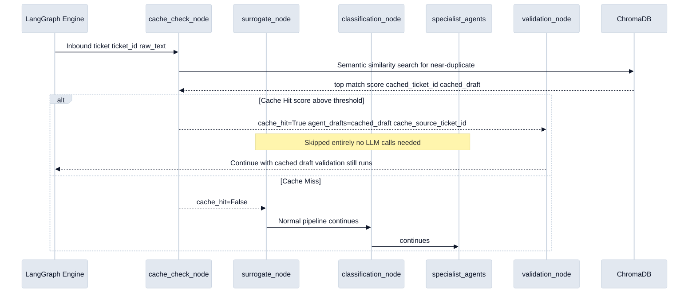
```mermaid
%%{init: {'theme': 'base', 'themeVariables': { 'primaryColor': '#e2e8f0', 'primaryTextColor': '#0f172a', 'primaryBorderColor': '#cbd5e1', 'lineColor': '#475569', 'secondaryColor': '#f1f5f9', 'tertiaryColor': '#ffffff', 'fontFamily': 'Inter, sans-serif'}}}%%
sequenceDiagram
    participant GR as LangGraph Engine
    participant CACHE as cache_check_node
    participant REDD as surrogate_node
    participant CLSS as classification_node
    participant SPEC as specialist_agents
    participant VAL as validation_node
    participant CHROMA as ChromaDB

    GR->>CACHE: Inbound ticket ticket_id raw_text
    CACHE->>CHROMA: Semantic similarity search for near-duplicate
    CHROMA-->>CACHE: top match score cached_ticket_id cached_draft

    alt Cache Hit score above threshold
        CACHE-->>VAL: cache_hit=True agent_drafts=cached_draft cache_source_ticket_id
        Note over REDD,SPEC: Skipped entirely no LLM calls needed
        VAL-->>GR: Continue with cached draft validation still runs
    else Cache Miss
        CACHE-->>REDD: cache_hit=False
        REDD->>CLSS: Normal pipeline continues
        CLSS->>SPEC: continues
    end
```

---

---

## 7. Deployment View
> **Paste into [mermaid.live](https://mermaid.live) to render.**

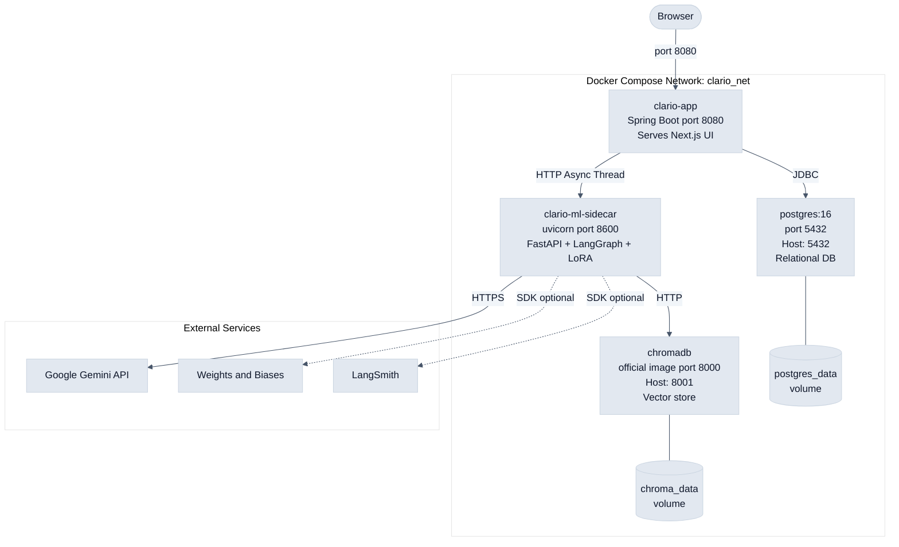
```mermaid
%%{init: {'theme': 'base', 'themeVariables': { 'primaryColor': '#e2e8f0', 'primaryTextColor': '#0f172a', 'primaryBorderColor': '#cbd5e1', 'lineColor': '#475569', 'secondaryColor': '#f1f5f9', 'tertiaryColor': '#ffffff', 'fontFamily': 'Inter, sans-serif'}}}%%
graph TB
    USER([Browser]) -->|port 8080| GW

    subgraph DockerCompose["Docker Compose Network: clario_net"]
        GW["clario-app\nSpring Boot port 8080\nServes Next.js UI"]
        ORC["clario-ml-sidecar\nuvicorn port 8600\nFastAPI + LangGraph + LoRA"]
        CHR["chromadb\nofficial image port 8000\nHost: 8001\nVector store"]
        PG["postgres:16\nport 5432\nHost: 5432\nRelational DB"]
        PGV[("postgres_data\nvolume")]
        CHRV[("chroma_data\nvolume")]
    end

    subgraph External["External Services"]
        GEMINI2["Google Gemini API"]
        WANDB2["Weights and Biases"]
        LS["LangSmith"]
    end

    GW -->|JDBC| PG
    GW -->|HTTP Async Thread| ORC
    ORC -->|HTTP| CHR
    ORC -->|HTTPS| GEMINI2
    ORC -.->|SDK optional| LS
    ORC -.->|SDK optional| WANDB2

    PG --- PGV
    CHR --- CHRV
```

**Critical Deployment Notes:**
- `depends_on: condition: service_healthy` on postgres and chromadb — services wait for readiness, not just container start.
- Chroma internal port 8000 collides with FastAPI default — mapped to host 8001 to avoid conflict.
- `clario-ml-sidecar` is the heaviest container (7–8B model in RAM). Test on the actual demo machine at least 1 week before the symposium.
- `data/raw/` and `.env` are gitignored — never committed. Verify with `git log -p -- .env`.

---

---

## 8. Implementation View
### 8.1 Overview
The software implementation is organized into distinct layer packages representing the Frontend, API Gateway, ML Sidecar, and ML Fine-Tuning pipelines.

### 8.2 Layers
#### 8.2.1 ML Sidecar Packages

> **Paste into [mermaid.live](https://mermaid.live) to render.**

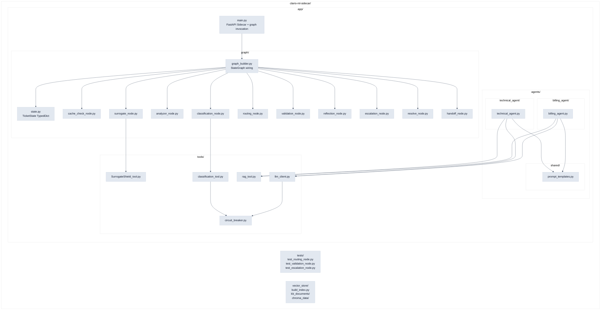
```mermaid
%%{init: {'theme': 'base', 'themeVariables': { 'primaryColor': '#e2e8f0', 'primaryTextColor': '#0f172a', 'primaryBorderColor': '#cbd5e1', 'lineColor': '#475569', 'secondaryColor': '#f1f5f9', 'tertiaryColor': '#ffffff', 'fontFamily': 'Inter, sans-serif'}}}%%
graph TD
    subgraph MlSidecar["clario-ml-sidecar/"]
        subgraph AppLayer["app/"]
            M["main.py\nFastAPI Sidecar + graph invocation"]
            subgraph GraphLayer["graph/"]
                SB["graph_builder.py\nStateGraph wiring"]
                ST["state.py\nTicketState TypedDict"]
                CC["cache_check_node.py"]
                RD["surrogate_node.py"]
                CL["classification_node.py"]
                AN["analyzer_node.py"]
                RT["routing_node.py"]
                VL["validation_node.py"]
                RF["reflection_node.py"]
                ES["escalation_node.py"]
                HO["handoff_node.py"]
                RP["resolve_node.py"]
            end
            subgraph AgentsLayer["agents/"]
                subgraph TechAgent["technical_agent/"]
                    TA["technical_agent.py"]
                end
                subgraph BillAgent["billing_agent/"]
                    BA["billing_agent.py"]
                end
                subgraph Shared["shared/"]
                    PT["prompt_templates.py"]
                end
            end
            subgraph ToolsLayer["tools/"]
                RC["SurrogateShield_tool.py"]
                CT["classification_tool.py"]
                RAG["rag_tool.py"]
                LC["llm_client.py"]
                CB["circuit_breaker.py"]
            end
        end
        TESTS["tests/\ntest_routing_node.py\ntest_validation_node.py\ntest_escalation_node.py"]
        VS["vector_store/\nbuild_index.py\nkb_documents/\nchroma_data/"]
    end

    M --> SB
    SB --> ST
    SB --> CC & RD & AN & CL & RT & VL & RF & ES & RP & HO
    CL --> CT
    RD --> RC
    TA & BA --> RAG & LC & PT
    CT & LC --> CB
```

---

#### 8.2.2 API Gateway Packages

> **Paste into [mermaid.live](https://mermaid.live) to render.**

```mermaid
%%{init: {'theme': 'base', 'themeVariables': { 'primaryColor': '#e2e8f0', 'primaryTextColor': '#0f172a', 'primaryBorderColor': '#cbd5e1', 'lineColor': '#475569', 'secondaryColor': '#f1f5f9', 'tertiaryColor': '#ffffff', 'fontFamily': 'Inter, sans-serif'}}}%%
graph TD
    subgraph SpringBootApp["clario-app/ (Spring Boot + Next.js)"]
        subgraph JavaSrc["src/main/java/com/clario/"]
            APP["ClarioApplication.java"]
            subgraph Config["config/"]
                SEC["SecurityConfig.java"]
                CORS["CorsConfig.java"]
            end
            subgraph Controllers["controllers/"]
                TKT["TicketController.java"]
                REV["ReviewController.java"]
                AUTH["AuthController.java"]
            end
            subgraph Services["services/"]
                TS["TicketService.java"]
                AS["AuthService.java"]
            end
            subgraph Repositories["repositories/"]
                TR["TicketRepository.java"]
                UR["UserRepository.java"]
            end
            subgraph Entities["entities/"]
                TE["Ticket.java (@Version)"]
                UE["User.java"]
            end
        end
        subgraph NextJsSrc["src/main/resources/static/ (Next.js Out)"]
            PAGES["_next/"]
            INDEX["index.html"]
        end
        TESTS["src/test/java/\nTicketControllerTest.java\nOptimisticLockingTest.java"]
    end

    APP --> SEC & CORS & TKT & REV & AUTH
    TKT & REV --> TS
    AUTH --> AS
    TS --> TR
    AS --> UR
    TR & UR --> TE & UE
```

---

#### 8.2.3 ML Fine-Tuning Packages

> **Paste into [mermaid.live](https://mermaid.live) to render.**

```mermaid
%%{init: {'theme': 'base', 'themeVariables': { 'primaryColor': '#e2e8f0', 'primaryTextColor': '#0f172a', 'primaryBorderColor': '#cbd5e1', 'lineColor': '#475569', 'secondaryColor': '#f1f5f9', 'tertiaryColor': '#ffffff', 'fontFamily': 'Inter, sans-serif'}}}%%
graph TD
    subgraph MlFT["ml_finetuning/"]
        subgraph DataLayer["data/"]
            RAW["raw/ Kaggle CSV gitignored"]
            DIST["distilled/\ndistilled_dataset.parquet\ncache json files\nfailed_rows.json"]
            SPLIT["splits/\ntrain.parquet\nval.parquet\ntest.parquet LOCKED\nsplit_manifest.json"]
        end
        subgraph Notebooks["notebooks/"]
            N1["01_eda.ipynb"]
            N2["02_distillation.ipynb"]
            N3["03_finetune_lora.ipynb"]
            N4["04_evaluation.ipynb"]
        end
        subgraph SrcLayer["src/"]
            subgraph DistillSrc["distillation/"]
                GML["gemini_labeler.py\nGemini client + runner"]
                PII["pii_clean.py\nOne-time dataset PII mask"]
            end
            subgraph TrainSrc["training/"]
                TRL["train_lora.py\nQLoRA + PEFT + Trainer"]
                DST["dataset.py\nparquet to HF Dataset"]
                CFG["config.yaml\nhyperparameters"]
            end
            subgraph EvalSrc["evaluation/"]
                EVL["evaluate.py\naccuracy macro-F1\nJSON-validity chart"]
            end
            subgraph InferSrc["inference/"]
                MLR["model_loader.py\nLoads 4-bit QLoRA model for ML Sidecar"]
            end
        end
        TESTS2["tests/\ntest_pii_clean.py\ntest_gemini_labeler.py\ntest_dataset.py\ntest_evaluate.py\ntest_compare_model_versions.py"]
        REG["models/registry.json\napproved model version history"]
    end

    N2 --> GML --> DIST
    N1 --> RAW
    PII --> RAW
    TRL --> DST --> SPLIT
    N3 --> TRL
    N4 --> EVL --> SPLIT
    SRV --> MLR
```

---

#### 8.2.4 Frontend Feature Packages

> **Paste into [mermaid.live](https://mermaid.live) to render.**

```mermaid
%%{init: {'theme': 'base', 'themeVariables': { 'primaryColor': '#e2e8f0', 'primaryTextColor': '#0f172a', 'primaryBorderColor': '#cbd5e1', 'lineColor': '#475569', 'secondaryColor': '#f1f5f9', 'tertiaryColor': '#ffffff', 'fontFamily': 'Inter, sans-serif'}}}%%
graph TD
    subgraph FE["frontend/src/"]
        subgraph Features["features/"]
            subgraph TicketSub["ticket-submission/"]
                TT["types.ts\nTicketSubmissionForm\nTicketResponse"]
                TFC["TicketForm.tsx\nTicketForm.test.tsx"]
                TAN["api.ts\nsubmitTicket\ngetTicketStatus"]
                THK["useSubmitTicket.ts\nuseMutation wrapper"]
            end
            subgraph AgentRev["agent-review/"]
                RT2["types.ts\nHandoffPackage\nReviewPatch"]
                RL["ReviewList.tsx"]
                RD2["ReviewDetail.tsx\nReviewDetail.test.tsx"]
                DE["DraftEditor.tsx\nDraftEditor.test.tsx"]
                CB2["ConflictBanner.tsx"]
                RA["api.ts\ngetEscalatedTickets\ngetTicket\npatchReview"]
                RH["useReview.ts\nuseQuery+useMutation\n409 draftBuffer handling"]
            end
            subgraph AuthFeat["auth/"]
                AC["AuthContext.tsx\nJWT + localStorage"]
                LF["LoginForm.tsx"]
            end
        end
        subgraph SharedLayer["shared/"]
            subgraph ApiLayer["api/"]
                CL2["client.ts\nAxios instance\nJWT interceptor\n401 redirect"]
            end
            subgraph MocksLayer["mocks/"]
                MSW["handlers.ts\nMSW mock API handlers"]
            end
        end
        APP["App.tsx\nRoutes + AuthContext"]
        MAIN["main.tsx\nQueryClient"]
    end

    TAN --> CL2
    RA --> CL2
    TFC --> TAN & THK
    DE --> RA & RH
    RL --> RA
    RD2 --> RA & RT2
    APP --> TFC & RL & LF
    MAIN --> APP
```

---

---

## 9. Data View
> **Paste into [mermaid.live](https://mermaid.live) to render.**

```mermaid
%%{init: {'theme': 'base', 'themeVariables': { 'primaryColor': '#e2e8f0', 'primaryTextColor': '#0f172a', 'primaryBorderColor': '#cbd5e1', 'lineColor': '#475569', 'secondaryColor': '#f1f5f9', 'tertiaryColor': '#ffffff', 'fontFamily': 'Inter, sans-serif'}}}%%
erDiagram
    users {
        UUID id PK
        string email UK
        string hashed_password
        string role
        timestamp created_at
        timestamp updated_at
    }

    tickets {
        UUID id PK
        UUID user_id FK
        string customer_name
        string customer_email
        string subject
        text raw_text
        text redacted_text
        string status
        integer version
        timestamp created_at
        timestamp updated_at
    }

    ticket_classifications {
        UUID id PK
        UUID ticket_id FK
        string category
        string priority
        string sentiment
        float confidence
        string source
        list pii_found
        timestamp created_at
    }

    ticket_drafts {
        UUID id PK
        UUID ticket_id FK
        string domain
        text draft_text
        float rag_top_score
        boolean low_relevance
        list retrieved_sources
        integer reflection_attempt
        timestamp created_at
    }

    ticket_validations {
        UUID id PK
        UUID ticket_id FK
        string domain
        boolean passed
        list failed_rules
        boolean judge_ran
        boolean on_topic
        boolean grounded_in_context
        boolean appropriate_tone
        string judge_reasoning
        string failure_type
        timestamp created_at
    }

    human_reviews {
        UUID id PK
        UUID ticket_id FK
        UUID reviewer_id FK
        text original_draft
        text final_draft
        string decision
        string notes
        timestamp reviewed_at
    }

    resolutions {
        UUID id PK
        UUID ticket_id FK
        text final_response
        string resolved_by
        boolean escalated
        list escalation_reasons
        integer total_reflection_count
        integer total_llm_calls
        float total_latency_ms
        timestamp resolved_at
    }

    ticket_logs {
        UUID id PK
        UUID ticket_id FK
        string stage
        string event
        float latency_ms
        timestamp logged_at
    }

    users ||--o{ tickets : "submits"
    tickets ||--o| ticket_classifications : "has"
    tickets ||--o{ ticket_drafts : "has"
    tickets ||--o{ ticket_validations : "has"
    tickets ||--o| human_reviews : "may have"
    tickets ||--o| resolutions : "has"
    tickets ||--o{ ticket_logs : "has"
    users ||--o{ human_reviews : "performs"
```

---

---

## 10. Size and Performance
- **Dimensioning**: The ChromaDB vector store is dimensioned to handle thousands of knowledge base documents and precedent memory vectors.
- **Latency Constraints**:
  - API Gateway responses (202 Accepted) must return within 200ms.
  - LangGraph background execution handles LLM API delays, with a 10-second timeout per external LLM call.
  - Inference latency for the custom QLoRA adapter is constrained to operate on consumer-grade academic GPUs.

---

## 11. Quality
### 11.1 Security & PII

> **Paste into [mermaid.live](https://mermaid.live) to render.**

```mermaid
%%{init: {'theme': 'base', 'themeVariables': { 'primaryColor': '#e2e8f0', 'primaryTextColor': '#0f172a', 'primaryBorderColor': '#cbd5e1', 'lineColor': '#475569', 'secondaryColor': '#f1f5f9', 'tertiaryColor': '#ffffff', 'fontFamily': 'Inter, sans-serif'}}}%%
flowchart LR
    A["Raw ticket text\nmay contain PII"] --> B["SurrogateShield\nsurrogate_node"]
    B --> C["fake_text\nType-consistent surrogates (John Doe, 123 Main St)"]
    B --> SM["ShadowMap\nAES-256 local mapping"]
    C --> D["All downstream LLM calls\nuse fake_text ONLY\nnever raw_text"]

    E["outgoing draft"] --> F["ResolvePass\nRestore original PII using ShadowMap"]
    F --> G["Clean draft send\noriginal user info restored securely"]

    J["Training data\nml_finetuning/data/raw/"] --> K["pii_clean.py\nOne-time offline masking"]
    K --> L["distilled_dataset.parquet\nclean safe for training"]
```

**Additional Security Rules:**
- JWTs stored in localStorage — acknowledged XSS risk; documented in README; acceptable for academic demo.
- API keys only in `.env`; never in code, notebooks, or git history.
- HTTP error responses return sanitised messages only; full tracebacks logged server-side only.
- `POSTGRES_PASSWORD` and `JWT_SECRET` are placeholders — rotate before any non-local deployment.

---

### 11.2 Observability & Logging

| Component | Logging |
|---|---|
| API Gateway | Structured per-request logging; never logs PII or raw keys |
| ML Sidecar | Per-node timing; `ticket_logs` table records stage + latency |
| ML Fine-Tuning | Inference latency per `/classify` call; W&B training curves |
| LangGraph | LangSmith traces (optional); full state logged server-side on exception |
| Classification tool | `WARNING` logged when keyword fallback is used instead of Gemini |
| RAG tool | `WARNING` logged when top score is below `RAG_SCORE_THRESHOLD` |
| Circuit breaker | `ERROR` logged on open; `INFO` on recovery |

---

### 11.3 Resilience Patterns

> **Paste into [mermaid.live](https://mermaid.live) to render.**

```mermaid
%%{init: {'theme': 'base', 'themeVariables': { 'primaryColor': '#e2e8f0', 'primaryTextColor': '#0f172a', 'primaryBorderColor': '#cbd5e1', 'lineColor': '#475569', 'secondaryColor': '#f1f5f9', 'tertiaryColor': '#ffffff', 'fontFamily': 'Inter, sans-serif'}}}%%
flowchart TD
    subgraph ExternalLLM["External LLM Calls Gemini"]
        T1["10-second timeout\n+ 2 retries exponential backoff"]
        CB2["Circuit Breaker\nsliding window 10 calls\n5 failures = OPEN\n60s cooldown = HALF-OPEN"]
        FB["Graceful fallback:\nClassification: keyword heuristic\nDrafting: None = dependency_failure escalation\nJudge: None = skip judge policy-only check"]
        T1 --> CB2 --> FB
    end

    subgraph MLService["ML Fine-Tuning Service"]
        T2["10-second timeout\n+ 2 retries httpx"]
        FB2["Fallback: keyword-matched classification\nLogs WARNING pipeline continues"]
        T2 --> FB2
    end

    subgraph VectorDB["ChromaDB"]
        T3["Connection timeout + retry"]
        FB3["Fallback: abstention draft\n+ immediate escalation"]
        T3 --> FB3
    end

    subgraph LoopBounds["LangGraph Loop Bounds"]
        RC["reflection_count less than MAX_REFLECTION_ATTEMPTS 2"]
        RA2["reroute_attempted bool\ncapped at 1 reroute per ticket"]
        ESC2["If cap reached to escalation_node\nNo infinite loops possible"]
        RC & RA2 --> ESC2
    end
```

---

---

## 12. References
1. Dettmers, T., et al. "QLoRA: Efficient Finetuning of Quantized LLMs." *arXiv preprint arXiv:2305.14314*, 2023.
2. LangChain Inc. "LangGraph Documentation." [Online]. Available: https://langchain-ai.github.io/langgraph/ (Accessed: July 2026).
3. "Mermaid: Generation of diagrams and flowcharts from text in a similar manner as markdown." [Online]. Available: https://mermaid.js.org/ (Accessed: July 2026).

---

# Appendices

## Appendix A: Technology Stack
| Layer | Technology | Rationale |
|---|---|---|
| Frontend | Next.js 14 + React 18 + TypeScript | Static export capability; feature-based structure |
| Frontend Styling | Tailwind CSS | Rapid prototyping; clean ticket form + review screen |
| API Gateway | Spring Boot (Java 17/21) | JPA ORM, Optimistic locking, Enterprise Security |
| ML Sidecar / Orchestration | FastAPI + LangGraph (Python 3.11) | ML isolation, state graph, ChromaDB access |
| Auth | Spring Security JWT | Robust backend authentication |
| Classification LLM (production) | Mistral-7B-Instruct-v0.3 (LoRA adapter) | Open-weight, academic GPU accessible |
| Classification LLM (stand-in) | Google Gemini 2.5 Flash Lite | Temporary until fine-tuned model is ready |
| Drafting/Judge LLM | Google Gemini 2.5 Flash | Provider-agnostic wrapper; one config change to swap |
| Knowledge distillation teacher | Google Gemini 2.x Flash (JSON mode) | Cheapest bulk labeller; structured output |
| Fine-tuning method | QLoRA via HuggingFace PEFT + bitsandbytes | Runs on Kaggle/Colab free GPU |
| PII Anonymization | SurrogateShield + Python Faker | AES-256 ShadowMap; substitutes fake semantic surrogates |
| Vector store | ChromaDB (persistent, Docker volume) | Low operational overhead for small KB |
| Embeddings | sentence-transformers/all-MiniLM-L6-v2 | Fast, small, no API cost |
| Relational DB | PostgreSQL 16 | Tickets, logs, resolutions, user auth |
| ORM | SQLAlchemy 2.0 + Alembic | Async ORM; versioned migrations |
| Containerisation | Docker + Docker Compose | One-command full-stack deployment |
| Experiment tracking | Weights & Biases (free academic tier) | Training curves in evaluation report |
| Tracing (optional) | LangSmith free tier | Visual debug of LangGraph runs |

---

## Appendix B: Knowledge Distillation & RAG Pipeline
> **Paste into [mermaid.live](https://mermaid.live) to render.**

```mermaid
%%{init: {'theme': 'base', 'themeVariables': { 'primaryColor': '#e2e8f0', 'primaryTextColor': '#0f172a', 'primaryBorderColor': '#cbd5e1', 'lineColor': '#475569', 'secondaryColor': '#f1f5f9', 'tertiaryColor': '#ffffff', 'fontFamily': 'Inter, sans-serif'}}}%%
flowchart LR
    subgraph Phase1["Phase 1: Data Engineering (Member 1)"]
        A["Kaggle Dataset\n~200K tickets raw"] --> B["01_eda.ipynb\nShape, balance, text length,\nduplicates, language"]
        B --> C["pii_clean.py\nRegex + spaCy NER\nOne-time masking pass"]
        C --> D["split_dataset\n70% train / 15% val / 15% test\nStratified; test.parquet LOCKED"]
    end

    subgraph Phase2["Phase 2: Distillation (Member 1)"]
        D --> E["Stratified sample\n5K to 15K tickets"]
        E --> F["gemini_labeler.py\nGemini 2.x Flash JSON mode\nAsync batch 5 concurrent\nExponential backoff\nPer-row disk cache"]
        F --> G["distilled_dataset.parquet\nticket_text, category,\npriority, sentiment, reasoning"]
    end

    subgraph Phase3["Phase 3: LoRA Fine-Tuning (Member 1 - Kaggle/Colab GPU)"]
        G --> H["dataset.py\nInstruction-tuning format\nInstruction / Ticket / Response"]
        H --> I["train_lora.py\nMistral-7B-Instruct-v0.3\nQLoRA r=16 alpha=32\n4-bit quantised\nCheckpoint every N steps\nW&B logging"]
        I --> J["LoRA Adapter Weights\nNOT full model — small, swappable"]
    end

    subgraph Phase4["Phase 4: Evaluation (Member 1)"]
        J --> K["evaluate.py\nvs non-fine-tuned baseline\nAccuracy + macro-F1\ncategory / priority / sentiment\nJSON-validity rate"]
    end

    subgraph Serving["Serving (Member 1)"]
        J --> L["serve.py FastAPI\nPOST /classify\nModel loaded once at startup\nPydantic schemas"]
    end
```

**Label Schema (locked before distillation runs):**

| Field | Values |
|---|---|
| `category` | Technical, Billing, Account, General, Other |
| `priority` | Low, Medium, High, Urgent |
| `sentiment` | Positive, Neutral, Negative, Strongly Negative |

---

## 12. RAG Pipeline

> **Paste into [mermaid.live](https://mermaid.live) to render.**

```mermaid
%%{init: {'theme': 'base', 'themeVariables': { 'primaryColor': '#e2e8f0', 'primaryTextColor': '#0f172a', 'primaryBorderColor': '#cbd5e1', 'lineColor': '#475569', 'secondaryColor': '#f1f5f9', 'tertiaryColor': '#ffffff', 'fontFamily': 'Inter, sans-serif'}}}%%
flowchart TD
    subgraph KBBuild["KB Build Offline — vector_store/build_index.py"]
        KB["kb_documents/\ntechnical/*.md + billing/*.md\n20 to 40 FAQ/policy snippets"]
        CHUNK["Chunk: ~300 tokens\n50-token overlap"]
        EMBED["Embed: all-MiniLM-L6-v2"]
        UPSERT["Upsert to ChromaDB kb_support_docs\nMetadata: source_file, chunk_index, domain\nDeterministic chunk ID = source_file + chunk_index\nIdempotent on re-run"]
        KB --> CHUNK --> EMBED --> UPSERT
    end

    subgraph Runtime["Runtime Retrieval rag_tool.py"]
        QUERY["retrieve_context query domain k=4\nFilters by domain metadata"]
        RESULT["Top-k chunks\ntext, source_file, score"]
        RELCHECK{"check_relevance\ntop_score >= RAG_SCORE_THRESHOLD 0.30?"}
        LOGRELEVANCE["Log WARNING\nlow_relevance_flags domain = True"]
        PROCEED["low_relevance_flags domain = False"]
        QUERY --> RESULT --> RELCHECK
        RELCHECK -- "Yes" --> PROCEED
        RELCHECK -- "No" --> LOGRELEVANCE
    end

    subgraph Prompt["Specialist Agent Prompt"]
        PROMPT["build_specialist_prompt\nAnswer ONLY from retrieved context\nCite source_file per claim\nFallback: I do not have enough information\nIf reflection: prepend prior critique"]
        DRAFT["Gemini draft response\nor None on total LLM failure"]
        PROMPT --> DRAFT
    end

    subgraph Closure["Closure and Learning Precedent Memory"]
        RESOLVE["Resolved ticket"]
        EMBED2["Embed resolution summary"]
        STORE["Store in ChromaDB\nas precedent for future cache hits"]
        RESOLVE --> EMBED2 --> STORE
    end

    UPSERT --> QUERY
    RESULT --> PROMPT
    LOGRELEVANCE --> PROMPT
    PROCEED --> PROMPT
    STORE --> UPSERT
```

---

### Validation & Escalation
> **Paste into [mermaid.live](https://mermaid.live) to render.**

```mermaid
%%{init: {'theme': 'base', 'themeVariables': { 'primaryColor': '#e2e8f0', 'primaryTextColor': '#0f172a', 'primaryBorderColor': '#cbd5e1', 'lineColor': '#475569', 'secondaryColor': '#f1f5f9', 'tertiaryColor': '#ffffff', 'fontFamily': 'Inter, sans-serif'}}}%%
stateDiagram-v2
    direction TB
    [*] --> CheckDraft: Enter validation_node
    
    state CheckDraft {
        [*] --> IsNone: draft is None? (LLM call failed)
        IsNone --> DependencyFailure: Yes
        IsNone --> RunPolicyChecks: No
    }
    
    state "Rule-Based Policy Checks" as PolicyChecks {
        RunPolicyChecks --> R1: Draft contains PII?
        RunPolicyChecks --> R2: Draft empty or > 2000 chars?
        RunPolicyChecks --> R3: Overcommitment phrases not in context?
        RunPolicyChecks --> R4: Context empty & no fallback?
    }
    
    state "Reference-Guided CoT Judge + EGC" as JudgeGate {
        Gate: decide_judge_call
        Judge: llm_judge_check (CoT)
        EGC: Evidence Graph Consistency
        Gate --> Judge
        Judge --> EGC
    }
    
    PolicyChecks --> JudgeGate
    
    state "Combine & Decide" as DecideState {
        Decision: All checks passed?
        Decision --> FT_NONE: Yes
        Decision --> FT_POLICY: Policy fail
        Decision --> FT_QUALITY: EGC Isolation / Hallucination
        Decision --> FT_MISROUTE: Wrong domain
        Decision --> DependencyFailure: Both domains low relevance
    }
    
    JudgeGate --> DecideState
    FT_NONE --> EscTrigger
    
    state "Escalation Trigger Check" as EscTrigger {
        EscCheck: decide_escalation
        EscCheck --> AutoSend: No (escalation_triggered=False)
        EscCheck --> Esc: Yes (escalation_triggered=True)
    }
    
    DependencyFailure --> RouteNode
    FT_POLICY --> RouteNode
    FT_QUALITY --> RouteNode
    FT_MISROUTE --> RouteNode
    
    RouteNode: Graph builder routes based on failure_type
    AutoSend --> [*]
    Esc --> [*]
```

---

## Appendix C: Testing Strategy
> **Paste into [mermaid.live](https://mermaid.live) to render.**

```mermaid
%%{init: {'theme': 'base', 'themeVariables': { 'primaryColor': '#e2e8f0', 'primaryTextColor': '#0f172a', 'primaryBorderColor': '#cbd5e1', 'lineColor': '#475569', 'secondaryColor': '#f1f5f9', 'tertiaryColor': '#ffffff', 'fontFamily': 'Inter, sans-serif'}}}%%
graph TD
    subgraph TestPyramid["Test Pyramid — Clario"]
        E2E["End-to-End Tests\nscripts/e2e_test.py\nPII SurrogateShield verified in logs\nTechnical Billing Ambiguous routing\nEscalation of Urgent tickets\n409 conflict flow two concurrent browsers\nSlow requires full Docker stack"]

        CONTRACT["Contract Tests cross-team\ntests/contracts/\ntest_ticket_state_contract.py\nTicketState fields match API schemas\ntest_handoff_package_contract.py\nhandoff JSON shape matches ReviewDetail.tsx"]

        AGENT["Agent Behaviour Tests\nscripts/langsmith_eval.py\n50-ticket manual RAG groundedness\nRouting accuracy 100 labelled tickets\nEscalation precision/recall\nRequires LangSmith"]

        INTEGRATION["Integration Tests per service\nAPI Gateway: test_tickets test_optimistic_locking\nOrchestration: mocked graph node tests\nML: test_compare_model_versions"]

        UNIT["Unit Tests fast no LLM calls fully mocked\nMember 1: test_pii_clean test_dataset test_evaluate\nMember 2: test_routing_node test_validation_node\ntest_escalation_node test_SurrogateShield_tool\ntest_rag_tool test_decide_judge_call\nMember 3: TicketForm.test.tsx DraftEditor.test.tsx\nclient.test.ts test_auth"]
    end

    UNIT --> INTEGRATION --> CONTRACT --> AGENT --> E2E
```

**Testing Framework by Service:**

| Service | Framework | Key Test Files |
|---|---|---|
| `ml_finetuning/` | pytest | test_gemini_labeler, test_dataset, test_evaluate |
| `clario-ml-sidecar/` | pytest | test_surrogate_node, test_analyzer_node, test_routing_node, test_validation_node, test_escalation_node |
| `clario-app/` (Spring Boot) | JUnit 5 + MockMvc | TicketControllerTest, OptimisticLockingTest, SecurityConfigTest |
| Next.js UI | Jest + React Testing Library | TicketForm.test.tsx, DraftEditor.test.tsx |
| Cross-service | pytest | test_ticket_state_contract, test_handoff_package_contract |
| Agent behaviour | LangSmith | langsmith_eval.py (routing accuracy, groundedness, escalation metrics) |
| Full stack | scripted | e2e_test.py (against running Docker Compose) |

---

## Appendix D: Timeline, Roles, & Evaluation
> **Paste into [mermaid.live](https://mermaid.live) to render.**

```mermaid
%%{init: {'theme': 'base', 'themeVariables': { 'primaryColor': '#e2e8f0', 'primaryTextColor': '#0f172a', 'primaryBorderColor': '#cbd5e1', 'lineColor': '#475569', 'secondaryColor': '#f1f5f9', 'tertiaryColor': '#ffffff', 'fontFamily': 'Inter, sans-serif'}}}%%
gantt
    title Clario Delivery Timeline 8 Weeks
    dateFormat  YYYY-MM-DD
    section Member 1 WEERASEKARA R.V.
    Dataset EDA                          :m1w1, 2026-01-05, 7d
    PII Cleaning and Train Val Test Split :m1w2, after m1w1, 7d
    Gemini Distillation Run              :m1w3, after m1w2, 7d
    LoRA Fine-Tuning v1                  :m1w4, after m1w3, 14d
    Held-out Evaluation                  :m1w6, after m1w4, 7d
    Evaluation Report Writing            :m1w8, 2026-02-16, 7d

    section Member 2 WETTASINGHE V.N.
    LangGraph Learning and State Design  :m2w1, 2026-01-05, 7d
    SurrogateShield and Classification Tools   :m2w2, after m2w1, 7d
    Routing Node and Tests               :m2w3, after m2w2, 7d
    KB Content and Chroma Index and RAG  :m2w4, after m2w3, 7d
    Specialist Agents                    :m2w5, after m2w4, 7d
    Validation and Escalation and Handoff :m2w6, after m2w5, 7d
    Integration Debug                    :m2w7, after m2w6, 7d
    Agent Metrics Report                 :m2w8, after m2w7, 7d

    section Member 3 WICKRAMARATNA S.I.P.
    Repo and Docker and Spring Boot Skeleton :m3w1, 2026-01-05, 7d
    DB Schema and Auth and POST /tickets :m3w2, after m3w1, 7d
    Next.js UI Scaffold and Ticket Form    :m3w3, after m3w2, 7d
    Agent Review Screen Scaffold         :m3w4, after m3w3, 7d
    Optimistic Locking and 409 Flow      :m3w5, after m3w4, 7d
    Docker Compose Full Integration      :m3w6, after m3w5, 7d
    Integration Debug                    :m3w7, after m3w6, 7d
    Deployment Polish and Demo Rehearsal :m3w8, after m3w7, 7d
```

---

### Evaluation Metrics
| Metric | Measured by | Method |
|---|---|---|
| Fine-tuned model accuracy per task | Member 1 | `evaluate.py` on held-out test vs non-fine-tuned baseline |
| Macro-F1 per classification task | Member 1 | Same script; class-weighted to catch minority-class failures |
| JSON-validity rate | Member 1 | % of model outputs parseable as valid JSON |
| PII masking precision/recall | Member 1 + 2 | Manual spot-check of ~100 tickets vs human-labelled ground truth |
| RAG groundedness rate | Member 2 | Manual review of ~50 specialist responses; every claim traced to a chunk |
| Routing accuracy | Member 2 | Manual labelling of ~100 tickets' "correct" domain vs actual routing_decision |
| Automation rate | Member 2 + 3 | % of held-out sample resolved without escalation (from PostgreSQL logs) |
| Escalation precision/recall | Member 2 | Manual labelling of "should escalate" vs actual escalation_triggered |
| End-to-end latency | Member 3 | `ticket_logs` stage timestamps; P50/P95 across 50 test runs |
| Per-ticket LLM cost | Member 3 | Token counts times price from Gemini API response headers |
| Single-LLM ablation | ALL | `scripts/ablation_single_llm.py`; single prompt vs full multi-agent pipeline |

> **Ablation design:** `ablation_single_llm.py` sends each held-out ticket as a single prompt to the same Gemini model asking it to classify, route, and draft a response in one call. Results are compared to the multi-agent pipeline on routing accuracy proxy, groundedness, latency, and cost. An honest mixed result is expected and acceptable — the proposal commits to testing whether the added agentic complexity is justified.

---

### Timeline & Phased Delivery
| Phase | Deliverable | Member | Weeks |
|---|---|---|---|
| Phase 0 | Accounts, repo setup, env, Docker skeleton | ALL | 1 |
| Phase 1 | EDA, PII cleaning, dataset split | M1 | 1–2 |
| Phase 2 | Gemini distillation (5K–15K rows labelled) | M1 | 2–3 |
| Phase 3 | QLoRA fine-tuning (Mistral-7B, Kaggle GPU) | M1 | 3–5 |
| Phase 4 | ML Sidecar (LangGraph orchestration + SurrogateShield) | M2 | 2–4 |
| Phase 5 | Specialist agents + RAG + EGC Validation | M2 | 4–6 |
| Phase 6 | Spring Boot Gateway + PostgreSQL + JWT Auth | M3 | 2–4 |
| Phase 7 | Next.js Frontend (Ticket form + Review screen) | M3 | 4–6 |
| Phase 8 | Fine-tuned model evaluation (held-out test, once) | M1 | 6 |
| Phase 9 | Cross-team integration (all together) | ALL | 6–7 |
| Phase 10 | Docker Compose full stack + deployment polish | M3 | 3–7 |
| Phase 11 | Evaluation metrics, ablation, report writing | ALL | 7–8 |
| Stretch | Rysera STEM LMS integration | M3 | 8+ |

---

## Appendix E: ADRs & Stretch Goals
### ADR-001: LangGraph for Orchestration
- **Status:** Accepted
- **Decision:** Use LangGraph (not a custom loop or CrewAI) for the multi-agent orchestration.
- **Rationale:** Explicit state graph with typed state; conditional edges make the graph's branching readable and testable; bounded loop support; matches proposal commitment.
- **Consequences:** Requires Python 3.11+. `TicketState` TypedDict is the cross-team shared contract — any field change must be coordinated with all three members.

### ADR-002: Explicit Domain Flip on Reroute (v3)
- **Status:** Accepted
- **Decision:** The reroute path unconditionally flips `technical` to `billing` or vice versa rather than re-running `decide_routing()`.
- **Rationale:** Re-running the same pure function on the same inputs produces the same wrong answer — this was a confirmed bug in v2 testing on the "payment failed but money was taken" case. An explicit flip guarantees the other specialist is actually tried.
- **Consequences:** "Both" tickets can never reroute (no third domain); they escalate directly on dual-domain failure. The `reroute_attempted` boolean enforces a single-attempt cap.

### ADR-003: Gated LLM Judge (Cost-Aware)
- **Status:** Accepted
- **Decision:** The LLM-as-judge call is not run on every ticket — only when RAG score is below threshold or randomly sampled (~17.5%).
- **Rationale:** Each judge call adds ~2–5s latency and real API cost. Statistical sampling provides representative quality monitoring without running it on every ticket.
- **Consequences:** Some low-quality drafts may pass without judge review; mitigated by rule-based policy checks which always run.

### ADR-004: Optimistic Locking for Human Review
- **Status:** Accepted
- **Decision:** The `tickets` table has an integer `version` column; `PATCH /tickets/{id}/review` checks and increments it atomically; returns HTTP 409 on version mismatch.
- **Rationale:** Multiple human agents can open the same escalated ticket simultaneously. Silent last-write-wins overwrites are a real support team data-loss bug.
- **Consequences:** Frontend must handle 409 by preserving `draftBuffer` and re-fetching rather than discarding in-progress edits. `ConflictBanner` component required.

### ADR-005: LoRA Adapters Not Merged Weights
- **Status:** Accepted
- **Decision:** Save and deploy LoRA adapter weights separately from the base model, not merged.
- **Rationale:** Adapter files are ~50–200 MB vs 13–30 GB for a merged 7–8B model; faster iteration; easier to swap; no need to re-download the base model per experiment.
- **Consequences:** `serve.py` must load both base model and adapter at startup. Startup time is longer but per-request latency is identical. Adapters stored on HuggingFace Hub private repo (not in Git — too large).

### ADR-006: Semantic Caching — Deferred
- **Status:** Deferred
- **Decision:** `cache_check_node` is structurally in the graph but intentionally minimal at v1. Full semantic caching is deferred.
- **Rationale:** Getting the core pipeline correct (reroute fix, validation, escalation) is higher priority. The cache node's position in the graph does not change when the logic is filled in.
- **Consequences:** Near-duplicate tickets will go through the full pipeline until this is implemented.

### ADR-007: JWT in localStorage (Acknowledged Risk)
- **Status:** Accepted with documented caveat
- **Decision:** Frontend stores JWT in `localStorage` for the academic demo.
- **Rationale:** `httpOnly` cookie auth requires backend session support not in scope for this project.
- **Mitigation:** Explicitly documented in `frontend/README.md` and the evaluation report as a known XSS risk, acceptable for an academic symposium demo, not recommended for production. Examiners who notice this should see it acknowledged proactively.

---

### Stretch Goal — Rysera STEM LMS Integration
> **Only begin after Phases 1–11 are solid and evaluated. Do not start early.**

### Current Status
- `https://stem.rysera.com/` returned 403 Forbidden during automated access testing.
- No approved API/webhook access confirmed yet.
- **Do not crawl or scrape without explicit Rysera permission.**

### Architecture (if approved)

> **Paste into [mermaid.live](https://mermaid.live) to render.**

```mermaid
%%{init: {'theme': 'base', 'themeVariables': { 'primaryColor': '#e2e8f0', 'primaryTextColor': '#0f172a', 'primaryBorderColor': '#cbd5e1', 'lineColor': '#475569', 'secondaryColor': '#f1f5f9', 'tertiaryColor': '#ffffff', 'fontFamily': 'Inter, sans-serif'}}}%%
flowchart LR
    subgraph RyseraLMS["Rysera STEM LMS"]
        LMS["Rysera LMS\nCourse Catalogue + Pricing\nAPI/webhook if approved"]
    end

    subgraph ClarioExt["Clario Extensions"]
        ADAPT["POST /integrations/rysera/webhook\nAPI Gateway adapter\nMaps Rysera payload to internal ticket schema\nRoutes through same POST /tickets logic\nNo business logic duplication"]
        COURSE_SPEC["course_catalog_agent_node\n4th specialist domain"]
        COURSE_KB["vector_store/kb_documents/course_catalog/\nApproved catalogue feed:\ncourse_id title price currency\neffective_date last_updated_at\nrefund_policy_url"]
        PRICE_RULES["Pricing Safety Rules:\nMust cite course_id + effective_date + currency\nNever infer from general knowledge\nEscalate if price unverifiable\nSeparate from student billing/enrollment"]
    end

    LMS -->|"Webhook / CSV export / API"| ADAPT
    ADAPT --> COURSE_SPEC
    COURSE_SPEC --> COURSE_KB
    COURSE_SPEC --> PRICE_RULES
```

**Required catalogue fields from Rysera before implementation:**

| Field | Why |
|---|---|
| `course_id`, `course_slug`, `course_title` | Disambiguates similarly named courses |
| Canonical public URL | Produces verifiable citations |
| Description, level, prerequisites | Answers suitability questions |
| Currency and base price | Prevents ambiguous price answers |
| Price type (one-time, monthly, installment, contact-us) | Prevents misleading totals |
| `effective_date` and `last_updated_at` | Enables freshness validation |
| Refund/cancellation policy URL | Separates policy from course claims |

---

### Pre-Symposium Checklist
> **Paste into [mermaid.live](https://mermaid.live) to render.**

```mermaid
%%{init: {'theme': 'base', 'themeVariables': { 'primaryColor': '#e2e8f0', 'primaryTextColor': '#0f172a', 'primaryBorderColor': '#cbd5e1', 'lineColor': '#475569', 'secondaryColor': '#f1f5f9', 'tertiaryColor': '#ffffff', 'fontFamily': 'Inter, sans-serif'}}}%%
flowchart TD
    C1["Held-out test.parquet touched exactly ONCE\nfor final evaluation numbers"]
    C2[".env is not in Git history\ngit log -p -- .env returns nothing"]
    C3["docker compose up --build works from\na clean clone on a non-dev machine"]
    C4["PII-containing test ticket manually verified\nas redacted BEFORE any LLM call\nchecked in actual logs not assumed"]
    C5["Two-tab optimistic-locking 409 conflict\nhas been demoed live and works"]
    C6["Single-LLM ablation numbers are in report\nwhatever they show honesty required"]
    C7["Every README.md exists and is accurate\nnot a leftover template"]
    C8["Fallback behaviour fine-tuned model service down\ntested at least once not just coded"]
    C9["Rysera integration status honestly stated:\ndone or partially done or descoped with reason"]
    C10["No raw Python tracebacks in any\nHTTP error response bodies"]
    C11["Port collision Chroma port 8000 vs API Gateway port 8000\nresolved and tested in docker-compose.yml"]
    C12["Chroma persistent volume mounted\nindex survives container restart"]

    C1 & C2 & C3 & C4 & C5 & C6 & C7 & C8 & C9 & C10 & C11 & C12 --> DONE(["Ready for Symposium"])
```

---

## Document Revision History

| Version | Date | Author | Change |
|---|---|---|---|
| 1.0 | July 2026 | Team (Group 23) | Initial complete SAD; synthesised from Plan.md, LangGraph Implementation Plan v3, RAG Optimization Plan, Testing Strategy v2, Rysera Pricing Agent Plan, and implemented codebase |

---

*End of Clario Software Architecture Document*